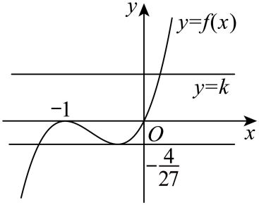

## 错法

看到一个正极大值，就断言它两侧各有一个零点；或画出全曲线后数所有交点，把题给区间之外的交点也计入。原因是把极值的高度当成了两侧完整值域，没有查两端函数值、连续性及取点范围。

## 正解

先写定义域和分界点，用导数证明每个连续段的严格增减，再列该段实际函数值覆盖的区间。极大值高于0说明顶点在轴上方；还要两侧有负值，连续性才保证各有根。极值点为0时单独记一次，两侧开段不能重复。

有限端点还需标开闭：闭端上的零点允许，开端只能趋近的零值不是根。原三次函数例在 [−1,2] 上，左段值域 [−4/27,0]，右段 [−4/27,18]；k=0时两根−1与0都允许，k=−4/27时只有同一个极小点。定义域断开处不能用连续性跨越。

如果采用远端趋势，须将“趋于负无穷”转换成“存在一个足够远且仍合法的负值点”，再在该点与分界点之间使用零点存在性；∞不是可代入的端点。

知识与分类依据：`HSMA-B4-C5-Dee15d199b365-P0015-P0022`（《专题5.4 导数在研究函数中的应用【八大题型】（举一反三）（人教A版2019选择性必修第二册）（解析版）.docx》）。原资料口径、补条件与勘误分别说明。

## 例题

### 原例：比较四个函数的零点数

来源：`HSMA-B4-C5-Dee15d199b365-P0023-P0039`；原件《专题5.4 导数在研究函数中的应用【八大题型】（举一反三）（人教A版2019选择性必修第二册）（解析版）.docx》。题号、学年及地区按讲义原标注，未另作来源核验。

以下完整保留原题、原答案与原详解（仅统一等价公式排版及配图路径）：

【例1】（23-24高二下·江西景德镇·期末）下列给出的四个函数中，零点的个数最多的是（    ）

A．$y=\frac{2x}{x-1}$  B．$y=\ln x-\frac{1}{3}x$

C．$y={e}^{x}-\left( x+1\right)$  D．$y={2}^{x}+lgx$

【解题思路】根据零点的定义，以及利用导数判断函数的单调性，以及最值，零点存在性定理，即可判断零点个数最多的函数.

【解答过程】A. $y=\frac{2x}{x-1}=0$，得$x=0$，有1个零点，

B. $f\left( x\right)=\ln x-\frac{1}{3}x$，${f}^{\prime }\left( x\right)=\frac{1}{x}-\frac{1}{3}=0$，得$x=3$，当$0<x<3$时，${y}^{\prime }>0$，函数单调递增，

当$x>3$时，${y}^{\prime }<0$，函数单调递减，当$x=3$时，函数取得最大值$\ln 3-1>0$，

且$f\left( 1\right)=-\frac{1}{3}<0$，所以$x\in \left( 1,3\right)$只有1个零点，

$f\left( {e}^{2}\right)=2-\frac{{e}^{2}}{3}<0$，所以在区间$\left( 3,{e}^{2}\right)$只有1个零点，

所以函数$y=\ln x-\frac{1}{3}x$有2个零点，

C. $y={e}^{x}-\left( x+1\right)$，${y}^{\prime }={e}^{x}-1=0$，得$x=0$，

当$x<0$时，${y}^{\prime }<0$，函数单调递减，当$x>0$时，${y}^{\prime }>0$，函数单调递增，

所以当$x=0$时，函数取得最小值0，所以$y={e}^{x}-\left( x+1\right)$只有1个零点，

D. $f\left( x\right)={2}^{x}+lgx$在定义域$\left( 0,+\infty \right)$单调递增，$f\left( \frac{1}{100}\right)={2}^{\frac{1}{100}}-2<0$，$f\left( 1\right)=2>0$，

所以函数$y={2}^{x}+lgx$只有1个零点，

综上可知，零点个数最多的是函数$y=\ln x-\frac{1}{3}x$有2个零点.

故选：B.

#### 补充讲解

先限定各自定义域：A 为 x≠1，B、D 为 x>0，C 为全体实数。A 的分母非零时零点由分子决定，得 x=0；x=1 不进入讨论。

B 的导数为 (3−x)/(3x)，所以在 (0,3) 递增、(3,+∞) 递减。f(3)>0，而 f(1)<0、f(e²)<0，连续性分别保证两侧至少各一个零点，严格单调性保证每侧至多一个。驻点 x=3 不是零点，因此总数恰为2。C 的最小值0在 x=0取得，两侧均大于0，只计一个不同零点；D 在正半轴严格递增，又有两个异号函数值，恰有一个。答案 B 的“最多”由四个数 1、2、1、1 比较得到，不能只证明 B 有零点就选它。

### 原例：有限闭区间上的水平线交点

来源：`HSMA-B4-C5-Dee15d199b365-P0148-P0168`；原件《专题5.4 导数在研究函数中的应用【八大题型】（举一反三）（人教A版2019选择性必修第二册）（解析版）.docx》。题号、学年及地区按讲义原标注，未另作来源核验。

以下完整保留原题、原答案与原详解（仅统一等价公式排版及配图路径）：

【变式2-2】（23-24高二下·四川遂宁·阶段练习）已知函数$f\left( x\right)={x}^{3}+2a{x}^{2}+bx+a-1$在$x=-1$处取得极值$0$，其中$a,b\in R$．

(1)求$a,b$的值；

(2)当$x\in \left[ -1,2\right]$时，方程$f\left( x\right)=k$有两个不等实数根，求实数k的取值范围．

【解题思路】（1）先求导函数${f}^{\prime }(x)$，再依据题意$\left\{ \begin{aligned}f\left( -1\right)=0\\{f}^{\prime }(-1)=0\end{aligned}\right.$求解检验即可.

（2）由（1）得$f(x)={x}^{3}+2{x}^{2}+x$和${f}^{\prime }(x)$，接着研究${f}^{\prime }(x)$在$x\in \left[ -1,2\right]$上的正负从而得$f(x)$在$x\in \left[ -1,2\right]$上的单调性，根据单调性数形结合即可得解.

【解答过程】（1）由$f\left( x\right)={x}^{3}+2a{x}^{2}+bx+a-1$求导得${f}^{\prime }(x)=3{x}^{2}+4ax+b$，

依题意可知$\left\{ \begin{aligned}f\left( -1\right)=0\\{f}^{\prime }(-1)=0\end{aligned}\right.$，即$\left\{ \begin{aligned}-1+2a-b+a-1=0\\3-4a+b=0\end{aligned}\right.$，解得$a=b=1$，

此时$f\left( x\right)={x}^{3}+2{x}^{2}+x$，${f}^{\prime }(x)=3{x}^{2}+4x+1$，

由${f}^{\prime }(x)=3{x}^{2}+4x+1=\left( 3x+1\right)\left( x+1\right)=0$得$x=-1$或$x=-\frac{1}{3}$，

当$x<-1$时，${f}^{\prime }(x)>0$，函数$f(x)$递增，

当$-1<x<-\frac{1}{3}$时，${f}^{\prime }(x)<0$，函数$f(x)$递减，

故$x=-1$时，函数取得极大值$f(-1)=0$，故$a=b=1$.

（2）由（1）得$f(x)={x}^{3}+2{x}^{2}+x$，${f}^{\prime }(x)=3{x}^{2}+4x+1=(3x+1)(x+1)$，

令${f}^{\prime }(x)=0$，解得$x=-\frac{1}{3}$或$x=-1$，因$x\in \left[ -1,2\right]$，

故当$-1<x<-\frac{1}{3}$时${f}^{\prime }(x)<0$，函数$f(x)$递减，当$-\frac{1}{3}<x<2$时${f}^{\prime }(x)>0$，函数$f(x)$递增，

当$x=-\frac{1}{3}$时，$f(x)$取得极小值，无极大值，所以$f{(x)}_{\min }=f\left( -\frac{1}{3}\right)=-\frac{4}{27}$，

所以在区间$[-1,2]$上，$f(x)$的最大值为$f(-1)$或$f(2)$，而$f(-1)=0,f(2)=8+8+2=18$，

所以$f(x)$在区间$[-1,2]$上的最大值为$18$，最小值为$-\frac{4}{27}$，

作出函数$y=f(x)$与直线$y=k$的图像，如图，

由图知$-\frac{4}{27}<k\le 0$.

#### 补充讲解

第一问同时用 f(−1)=0与 f'(−1)=0，解出 a=b=1后仍需检验导数确实变号。此时 f=x(x+1)²，f'=(3x+1)(x+1)，在 −1两側由正转负，符合极大值0。

第二问限定 x∈[−1,2]。在 [−1,−1/3] 上连续严格递减，函数值覆盖 [−4/27,0]；在 [−1/3,2] 上连续严格递增，覆盖 [−4/27,18]。水平线高度 k 在 (−4/27,0] 时每支一个交点，且不同。k=−4/27时两支交点合在 x=−1/3，只计一个；k=0时左端 x=−1允许取到，另一交点 x=0也允许，仍是两个；k>0时只有右支一个交点。原图画的是完整三次曲线，真正计数必须回到题给的闭区间。
