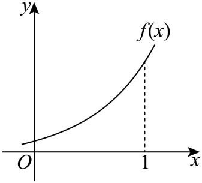

## 讲解

### 是什么

把 g(x)=f′(x)作为新函数看图时，g图象的纵坐标是 f曲线在对应横坐标处的切线斜率，不是 f曲线本来的高度。同一横坐标下，f(x)与 g(x)可以不同，也没有“谁越高谁的导数就越大”的一般结论。

g(x)>0、=0、<0分别表示原曲线该点有限切线向右上倾、水平、向右下倾。若 f在整个区间可导，g在该区间恒正可判 f严格递增，恒负可判严格递减；只知道一个点的正负，不能声称整个区间单调。g的纵坐标升降反映切线斜率升降，也不能直接用作 f函数值升降的判据。

### 怎么来的

点上的对应来自 g(x)=f′(x)及导数给切线斜率。区间单调判据的严格依据可用拓展的拉格朗日中值定理：任取区间内 a<b，若 f在[a,b]连续且在(a,b)可导，则存在 c∈(a,b)使

$$f(b)-f(a)=f^{\prime}(c)(b-a).$$

b−a为正，导数在整个区间同号便给函数值差同号。教材的导数单调性结论与此一致；这里说明全区间条件，不把一个局部斜率说成全局证明。g某点等于0只说明水平切线，极值还须比较附近函数值或导数符号变化。

比较端点切线与割线时，割线斜率是[f(b)−f(a)]/(b−a)。若 g在该区间严格增加，拓展中值定理给割线斜率=g(c)，于是夹在 g(a)、g(b)之间；若 g严格减少，方向反转。图象题可直接从题给切线与弯曲趋势识别这种几何比较，不能仅凭 f递增就假定 g递增。

公式选图另有路线：先准确求 g，再检查定义域、奇偶性、零点、特定横坐标处的正负，逐条排图。若 f在对称区间可导且为偶函数，对 f(−x)=f(x)两边求导得−f′(−x)=f′(x)，所以 g为奇函数；若 f为奇函数，同理 g为偶函数。需要原定义域关于0对称。

### 什么时候能用

先看图标的是 f还是 f′。原函数图读高度，导函数图读斜率；几何比较中同时检查横距与符号。若只给局部图，只能在图示及题设支持的区间判断，不能补出全实数域性质。示意图无法给出未标出的精确函数值，不能把视觉估读当精确计算。

## 例题

### 原例（HSMA-B4-C5-Dbd930dde7c71-P0218—P0228）

**原题与原解析（保留）**

【例7】（23-24高二下·吉林·阶段练习）已知函数 $f\left( x\right)$的部分图象如图所示，${f}^{\prime}\left( x\right)$为 $f\left( x\right)$的导函数，则（    ）

A．$f\left( 1\right)-f\left( 0\right)>{f}^{\prime}\left( 1\right)>{f}^{\prime}\left( 0\right)$  B．${f}^{\prime}\left( 1\right)>{f}^{\prime}\left( 0\right)>f\left( 1\right)-f\left( 0\right)$

C．${f}^{\prime}\left( 0\right)>f\left( 1\right)-f\left( 0\right)>{f}^{\prime}\left( 1\right)$  D．${f}^{\prime}\left( 1\right)>f\left( 1\right)-f\left( 0\right)>{f}^{\prime}\left( 0\right)$

【解题思路】直接由导数的几何意义结合函数图象即可求解.

【解答过程】由导数的几何意义可知，${f}^{\prime}\left( 0\right)$表示曲线$y=f\left( x\right)$在$x=0$处的切线斜率，

${f}^{\prime}\left( 1\right)$表示曲线$y=f\left( x\right)$在$x=1$处的切线斜率，

$\frac{f\left( 1\right)-f\left( 0\right)}{1-0}$表示$\left( 0,f\left( 0\right)\right)$，$\left( 1,f\left( 1\right)\right)$两点连线的斜率，

由图可知，当$x$从0变化到1时，$f\left( x\right)$切线斜率越来越大，

所以${f}^{\prime}\left( 1\right)>f\left( 1\right)-f\left( 0\right)>{f}^{\prime}\left( 0\right)$，对比选项可知，D正确.

故选：D.

### 补讲

三项先翻译成三个斜率：f′(0)、f′(1)是端点切线斜率；f(1)−f(0)因为横距1，是两端点割线斜率。图中曲线向上弯，沿[0,1]切线斜率增加，割线方向位于两个切线方向之间，所以 f′(0)<f(1)−f(0)<f′(1)，选D。所依据的是原图的弯曲与切线趋势，不能仅因 f递增就推得斜率也递增。

若要把图形比较写成定理，这是拓展的拉格朗日中值定理：f在[0,1]连续、在(0,1)可导时，割线斜率=f′(c)，某个0<c<1；再用这里切线斜率严格增加，即得两端严格不等式。这一拓展说明理由，不额外假设图中有可读取的精确坐标。

### 原例（HSMA-B4-C5-Df0bbb10e91ee-P0234—P0242）

**原题与原解析（保留）**

【例6】（23-24高二下·辽宁鞍山·阶段练习）函数$f\left( x\right)=x\sin x+\cos x$的导数${f}^{\prime}\left( x\right)$的部分图象大致为（    ）

A．    B．

C．    D．

【解题思路】根据已知，利用函数的求导公式以及函数的奇偶性、函数值进行排除.

【解答过程】因为$f\left( x\right)=x\sin x+\cos x$，所以${f}^{\prime}\left( x\right)=\sin x+x\cos x-\sin x=x\cos x$，

令$g\left( x\right)={f}^{\prime}\left( x\right)=x\cos x$，$x\in R$，则$g\left( -x\right)=-x\cos x=-g\left( x\right)$，

所以函数$g\left( x\right)=x\cos x$是奇函数，故A，C错误；

又$g\left( \pi \right)=\pi \cos \pi =-\pi <0$，故B错误.

故选：D.

### 补讲

先求完整导函数：乘积 xsin x给 sin x+xcos x，cos x给−sin x，两项抵消后 g(x)=f′(x)=xcos x。不是把原函数图象直接当成 g图象。g(−x)=−g(x)，定义域实数域关于0对称，故 g为奇函数，可排偶形图A、C；g(π)=−π<0，与B在 π处的正高度不符，留D。再核 g(0)=0，符合D经过原点。判断 g的奇偶与高度全部用 g自身，f本身是偶函数并不导致 f′也为偶函数。

## 易错

割线分母只有横距恰为1才可省成函数值差。g递增不代表 f恒增；斜率大小也不能跨90°盲按倾斜角排序。

## 来源

原件：[48146687]专题5.1+导数的概念及其意义【八大题型】（举一反三）（人教A版2019选择性必修第二册）（解析版）.docx；来源 ID：Dbd930dde7c71。

原件：专题5.2 导数的运算【七大题型】（举一反三）（人教A版2019选择性必修第二册）（解析版）.docx；来源 ID：Df0bbb10e91ee。

知识与分类定位：HSMA-B4-C5-Dbd930dde7c71-P0217—P0217, HSMA-B4-C5-Df0bbb10e91ee-P0233—P0233。

选用原例：HSMA-B4-C5-Dbd930dde7c71-P0218—P0228, HSMA-B4-C5-Df0bbb10e91ee-P0234—P0242。
