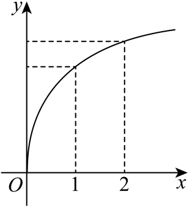
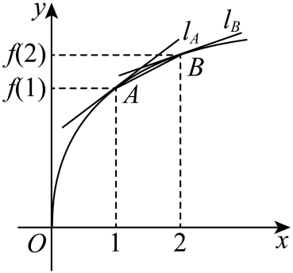
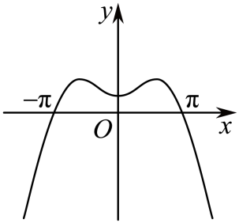
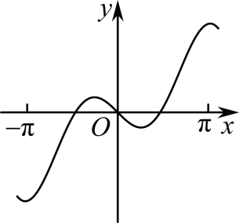
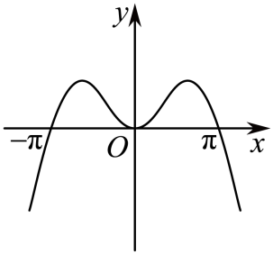
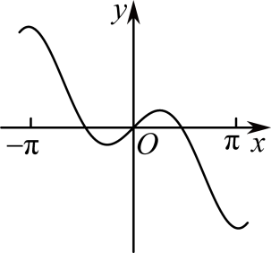

## 讲解

### 判据与流程

先识别图画的是 f还是 g=f′：f的纵坐标给函数值，g的纵坐标给原函数对应点切线斜率。割线斜率为[f(b)−f(a)]/(b−a)，只有横距恰为1时才能省掉分母。

1. 原函数图比较斜率时，画或识别两端切线与割线。切线斜率随横坐标增减是图中弯曲的性质，不能仅凭函数值递增推出。
2. 若用倾斜角比较 tan，核这些角在同一单调分支；原例三条线均为锐角才能依次比较。跨过竖直方向要分支。
3. 导函数图先读 g的零点和正负区间。对 f全区间可导，g恒正/恒负给 f增/减；单点 g=0只说明水平切线，不能独自保证极值。
4. 若需从公式选导函数图，先完整求 g，再检查 g自身的定义域、奇偶、特殊点与符号排除选项，不照搬 f的图形。
5. 不从示意图估读未经标出的精确值，不把局部图结论外推到图外。

当需要把切线割线夹逼严格写成定理，可用拓展的中值定理：割线斜率等于某内点导数；再配合导数在区间严格单调，才得到严格夹在两端之间。相应连续、可导条件须具备。

## 例题

### 原例（HSMA-B4-C5-Dbd930dde7c71-P0229—P0241）

**原题与原解析（保留）**

【变式7-1】（23-24高二下·新疆乌鲁木齐·期中）函数$f\left( x\right)$的图象如图所示，下列数值排序正确的是（    ）

A．$0<f^{\prime}\left( 1\right)<f^{\prime}\left( 2\right)<f\left( 2\right)-f\left( 1\right)$  B．$0<f^{\prime}\left( 2\right)<f\left( 2\right)-f\left( 1\right)<f^{\prime}\left( 1\right)$

C．$0<f^{\prime}\left( 2\right)<f^{\prime}\left( 1\right)<f\left( 2\right)-f\left( 1\right)$  D．$0<f\left( 2\right)-f\left( 1\right)<f^{\prime}\left( 1\right)<f^{\prime}\left( 2\right)$

【解题思路】结合图形，利用曲线上两点所在直线的斜率和过两点的切线斜率的比较即可得到.

【解答过程】

如图，设函数$f\left( x\right)$的图象上有两点$A(1,f(1)),B(2,f(2))$，经过点$A,B$的切线分别为${l}_{A},{l}_{B}$,

则直线$AB,{l}_{A},{l}_{B}$的斜率依次为${k}_{AB}=\frac{f(2)-f(1)}{2-1}=f(2)-f(1),$ ${k}_{{l}_{A}}={f}^{\prime}(1),{k}_{{l}_{B}}={f}^{\prime}(2)$，

由图知直线$AB,{l}_{A},{l}_{B}$的倾斜角${\alpha }_{AB},{\alpha }_{{l}_{A}},{\alpha }_{{l}_{B}}$满足，$0<{\alpha }_{{l}_{B}}<{\alpha }_{AB}<{\alpha }_{{l}_{A}}<\frac{\pi }{2}$，

因函数$y=\tan x$在$(0,\frac{\pi }{2})$上递增，故$0<\tan {\alpha }_{{l}_{B}}<\tan {\alpha }_{AB}<\tan {\alpha }_{{l}_{A}}$，

即$0<f^{\prime}\left( 2\right)<f\left( 2\right)-f\left( 1\right)<f^{\prime}\left( 1\right)$.

故选：B.

### 补讲

原图及原解配图展示切线斜率均为正且从1到2减小。割线 AB横距为1，斜率=f(2)−f(1)；它夹在右端、左端切线斜率之间，故0<f′(2)<f(2)−f(1)<f′(1)。原解的三倾斜角都在(0,π/2)，此时 tan确实严格递增，可以用角度比较斜率；若跨过π/2则不能沿用此比较。切线是“分别在 A、B处的切线”，不是任意过 A、B的两条线。

### 原例（HSMA-B4-C5-Df0bbb10e91ee-P0234—P0242）

**原题与原解析（保留）**

【例6】（23-24高二下·辽宁鞍山·阶段练习）函数$f\left( x\right)=x\sin x+\cos x$的导数${f}^{\prime}\left( x\right)$的部分图象大致为（    ）

A．    B．

C．    D．

【解题思路】根据已知，利用函数的求导公式以及函数的奇偶性、函数值进行排除.

【解答过程】因为$f\left( x\right)=x\sin x+\cos x$，所以${f}^{\prime}\left( x\right)=\sin x+x\cos x-\sin x=x\cos x$，

令$g\left( x\right)={f}^{\prime}\left( x\right)=x\cos x$，$x\in R$，则$g\left( -x\right)=-x\cos x=-g\left( x\right)$，

所以函数$g\left( x\right)=x\cos x$是奇函数，故A，C错误；

又$g\left( \pi \right)=\pi \cos \pi =-\pi <0$，故B错误.

故选：D.

### 补讲

先求完整导函数：乘积 xsin x给 sin x+xcos x，cos x给−sin x，两项抵消后 g(x)=f′(x)=xcos x。不是把原函数图象直接当成 g图象。g(−x)=−g(x)，定义域实数域关于0对称，故 g为奇函数，可排偶形图A、C；g(π)=−π<0，与B在 π处的正高度不符，留D。再核 g(0)=0，符合D经过原点。判断 g的奇偶与高度全部用 g自身，f本身是偶函数并不导致 f′也为偶函数。

## 易错

读导函数图的高度是在读原函数斜率。原函数与导函数的奇偶通常相反，但要先核对称定义域与可导性。

## 来源

原件：[48146687]专题5.1+导数的概念及其意义【八大题型】（举一反三）（人教A版2019选择性必修第二册）（解析版）.docx；来源 ID：Dbd930dde7c71。

原件：专题5.2 导数的运算【七大题型】（举一反三）（人教A版2019选择性必修第二册）（解析版）.docx；来源 ID：Df0bbb10e91ee。

知识与分类定位：HSMA-B4-C5-Dbd930dde7c71-P0217—P0217, HSMA-B4-C5-Df0bbb10e91ee-P0233—P0233。

选用原例：HSMA-B4-C5-Dbd930dde7c71-P0229—P0241, HSMA-B4-C5-Df0bbb10e91ee-P0234—P0242。
