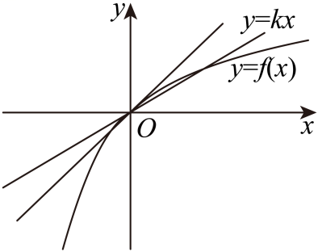

## 讲解

### 判据与流程

题给“恰有两个”“只有三个不同根”等数量时，先找数量改变的合法分界高度，再保留满足要求的参数段。

1. 列题给 x范围和参数范围；先查是否有与参数无关的固定根，登记后再看剩余数量。
2. 对原函数分类求单调值域，或等价分离为水平线。根数的分界需检查极值高度、有限端点高度、开端或无穷端的极限高度、缺口边界及参数使函数结构改变的位置，这些位置都要独立验。
3. 在每个候选参数段，按每个单调分支的实际值域数交点。两段用同一极值点时不重计；端点属于定义域才算根。
4. 把“各侧有几个”相加，保留恰好符合题给数目的参数。必要条件要和实际存在/唯一一起检查，不能只由极值符号得到最终范围。
5. 回验边界：参数取等时，根可能合并、移到排除端点、回到已有固定根。以这种实际行为决定开闭号。

## 易错

- 分段例的 x=0先计一次，负根回到0时并未增加根数。
- 闭区间水平线高度0仍允许左端−1，极小高度只给一个合并根，两者不能统一开端处理。
- 多个条件必须求交集；“某一侧有根”的范围不是整题答案。

知识与分类依据：`HSMA-B4-C5-Dee15d199b365-P0015-P0022`（《专题5.4 导数在研究函数中的应用【八大题型】（举一反三）（人教A版2019选择性必修第二册）（解析版）.docx》）。原资料口径、补条件与勘误分别说明。

## 例题

### 原例：分段函数三零点与必有的零点

来源：`HSMA-B4-C5-Dee15d199b365-P0111-P0122`；原件《专题5.4 导数在研究函数中的应用【八大题型】（举一反三）（人教A版2019选择性必修第二册）（解析版）.docx》。题号、学年及地区按讲义原标注，未另作来源核验。

以下完整保留原题、原答案与原详解（仅统一等价公式排版及配图路径）：

【例2】（23-24高三上·天津·期中）已知函数$f\left( x\right)=\left\{ \begin{aligned}-{x}^{2}+\frac{1}{2}x,x<0\\\ln \left( x+1\right),x\ge 0\end{aligned}\right.$，若函数$y=f\left( x\right)-kx$有且只有3个零点，则实数$k$的取值范围为（    ）

A．$\left( 0,\frac{1}{2}\right)$  B．$\left( \frac{1}{2},1\right)$  C．$\left( 1,+\infty \right)$  D．$\left( \frac{1}{4},1\right)$

【解题思路】根据题意，得到$x=0$是$y=f\left( x\right)-kx$的一个零点，转化为$x>0$和$x<0$时，分别有一个零点，分类讨论，结合二次函数的性质，以及利用导数的几何意义，即可求解.

【解答过程】解：由函数$f\left( x\right)=\left\{ \begin{aligned}-{x}^{2}+\frac{1}{2}x,x<0\\\ln \left( x+1\right),x\ge 0\end{aligned}\right.$，若$y=f\left( x\right)-kx$有且只有3个零点，

当$x=0$时，可得$f\left( 0\right)=\ln 1=0$，可得$x=0$是$y=f\left( x\right)-kx$的一个零点，

当$x<0$时，由$-{x}^{2}+\frac{1}{2}x=kx$，可得$x=\frac{1}{2}-k<0$，解得$k>\frac{1}{2}$；

当$x>0$时，$f\left( x\right)=\ln \left( x+1\right)$，可得${f}^{\prime }\left( x\right)=\frac{1}{x+1}$，可得${f}^{\prime }\left( 0\right)=1$，

要使得函数$y=f\left( x\right)-kx$在$x>0$上有一个零点，

即函数$y=f\left( x\right)$与$y=kx$的图象有一个公共点，则满足$0<k<1$，

综上可得：$\frac{1}{2}<k<1$，即函数$f\left( x\right)-kx$有三个零点时，实数$k$的范围为$(\frac{1}{2},1)$

故选：B.

#### 补充讲解

x=0属于右段且 f(0)−k·0=0，对每个 k 都是一个不同零点。先单独登记它，再处理两侧，才不会因除 x 丢根。

负半轴原式 −x²+(1/2−k)x=0 可写成 x(−x+1/2−k)=0。这里 x<0，故只能取 x=1/2−k；严格落在负半轴等价于 k>1/2。k=1/2时这个代数根回到0，不能再计一次。

正半轴令 H(x)=ln(1+x)−kx。若 k≤0，H'(x)=1/(1+x)−k>0且 H(0)=0，所以没有正零点；若 k≥1，则 x>0时 H'<0，也没有正零点。若 0<k<1，H'先正后负，先从0升为正，随后 H(x)→−∞，所以下降支恰有一个正零点。也可令 h(x)=ln(1+x)/x，证明其严格下降且值域为 (0,1)。于是需要 k>1/2与0<k<1同时成立，答案 B。端点 k=1并不因直线在0相切就出现额外正零点。

### 原例：有限闭区间上的水平线交点

来源：`HSMA-B4-C5-Dee15d199b365-P0148-P0168`；原件《专题5.4 导数在研究函数中的应用【八大题型】（举一反三）（人教A版2019选择性必修第二册）（解析版）.docx》。题号、学年及地区按讲义原标注，未另作来源核验。

以下完整保留原题、原答案与原详解（仅统一等价公式排版及配图路径）：

【变式2-2】（23-24高二下·四川遂宁·阶段练习）已知函数$f\left( x\right)={x}^{3}+2a{x}^{2}+bx+a-1$在$x=-1$处取得极值$0$，其中$a,b\in R$．

(1)求$a,b$的值；

(2)当$x\in \left[ -1,2\right]$时，方程$f\left( x\right)=k$有两个不等实数根，求实数k的取值范围．

【解题思路】（1）先求导函数${f}^{\prime }(x)$，再依据题意$\left\{ \begin{aligned}f\left( -1\right)=0\\{f}^{\prime }(-1)=0\end{aligned}\right.$求解检验即可.

（2）由（1）得$f(x)={x}^{3}+2{x}^{2}+x$和${f}^{\prime }(x)$，接着研究${f}^{\prime }(x)$在$x\in \left[ -1,2\right]$上的正负从而得$f(x)$在$x\in \left[ -1,2\right]$上的单调性，根据单调性数形结合即可得解.

【解答过程】（1）由$f\left( x\right)={x}^{3}+2a{x}^{2}+bx+a-1$求导得${f}^{\prime }(x)=3{x}^{2}+4ax+b$，

依题意可知$\left\{ \begin{aligned}f\left( -1\right)=0\\{f}^{\prime }(-1)=0\end{aligned}\right.$，即$\left\{ \begin{aligned}-1+2a-b+a-1=0\\3-4a+b=0\end{aligned}\right.$，解得$a=b=1$，

此时$f\left( x\right)={x}^{3}+2{x}^{2}+x$，${f}^{\prime }(x)=3{x}^{2}+4x+1$，

由${f}^{\prime }(x)=3{x}^{2}+4x+1=\left( 3x+1\right)\left( x+1\right)=0$得$x=-1$或$x=-\frac{1}{3}$，

当$x<-1$时，${f}^{\prime }(x)>0$，函数$f(x)$递增，

当$-1<x<-\frac{1}{3}$时，${f}^{\prime }(x)<0$，函数$f(x)$递减，

故$x=-1$时，函数取得极大值$f(-1)=0$，故$a=b=1$.

（2）由（1）得$f(x)={x}^{3}+2{x}^{2}+x$，${f}^{\prime }(x)=3{x}^{2}+4x+1=(3x+1)(x+1)$，

令${f}^{\prime }(x)=0$，解得$x=-\frac{1}{3}$或$x=-1$，因$x\in \left[ -1,2\right]$，

故当$-1<x<-\frac{1}{3}$时${f}^{\prime }(x)<0$，函数$f(x)$递减，当$-\frac{1}{3}<x<2$时${f}^{\prime }(x)>0$，函数$f(x)$递增，

当$x=-\frac{1}{3}$时，$f(x)$取得极小值，无极大值，所以$f{(x)}_{\min }=f\left( -\frac{1}{3}\right)=-\frac{4}{27}$，

所以在区间$[-1,2]$上，$f(x)$的最大值为$f(-1)$或$f(2)$，而$f(-1)=0,f(2)=8+8+2=18$，

所以$f(x)$在区间$[-1,2]$上的最大值为$18$，最小值为$-\frac{4}{27}$，

作出函数$y=f(x)$与直线$y=k$的图像，如图，

由图知$-\frac{4}{27}<k\le 0$.

#### 补充讲解

第一问同时用 f(−1)=0与 f'(−1)=0，解出 a=b=1后仍需检验导数确实变号。此时 f=x(x+1)²，f'=(3x+1)(x+1)，在 −1两側由正转负，符合极大值0。

第二问限定 x∈[−1,2]。在 [−1,−1/3] 上连续严格递减，函数值覆盖 [−4/27,0]；在 [−1/3,2] 上连续严格递增，覆盖 [−4/27,18]。水平线高度 k 在 (−4/27,0] 时每支一个交点，且不同。k=−4/27时两支交点合在 x=−1/3，只计一个；k=0时左端 x=−1允许取到，另一交点 x=0也允许，仍是两个；k>0时只有右支一个交点。原图画的是完整三次曲线，真正计数必须回到题给的闭区间。
