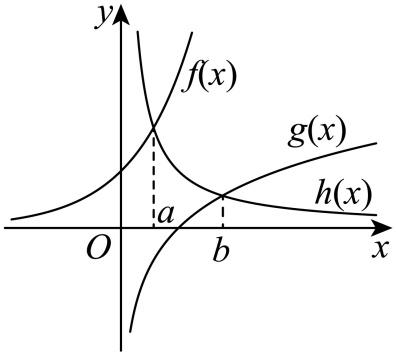
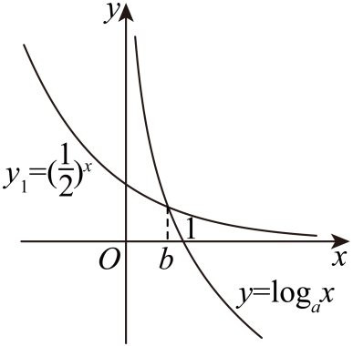
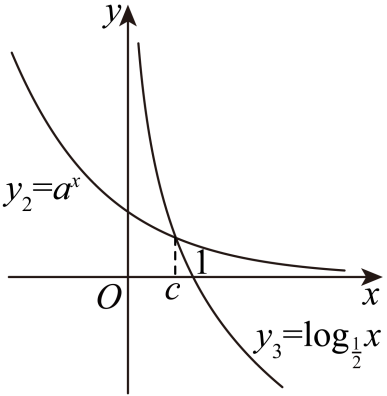

## 错法

看到原图画出某交点在另一交点右边，就把横坐标顺序直接写成结论；或只说“指数增长快，所以指数值更大”。示意图可以压缩已知关系，但画图比例、手画交点和局部趋势并不证明指定输入范围内的跨函数不等式。两条递減曲线可能在不同位置相交，也不能仅因都递减断言交点个数。

## 正解

先把坐标关系翻译回原等式、定义条件和同一单调函数。正的指数输出等于一个对数时，可由对数输出为正确定真数在1哪一侧；固定共同输出时，可通过合法互化比较输入。若确实需要跨两个不同函数的值比较，要给出适用范围内的明确界，或构造差函数并证明其符号，不把图示当成依据。

顺序分为：先证明每个量在哪个区间，再证明区间内剩余两量的顺序；图保留作观察与核对。原题已经给出某量满足方程时，比较可以只针对这些给定解，不必无依据追加“存在唯一解”。若解的存在性也是任务，连续、异号与严格单调应分别核查。

## 关键差别

错法从绘图位置直接跳到实数结论；正解的每一段链都有定义、等式、单调或不等式依据。下面完整保留原图，同时补出这些依据。

## 例题

### 原题 P0291

> 来源ID HSMA-B1-C4-De53bedf7910d-P0291；原件 `专题01 指、对、幂数的大小比较必考七类问题（举一反三专项训练）数学人教A版必修第一册（解析版）.docx`；DOCX正文段落 P0291—P0292；答案与详解 P0293—P0305。年份、地区和试题标签沿原资料记载，未独立核实。

**原资料题干与选项：**

25．（2025·江西·模拟预测）若$a{e}^{a}=b\ln b\left( a>0\right)$，则（   ）

A．$a<b$  B．$a=b$  C．$a>b$  D．无法确定

**原资料答案与详解（完整保留，公式转写为LaTeX）：**

【答案】A

【解题思路】令$a{e}^{a}=b\ln b=k$，$k>0$，构造函数，作出函数图象，即可比大小.

【解答过程】因为$a>0$，

所以$a{e}^{a}>a>0$，

因为$a{e}^{a}=b\ln b$，

所以$b\ln b>0$，可得$b>1$，

令$a{e}^{a}=b\ln b=k$，$k>0$，

所以${e}^{a}=\frac{k}{a},\ln b=\frac{k}{b}$，

设$f(x)={e}^{x}$，$g(x)=\ln x$，$h(x)=\frac{k}{x}$，

作出它们的图象如图：

由图可知$a<b$.故选项A正确.

故选：A.

**展开解析与核验（依据原详解补足，勘误另标）：**

原图提供思路，a<b仍须证明。a>0使a $e^a$>0；对数定义先要求b>0，b ln b>0进而给b>1。若a≤1，立即a<b。若假设a≥b>1，正乘积和指数保序给$a e^a\ge b e^b$。

说明$e^b>\ln b$可只用整数幂：任意t>1，取整数n≥1使n≤t<n+1。e>2且$2^n\ge n+1$（n=1成立；归纳时2(n+1)≥n+2），故$e^n$>n+1。于是$e^t$≥$e^n$>n+1>t；又取递增自然对数得ln(n+1)<n，所以ln t<ln(n+1)<n≤t。得到$e^t$>t>ln t。令t=b，$a e^a\ge b e^b>b\ln b$，与相等条件矛盾。因此a<b，A正确；B等号、C反向都被a≥b矛盾排除，D无法判断不合。保留原图，同时不用示意位置证明。

### 原题 P0317

> 来源ID HSMA-B1-C4-De53bedf7910d-P0317；原件 `专题01 指、对、幂数的大小比较必考七类问题（举一反三专项训练）数学人教A版必修第一册（解析版）.docx`；DOCX正文段落 P0317—P0319；答案与详解 P0320—P0336。年份、地区和试题标签沿原资料记载，未独立核实。

**原资料题干与选项：**

27．（2024·全国·模拟预测）已知$a={\left( \frac{1}{2}\right)}^{a},{\left( \frac{1}{2}\right)}^{b}={\log }_{a}b,{a}^{c}={\log }_{\frac{1}{2}}c$，则实数$a,b,c$的大小关系为（    ）

A．$a<b<c$  B．$a<c<b$

C．$c<b<a$  D．$c<a<b$

**原资料答案与详解（完整保留，公式转写为LaTeX）：**

【答案】D

【解题思路】由函数单调性，零点存在性定理及画出函数图象，得到$a,b,c\in \left( 0,1\right)$，得到${\log }_{a}b<1={\log }_{a}a$，求出$b>a$，根据单调性得到$c={\left( \frac{1}{2}\right)}^{{a}^{c}}<{\left( \frac{1}{2}\right)}^{a}=a$，从而得到答案.

【解答过程】令$f\left( x\right)={\left( \frac{1}{2}\right)}^{x}-x$，其在R上单调递减，

又$f\left( 0\right)=1>0,f\left( 1\right)=\frac{1}{2}-1=-\frac{1}{2}<0$，

由零点存在性定理得$a\in \left( 0,1\right)$，

则$y={\log }_{a}x$在$\left( 0,+\infty \right)$上单调递减，

画出${y}_{1}={\left( \frac{1}{2}\right)}^{x}$与$y={\log }_{a}x$的函数图象，

  

可以得到$b\in \left( 0,1\right)$，

又${y}_{2}={a}^{x}$在R上单调递减，画出${y}_{2}={a}^{x}$与${y}_{3}={\log }_{\frac{1}{2}}x$的函数图象，

  

可以看出$c\in \left( 0,1\right)$，

因为${\left( \frac{1}{2}\right)}^{b}<{\left( \frac{1}{2}\right)}^{0}=1$，故${\log }_{a}b<1={\log }_{a}a$，故$b>a$，

因为$a,c\in \left( 0,1\right)$，故${a}^{c}>{a}^{1}=a$，

由${a}^{c}={\log }_{\frac{1}{2}}c$得，$c={\left( \frac{1}{2}\right)}^{{a}^{c}}<{\left( \frac{1}{2}\right)}^{a}=a$．

综上，$c<a<b$．

故选：D．

**展开解析与核验（依据原详解补足，勘误另标）：**

a作为对数底须正非1；又$a=(1/2)^a$。若a≥1，右侧≤1/2<a矛盾，故0<a<1。原书也可用连续严格递减的$F(t)=(1/2)^t-t$在0、1异号，确定唯一根在此区间。

b真数先要求b>0；正值$(1/2)^b$使$\log_a b$>0，底a<1给b<1。b>0又使$(1/2)^b$<1=$\log_a a$，递减对数将$\log_a b$<$\log_a a$反向为b>a。

c真数要求c>0；$\log_{1/2}c$=$a^c$>0给c<1。0<c<1、底a<1使$a^c$>a。互化$c=(1/2)^{a^c}$，底1/2递减，故$c<(1/2)^a=a$。合为$c<a<b$、原答案D。原两图保留；b,c的区间已经从定义和输出符号证明，不凭同减曲线示意断定交点。

**逐项核对：** A写$b<c$，实际$b>c$，错误。 B写$a<c$，实际$a>c$，错误。 C写$b<a$，实际$b>a$，错误。 D的完整顺序与已证大小链一致，正确。
