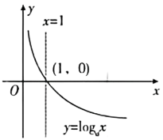
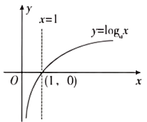

## 讲解

### 是什么

标准对数函数的域为$(0,\infty)$，值域$\mathbb R$，经过(1,0)与(a,1)，没有纵轴交点。a>1时在全域严格递增；0<a<1时在全域严格递减。前者在0<x<1输出负、x>1输出正，后者相反。这些性质只先用于标准函数；复合式须检查内层正性、真实域及内层方向。

原概述的两种图象保留。图中的趋势需由底数条件解释，不靠示意斜率猜精确数值。

### 怎么来的

对任意正输入$x_1<x_2$，记$y_i=\log_a x_i$，则$a^{y_i}=x_i$。a>1时指数严格递增，若$y_1\ge y_2$就会$x_1\ge x_2$，矛盾，故$y_1<y_2$。0<a<1时指数严格递减，若$y_1\le y_2$，反而会有$a^{y_1}\ge a^{y_2}$，即$x_1\ge x_2$，仍与原输入次序矛盾，故$y_1>y_2$。对数方向从指数对应的唯一性与方向传来。

任意实y可选正输入$x=a^y$，其对数输出就是y，所以值域确实全部实数，不仅“没有明显上下界”。$a^0=1$与$a^1=a$直接给两个定点；再以输入1为界结合单调方向得到输出符号。0无对数，所以纵轴不属于图象。

对数定义给
$$\log_{1/a}x=\frac{\ln x}{-\ln a}=-\log_a x.$$
因此互为倒数的底数使图象关于x轴反射。比较不同底数时可换成$\ln x/\ln a$：同一x>1且两个底>1时，底越大、正分母越大，输出越小；x<1时分子负，方向相反。最直接的底数排序是读同一水平线y=1的交点横坐标，因为该坐标恰是底数。

指数与对数还互为反函数：$a^{\log_a x}=x$对正x成立，$\log_a(a^t)=t$对实t成立。指数的输入域实数、输出域正数，正好交换成对数的输入域正数、输出域实数。若指数图上有(t,x)，对数图上有(x,t)，交换坐标的两点关于直线y=x对称，所以两个完整图象关于这条直线对称。一般函数只有每个可达输出对应唯一输入时才能反求成函数；$f^{-1}$表示反函数，并非$1/f$。本节原题没有独立要求求反函数的题，以上为原概述中指对关系的规范补讲，下面的过点例题展示其直接计算用途；其余例题分别展示大小比较、底数排序和复合单调。

### 什么时候能用

同底正真数比较、过点求底、图象识别与复合单调。变底排序先检查真数对1的位置，以及两个底对1的位置；不能固定一句“底越大值越小”覆盖全部合法情况。复合对数的禁值可能割开原域，分别有同方向也不代表并集全域有同方向，还需核验跨支输入。

### 补足判断依据

标准函数在正输入域连续，且由指对互化可以判断图象靠近边界的去向：a>1时，x趋近0的正侧，输出趋向负无穷；x增大无界时，输出也增大无界。0<a<1时，两端方向相反。依据是要让$a^y$趋近0或增大无界，指数y必须沿对应方向走。纵轴是边界，图象永不与它相交。以上边界解释用于标准图象；复合式应先找真实的真数边界。

## 例题

### 原题 2-1

> 来源ID HSMA-B1-C4-D691361d63db8-P0058；原件 `专题4.4 对数函数（举一反三讲义）数学人教A版必修第一册（解析版）.docx`；DOCX正文段落 P0058—P0060；答案与详解 P0061—P0067。年份、地区和试题标签沿原资料记载，未独立核实。

**原资料题干与选项：**

【变式2-1】（24-25高一上·全国·课后作业）已知对数函数的图象过点$M\left( 9,-2\right)$，则此对数函数的解析式为（    ）

A．$y={\log }_{2}x$  B．$y={\log }_{3}x$

C．$y={\log }_{\frac{1}{3}}x$  D．$y={\log }_{\frac{1}{2}}x$

**原资料答案与详解（完整保留，公式转写为LaTeX）：**

【答案】C

【解题思路】设对数函数解析式求参即可.

【解答过程】设对数函数为$y={\log }_{a}x$,

$M\left( 9,-2\right)$代入可得$-2={\log }_{a}9={\log }_{a}{a}^{-2}$,

所以${a}^{-2}=9,\frac{1}{{a}^{2}}=9,a=\frac{1}{3}$,

则对数函数的解析式为$y={\log }_{\frac{1}{3}}x$.

故选：C.

**展开解析与核验（依据原详解补足，勘误另标）：**

设固定合法底数a，过点给$\log_a9=-2$，等价$a^{-2}=9$。因为$a>0$，$1/a^2=9$得$a^2=1/9$，只取$a=1/3$，负根不能作实对数底数；故C。A底2或B底3均大于1，对真数9输出应正，不可能为−2。D底1/2若输出−2则真数应$(1/2)^{-2}=4$，而非9。C反算$(1/3)^{-2}=9$，合法且吻合。

### 原题 4-3

> 来源ID HSMA-B1-C4-D691361d63db8-P0232；原件 `专题4.4 对数函数（举一反三讲义）数学人教A版必修第一册（解析版）.docx`；DOCX正文段落 P0232—P0236；答案与详解 P0237—P0253。年份、地区和试题标签沿原资料记载，未独立核实。

**原资料题干与选项：**

【变式4-3】（2025高一上·全国·专题练习）比较下列各组中两个值的大小．

(1)$\ln 0.3,\ln 2$；

(2)${\log }_{a}1.5,{\log }_{a}2.3$（$a>0$，且$a\ne 1$）；

(3)${\log }_{3}0.2,{\log }_{4}0.2$；

(4)${\log }_{3}\pi ,{\log }_{\pi }3$．

**原资料答案与详解（完整保留，公式转写为LaTeX）：**

【答案】(1)$\ln 0.3<\ln 2$

(2)答案见解析.

(3)${\log }_{3}0.2<{\log }_{4}0.2$

(4)${\log }_{3}\pi >{\log }_{\pi }3$

【解题思路】根据对数函数的单调性比较大小.

【解答过程】（1）因为函数$y=\ln x$是增函数，且$0.3<2$，所以$\ln 0.3<\ln 2$．

（2）当$a>1$时，函数$y={\log }_{a}x$是增函数，

又$1.5<2.3$，所以${\log }_{a}1.5<{\log }_{a}2.3$；

当$0<a<1$时，函数$y={\log }_{a}x$是减函数，

又$1.5<2.3$，所以${\log }_{a}1.5>{\log }_{a}2.3$．

综上所述，当$a>1$时，${\log }_{a}1.5<{\log }_{a}2.3$；

当$0<a<1$时，${\log }_{a}1.5>{\log }_{a}2.3$．

（3）因为$0>{\log }_{0.2}3>{\log }_{0.2}4$，所以$\frac{1}{{\log }_{0.2}3}<\frac{1}{{\log }_{0.2}4}$，

即${\log }_{3}0.2<{\log }_{4}0.2$．

（4）因为函数$y={\log }_{3}x$是增函数，且$\pi >3$，

所以${\log }_{3}\pi >{\log }_{3}3=1$．

同理，$1={\log }_{\pi }\pi >{\log }_{\pi }3$，所以${\log }_{3}\pi >{\log }_{\pi }3$．

**展开解析与核验（依据原详解补足，勘误另标）：**

(1)自然对数底e>1，$0.3<2$且输入均正，故$\ln0.3<\ln2$。

(2)底a未知，必须分支：a>1时$\log_a1.5<\log_a2.3$；0<a<1时递减，故$\log_a1.5>\log_a2.3$。a=1与a≤0已被题设排除，无需混入非法分支。

(3)同真数0.2<1，分子$\ln0.2<0$；分母$0<\ln3<\ln4$。比较差：
$$\frac{\ln0.2}{\ln3}-\frac{\ln0.2}{\ln4}=\frac{\ln0.2(\ln4-\ln3)}{\ln3\ln4}<0.$$
所以$\log_3 0.2<\log_4 0.2$。不能照搬真数大于1时的变底排序。

(4)$\pi>3>1$，故$\log_3\pi>1$；在底$\pi$的递增对数中，$1<3<\pi$给$0<\log_\pi3<1$。于是$\log_3\pi>\log_\pi3$。四问均在合法底与正输入内比较。

### 原题 6-3

> 来源ID HSMA-B1-C4-D691361d63db8-P0335；原件 `专题4.4 对数函数（举一反三讲义）数学人教A版必修第一册（解析版）.docx`；DOCX正文段落 P0335—P0337；答案与详解 P0338—P0342。年份、地区和试题标签沿原资料记载，未独立核实。

**原资料题干与选项：**

【变式6-3】（24-25高一·全国·课后作业）如图所示的曲线是对数函数$y={\log }_{a}x$，$y={\log }_{b}x$，$y={\log }_{c}x$，$y={\log }_{d}x$的图象，则a，b，c，d，1的大小关系为（    ）

A．b>a>1>c>d  B．a>b>1>c>d  C．b>a>1>d>c  D．a>b>1>d>c

**原资料答案与详解（完整保留，公式转写为LaTeX）：**

【答案】C

【解题思路】根据对数函数的图象性质即可求解.

【解答过程】由图可知a>1，b>1，0<c<1，0<d<1．

过点$\left( 0,1\right)$作平行于x轴的直线，则直线与四条曲线交点的横坐标从左到右依次为c，d，a，b，显然b>a>1>d>c．

故选：C．

**展开解析与核验（依据原详解补足，勘误另标）：**

对每个标准对数函数，$\log_a a=1$，所以与同一水平线y=1交点的横坐标就是底数a。原图这条水平线的交点从左到右为c、d、a、b；下降的两条对应0<c,d<1，上升的两条对应a,b>1。故$0<c<d<1<a<b$，反写$b>a>1>d>c$，C正确。A把c、d反置；B既把a、b反置又把c、d反置；D把a、b反置。排序依据是标出的共同行y=1及对数恒等式，不是测量曲线倾角或图上长度。

### 原题 7-0

> 来源ID HSMA-B1-C4-D691361d63db8-P0344；原件 `专题4.4 对数函数（举一反三讲义）数学人教A版必修第一册（解析版）.docx`；DOCX正文段落 P0344—P0345；答案与详解 P0346—P0352。年份、地区和试题标签沿原资料记载，未独立核实。

**原资料题干与选项：**

【例7】（25-26高三上·山西太原·阶段练习）函数$y=\lg \left( 10x-{x}^{2}\right)$的单调递增区间是（   ）

A．$\left( 0,5\right)$  B．$\left( -\infty ,5\right)$  C．$\left( 5,10\right)$  D．$\left( 5,+\infty \right)$

**原资料答案与详解（完整保留，公式转写为LaTeX）：**

【答案】A

【解题思路】先利用对数函数的定义域得到$0<x<10$，再结合复合函数的性质求解单调区间即可.

【解答过程】由$10x-{x}^{2}>0$，解得$0<x<10$，

由二次函数性质得$y=10x-{x}^{2}$在$\left( 0,5\right)$上单调递增，在$\left( 5,10\right)$上单调递减，

由对数函数性质得$y=\lg x$在$\left( 0,+\infty \right)$上单调递增，

则$y=\lg \left( 10x-{x}^{2}\right)$的单调递增区间是$\left( 0,5\right)$，故A正确.

故选：A.

**展开解析与核验（依据原详解补足，勘误另标）：**

真数$10x-x^2=x(10-x)>0$，域为(0,10)。配方$10x-x^2=25-(x-5)^2$，在轴5左侧递增、右侧递减；外层常用对数递增，所以指定单调方向保留。A(0,5)全在域内且递增，正确；B含无定义的x≤0；C在轴右侧应递减；D还含x≥10的非法输入。

轴点x=5本身真数25、有定义；若问最大递增区间，亦可包含这个端点写(0,5]。原题选项按开放区间列A，A本身成立，不必把“5绝对不能加入递增区间”当规则。

## 易错

- 底0<a<1仍按递增去对数符号。
- 将横轴反射与指数、对数的y=x反射混淆。
- 由示意曲线角度计算底，忽略可用的y=1交点。
- 把原变量全域与真数变量的正全域混为一谈。
