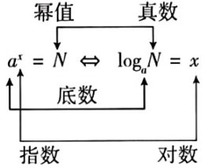

## 讲解

### 是什么

固定$a>0,a\ne1$，对任意正数N，满足$a^x=N$的唯一实数x，叫作以a为底N的对数，记$\log_a N=x$。a是底数，N是真数，x是对数值；对数问的是“这个合法底数要取几次幂才能得到真数”。实数对数允许结果为0或负数，但真数必须正，二者不是同一个对象。

常用对数以10为底，写$\lg N$；自然对数以e为底，写$\ln N$。e是固定无理数，约2.71828，大于1；这两种都是对数的特例，不另换真数范围。$\log_a N$是一个数值，$a^{\log_a N}$又是幂值，不能将对数符号当可直接约去的普通乘法因子。

### 怎么来的

这是逆向记录指数关系的定义。前一节指数函数在全实数域严格单调、值域全部正数，说明每个正N都能得到且只得到一个x；底数1只给恒值1，不能如此唯一反求，负底数也不覆盖任意实指数。

按定义，$a^0=1$推出$\log_a1=0$，$a^1=a$推出$\log_a a=1$。若$x=\log_a N$，定义直接给$a^x=N$，因此$a^{\log_a N}=N$；反过来对任意实r，$a^r>0$且$\log_a(a^r)=r$，依据也是同一底数指数输出的唯一性。

原概述的角色示意图保留，读图时沿底数、指数、幂值分别对应，不把位置当成可任意交换的三个字母。

### 什么时候能用

合法范围内，$a^x=N$与$\log_aN=x$双向等价。求未知真数可转幂，求未知指数可转对数；含嵌套对数时，每一层真数都须正，而内层对数值并非自动正。未知字母出现在底数时还须查它非1；几个条件必须同时满足。

“负数和0没有对数”限于本章实数对数，不能据此否定合法的负对数值。底数小于1仍合法，所得符号与大于1的底数不同：真数大于1时，前者需负指数，后者需正指数。只查一条真数条件，或把真数正误解为对数值正，都会改变定义范围。

### 补足判断依据

对数的符号可以统一从指数0判断：$a^0=1$，所以真数1对应对数0。a>1时，要得到大于1的真数，需要正指数；要得到0与1之间的真数，需要负指数。0<a<1时指数方向相反。这个判断区分了“负的对数值完全合法”和“负真数没有本章实对数”。

## 例题

### 原题 1-1

> 来源ID HSMA-B1-C4-D7cd486b3bd93-P0043；原件 `专题4.3 对数（举一反三讲义）数学人教A版必修第一册（解析版）.docx`；DOCX正文段落 P0043—P0049；答案与详解 P0050—P0054。年份、地区和试题标签沿原资料记载，未独立核实。

**原资料题干与选项：**

【变式1-1】（24-25高一上·全国·课后作业）有下列说法：

①以10为底的对数叫作常用对数；

②任何一个指数式都可以化成对数式；

③以e为底的对数叫作自然对数；

④零和负数没有对数.

其中正确的个数为（  　）

A．1  B．2  C．3  D．4

**原资料答案与详解（完整保留，公式转写为LaTeX）：**

【答案】C

【解题思路】根据对数的相关概念和性质，一一判断每个选项，可得答案.

【解答过程】根据常用对数以及自然对数的概念可知①③正确，根据对数的性质可知④正确，

只有当$a>0$且$a\ne 1$时，指数式${a}^{x}=N$才可以化成对数式，②错误，

故选：C.

**展开解析与核验（依据原详解补足，勘误另标）：**

①是常用对数的定义，③是自然对数的定义，均正确；这里e为固定正且非1的常数。④在本章实数对数范围正确：正底数幂始终正，所以没有实指数能产生0或负输出。

②把互化范围说成“任何”，错误。只有底数正且非1时，指数输出与实指数才一一对应，可以定义其逆向的对数；底数1的幂式不能唯一反求指数，负底数的某些整数幂虽存在，也不属于这一定义。故正确三条，C正确；A、B计数少，D把②也算正确。原④没有讨论复数对数，学生不应由它推断超出本课范围的结论。

### 原题 1-2

> 来源ID HSMA-B1-C4-D7cd486b3bd93-P0055；原件 `专题4.3 对数（举一反三讲义）数学人教A版必修第一册（解析版）.docx`；DOCX正文段落 P0055—P0056；答案与详解 P0057—P0060。年份、地区和试题标签沿原资料记载，未独立核实。

**原资料题干与选项：**

【变式1-2】（24-25高一上·天津西青·期中）${\log }_{4}\left( {\log }_{5}x\right)=0$，则$x=$(    )

A．0  B．1  C．5  D．625

**原资料答案与详解（完整保留，公式转写为LaTeX）：**

【答案】C

【解题思路】利用对数的性质${\log }_{a}1=0$，${\log }_{a}a=1$由内到外进行求值即可.

【解答过程】$\because {\log }_{4}({\log }_{5}x)=0$，$\therefore {\log }_{5}x={4}^{0}=1$，$\therefore x={5}^{1}=5$.

故选：C.

**展开解析与核验（依据原详解补足，勘误另标）：**

先列内外两层合法条件：$x>0$且$\log_5x>0$；由于5大于1，后者等价$x>1$。解题从外层给定的输出0反求外层真数：$\log_5x=4^0=1$，再反求内层真数$x=5^1=5$。代回内层为1正、外层为0，所有条件满足，C正确。

A的0使内层无定义；B的1使内层0，从而外层真数0无定义；D的625使内层4、外层1而非0。原思路说“由内到外求值”，但求未知输入时实际是从外层等式向内层反解；验算才按内层到外层。

### 原题 2-3

> 来源ID HSMA-B1-C4-D7cd486b3bd93-P0094；原件 `专题4.3 对数（举一反三讲义）数学人教A版必修第一册（解析版）.docx`；DOCX正文段落 P0094—P0098；答案与详解 P0099—P0107。年份、地区和试题标签沿原资料记载，未独立核实。

**原资料题干与选项：**

【变式2-3】（24-25高一上·上海·随堂练习）将下列指数式与对数式互化．

(1)${5}^{3}=125$；

(2)${4}^{-2}=\frac{1}{16}$；

(3)${\log }_{\frac{1}{2}}8=-3$；

(4)${\log }_{3}\frac{1}{27}=-3$．

**原资料答案与详解（完整保留，公式转写为LaTeX）：**

【答案】(1)${\log }_{5}125=3$

(2)${\log }_{4}\frac{1}{16}=-2$

(3)${\left( \frac{1}{2}\right)}^{-3}=8$

(4)${3}^{-3}=\frac{1}{27}$

【解题思路】根据指数式和对数式的互换公式${a}^{b}=N\Leftrightarrow {\log }_{a}N=b$直接得出答案.

【解答过程】（1）${5}^{3}=125\Leftrightarrow {\log }_{5}125=3$；

（2）${4}^{-2}=\frac{1}{16}\Leftrightarrow {\log }_{4}\frac{1}{16}=-2$；

（3）${\log }_{\frac{1}{2}}8=-3\Leftrightarrow {\left( \frac{1}{2}\right)}^{-3}=\frac{1}{8}$；

（4）${\log }_{3}\frac{1}{27}=-3\Leftrightarrow {3}^{-3}=\frac{1}{27}$.

**展开解析与核验（依据原详解补足，勘误另标）：**

（1）$5^3=125$等价$\log_5 125=3$；（2）$4^{-2}=1/16$等价$\log_4(1/16)=-2$。负指数对应倒数，原幂值必须完整移入真数。

（3）$\log_{1/2}8=-3$等价$(1/2)^{-3}=8$。**原书详解排字错误：** 第4页过程将右边写成1/8，与负指数含义相反；原答案写8正确，原错行完整保留并纠正。

（4）$\log_3(1/27)=-3$等价$3^{-3}=1/27$。四个底数都正非1、真数都正，互化在定义允许范围内是双向等价。

## 易错

- 指数式的底数、指数、幂值换位，互化成另一条关系。
- 只给真数正，忘记底数正且非1。
- 把对数值0误当真数0，或把合法负结果删除。
- 嵌套对数只检查最内层输入，外层把内层值当真数也要正。
