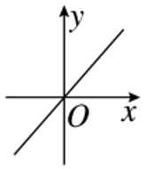
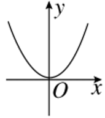
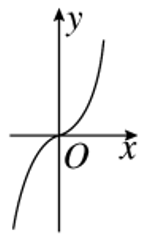
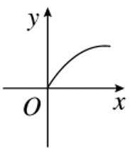
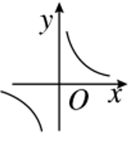
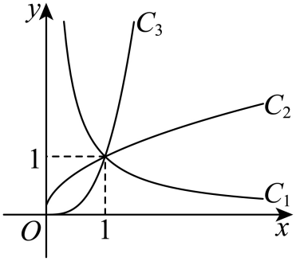
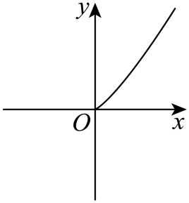
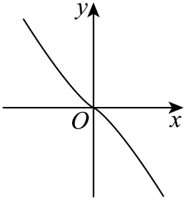
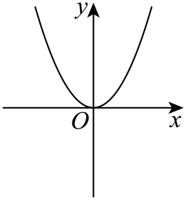
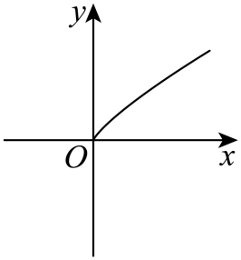

## 讲解
### 是什么
幂函数图象是满足$y=x^\alpha$的全部合法点。它在第一象限总经过$(1,1)$。正指数经过原点；负指数不经过原点；零指数是$y=1$且去掉$(0,1)$。其他象限是否出现图象，先看根式定义域和奇偶性，不能只看一段曲线的形状。

### 怎么来的
正输入取$0<x<1$或$x>1$时，以直线$y=x$为参照，有
$$\frac{x^\alpha}{x}=x^{\alpha-1}.$$
若$\alpha>1$，指数$\alpha-1>0$：在$x>1$处比值大于1，所以图象在$y=x$上方；在$0<x<1$处比值小于1，所以图象在其下方。若$0<\alpha<1$，比值的指数为负，位置正好相反。若$\alpha<0$，输出始终正但随正输入增大而减小；与递增候选容易区分。若$\alpha=1$，图象就是参照直线。

这些判断来自幂的大小关系，比只记“上凸”“下凸”更明确。曲率的严格微积分证明属于后续内容，本条不拿示意弯曲当作证明。读原题已标定的标准候选图时，可以据定义域、单调性和与参照线的位置排除。

原资料中的五种标准图如下，按次序对应$x$、$x^2$、$x^3$、$x^{1/2}$、$x^{-1}$；图只示意形状，具体大小关系由解析式核验。

| 函数 | 原图 | 自然定义域及方向 |
| --- | --- | --- |
| $y=x$ |  | $\mathbb R$，全域递增 |
| $y=x^2$ |  | $\mathbb R$，负侧递减，正侧递增 |
| $y=x^3$ |  | $\mathbb R$，全域递增 |
| $y=\sqrt{x}$ |  | $[0,+\infty)$，递增 |
| $y=1/x$ |  | 非零实数，两侧各递减 |

### 什么时候能用
先据定义域判断是否有负侧，再据奇偶性判断负侧是轴反射还是中心反射。第一象限内，负指数递减、零指数水平、正指数递增；正指数再按小于1、等于1、大于1分类。若只知道“递增”，不能区分$1/2$与3。若只知道“过$(1,1)$”，甚至不能区分正、负与零指数。

两个指数不同的幂函数在正输入处共同点只能有$(1,1)$：$x^\alpha=x^\beta$使$x^{\alpha-\beta}=1$，非零指数在正侧只有$x=1$能给1。若负侧都允许，反射后也只能在$x=-1$相交；零点则只有两指数都正时才共有。因此“最多三个公共点”必须加“指数不同、函数不同”的前提。同一个函数和自己当然有无限多个共同点。这个上界不意味着三点一定同时存在。

### 图象提供什么信息，代数依据就检查什么

原知识P164把 $1/x$ 在正半轴列为增函数，原页的字面说法保留在资料提取中；规范表纠正为减函数。取任意0<u<v，$1/u-1/v=(v-u)/(uv)>0$，已按定义证明方向，不能因为原表排了“增”就照抄。

原知识P191说“任何两个幂函数最多三个公共点”，必须补指数不同。若 α≠β，正输入的等值方程可除以正值 $x^\beta$，得到 $x^{\alpha-\beta}=1$，非零指数的正侧严格单调使唯一正输入为1。允许负输入时取绝对值，$|x|^\alpha=|x|^\beta$又迫使|x|=1，还要比较两式在−1的符号是否一致；两个正指数才可能同有原点。两条相同函数不是这个结论的对象。

原图题的弯曲术语容易混淆。本条先用正侧增减、与参照线的位置或两条候选曲线的相对顺序说明，再对应原题明确给出的标准图，不从画线粗细、像素斜率或未标注的坐标推导精确数值。

## 例题

### 原题 6-0

> 来源ID HSMA-B1-C3-Dc8f3ca8ed219-P0286；原件 `专题3.4 幂函数（举一反三讲义）数学人教A版必修第一册（解析版）.docx`；DOCX正文段落 P0286—P0289；答案与详解 P0290—P0295。年份、地区和试题标签沿原资料记载，未独立核实。

**原资料题干与选项：**

【例6】（24-25高一上·湖北武汉·阶段练习）图中${C}_{1}$、${C}_{2}$、${C}_{3}$为三个幂函数$y={x}^{\alpha }$在第一象限内的图象，则指数$\alpha $的值依次可以是（   ）

A．$\frac{1}{2}$，3，$-1$  B．$-1$，3，$\frac{1}{2}$

C．$\frac{1}{2}$，$-1$，3  D．$-1$，$\frac{1}{2}$，3

**原资料答案与详解（完整保留，公式转写为LaTeX）：**

【答案】D

【解题思路】结合图象及幂函数的性质判断即可.

【解答过程】由图可知，${C}_{1}$：在第一象限内单调递减，则指数$\alpha $的值满足$\alpha <0$；

${C}_{2}$：在第一象限内单调递增，且图象呈现上凸趋势，则指数$\alpha $的值满足$0<\alpha <1$；

${C}_{3}$：在第一象限内单调递增，且图象呈现下凸趋势，则指数$\alpha $的值满足$\alpha >1$.

故选：D.

**展开解析与核验（依据原详解补足，勘误另标）：**

**看到什么、想到什么：** 原图标明三个幂函数在第一象限的曲线、共同点(1,1)，四项只使用候选指数−1、1/2、3。先辨减曲线，再比较两增曲线在共同点两侧的次序，避免只背弯曲词。

C₁随正输入增大而下降，所以候选指数只能是−1；指数1/2、3均为正，不能对应它。这样A、C的第一项1/2立即排除。

对剩下两正候选，在x>1时比较：

$$
\frac{x^3}{x^{1/2}}=x^{5/2}>1;
$$

在0<x<1时，正指数幂小于1，所以同一比值<1。这些大小关系来自正幂在正侧增且1处为1。原图C₃在x>1时高于C₂，在0<x<1时低于C₂，正符合C₃=x³、C₂=x^(1/2)，不符合两者调换。

**逐项核验：** A、C第一项方向错；B第一项−1虽对，却把两条增曲线的候选互换；D依次−1、1/2、3，三条都一致，选D。

**如何检验：** 只判断候选“可以是”，不从一幅示意图确定所有可能的精确指数。原解弯曲术语由上述两侧相对顺序解释；共同点(1,1)由解析式独立确认，不靠量像素或角度。

### 原题 6-1

> 来源ID HSMA-B1-C3-Dc8f3ca8ed219-P0296；原件 `专题3.4 幂函数（举一反三讲义）数学人教A版必修第一册（解析版）.docx`；DOCX正文段落 P0296—P0298；答案与详解 P0299—P0303。年份、地区和试题标签沿原资料记载，未独立核实。

**原资料题干与选项：**

【变式6-1】（24-25高一上·上海奉贤·期中）下列图象中，最符合函数$y={x}^{\frac{5}{4}}$的图象的是（   ）

A．  B．

C．  D．

**原资料答案与详解（完整保留，公式转写为LaTeX）：**

【答案】A

【解题思路】根据幂函数的图象判断即可.

【解答过程】由$y={x}^{\frac{5}{4}}=\sqrt[4]{{x}^{5}}$，函数的定义域为$\left[ 0,+\infty \right)$，排除BC，

因为$\frac{5}{4}>1$，所以函数$y={x}^{\frac{5}{4}}$的图象呈现下凸的趋势，排除D.

故选：A.

**展开解析与核验（依据原详解补足，勘误另标）：**

**看到什么、想到什么：** 指数5/4正且分母偶，先确定图象存在的输入范围；再用指数与1的比较核验正侧形状。

x^(5/4)=⁴√(x⁵)，偶次根要求x⁵≥0；五次幂保持符号，所以x≥0。0合法且输出0，正输入输出正，图象只在第一象限和原点存在。B有负输入段且正侧输出负，C也有负输入段，均与完整定义域不合。

在正侧，

$$
\frac{f(x)}x=x^{5/4-1}=x^{1/4}.
$$

四次根在正侧严格增，故从原点到曲线点的比值随x增大而增大；0<x<1时曲线在y=x下方，x>1时在其上方，与指数介于0、1时的标准根曲线趋势相反。A是原题给出的越向右越陡的正侧标准曲线，D则是趋缓的根曲线形状，不符合5/4的性质。

**逐项核验：** A满足输入范围、原点、正侧增和大于1指数的方向；B、C因非法负输入排除，D因正侧形状排除，原答案A保持。这里按题目提供的标准图作性质匹配，不以未标注点的高度或像素斜率计算精确值；弯曲的完整微积分证明属于后续内容。

## 易错

- 只看“递增”就定指数为大于1：0<α<1也递增，需要其他图象信息。
- 把幂函数共同点(1,1)当成唯一指数信息：所有指数都满足这个点。
- 说两个幂函数最多三交点却允许两式相同：先加指数不同，再逐个核验0、±1是否合法及输出一致。
- 用示意图粗细决定端点或数值：这些结论回到定义域、原标记和解析式；1/x正侧“增”的原表错误已纠正。
