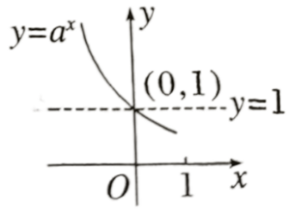
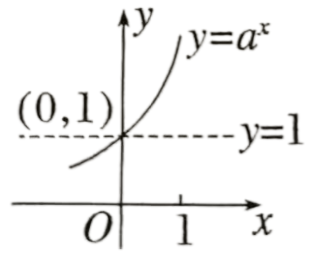
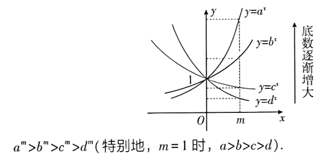

## 讲解

### 是什么

对$y=a^x$，a为固定正常数且非1，定义域$\mathbb R$、值域$(0,+\infty)$，图象总过(0,1)，没有与x轴的交点。a大于1时全域严格递增；a在0与1之间时全域严格递减。0是输出可趋近的界，不是函数某处能取的值。

原概述的两种图完整保留，坐标与定点都是说明性质的部分。

### 怎么来的

幂值正说明图象在x轴上方；非零底数零次幂给公共点。为解释严格单调，任取$x_1<x_2$，令$h=x_2-x_1>0$，幂法则给
$$\frac{a^{x_2}}{a^{x_1}}=a^h.$$
分母正可除。a大于1时正h使$a^h>1$，因此后输出严格大；a在0与1之间时$a^h<1$，因此后输出严格小。正实指数的这一性质与前一节正根、有理指数及实数指数推广衔接，不把有理证明直接冒充完整无理指数构造。

由$x=0$的输出1及单调性，可判断与1的关系：a大于1时，x负给$0<a^x<1$，x正给$a^x>1$；a小于1时顺序反向。趋向一端时可用整数幂越来越大、其倒数越来越小解释无界与趋近0；连续性与这些端部性质使每个正输出能取到。这里沿用高中实数指数函数的连续性基本性质，不虚构其严格极限证明。

底数比较要固定同一个指数。对同一$x>0$，正底数越大输出越大，因为此时底数是幂函数$t^x$的输入，正指数保持次序；对$x<0$则次序反向；x为0时所有输出相同。原概述比较图的m是正横坐标，只在右半平面可以说“底大图高”。

倒数底数满足$(1/a)^x=a^{-x}$，所以这两条指数曲线关于y轴对称；它们不一定关于x轴对称，输出仍都正。

### 什么时候能用

比较同底数幂、解指数不等式、判断底数范围及筛图。用定点、增减方向、输出正性、同横坐标高低逐条核图；需要比较两个底数时先辨图中底数究竟是a还是1/a。

题设只给一部分图象时，只读它确实显示的特征；不能据局部走势推未知函数全域性质。图中未标注的坐标、斜率数值不得从绘图比例补造。图象比高低时所比较的横坐标必须相同，正负两侧使用不同方向。

## 例题

### 原题 4-0

> 来源ID HSMA-B1-C4-D51076550c7bd-P0174；原件 `专题4.2 指数函数（举一反三讲义）数学人教A版必修第一册（解析版）.docx`；DOCX正文段落 P0174—P0175；答案与详解 P0176—P0180。年份、地区和试题标签沿原资料记载，未独立核实。

**原资料题干与选项：**

【例4】（24-25高一上·吉林长春·期中）已知$a={2}^{0.3}$，$b={4}^{0.1}$，$c={\left( \frac{1}{3}\right)}^{0.2}$，则三个数的大小关系是（    ）

A．$a>b>c$  B．$b>a>c$  C．$b>c>a$  D．$c\ge a>b$

**原资料答案与详解（完整保留，公式转写为LaTeX）：**

【答案】A

【解题思路】根据给定条件，利用指数函数性质比较大小即得.

【解答过程】依题意，$b={({2}^{2})}^{0.1}={2}^{0.2}<{2}^{0.3}=a$，$c={(\frac{1}{3})}^{0.2}<{(\frac{1}{3})}^{0}=1$，$b={4}^{0.1}>{4}^{0}=1$，

所以$a>b>c$.

故选：A.

**展开解析与核验（依据原详解补足，勘误另标）：**

先观察a、b可统一到同一底数：$b=4^{0.1}=(2^2)^{0.1}=2^{0.2}$。底数2大于1，$0.3>0.2$使a大于b。c底数1/3在0与1之间、指数0.2正，故$c<1$；b底数4大于1、指数正，故$b>1$。连接$a>b>1>c$，A正确。B、C都把a与b排反；D把c放到最大，与$c<1<a$冲突。这里统一底数与中间值1各解决一段比较，没有仅凭小数直觉排列。

### 原题 4-3

> 来源ID HSMA-B1-C4-D51076550c7bd-P0200；原件 `专题4.2 指数函数（举一反三讲义）数学人教A版必修第一册（解析版）.docx`；DOCX正文段落 P0200—P0202；答案与详解 P0203—P0208。年份、地区和试题标签沿原资料记载，未独立核实。

**原资料题干与选项：**

【变式4-3】（25-26高一上·全国·单元测试）若$a={0.5}^{0.2},b={0.25}^{-1},c={0.5}^{-0.5}$，则（   ）

A．$a>b>c$  B．$b>a>c$

C．$b>c>a$  D．$c>a>b$

**原资料答案与详解（完整保留，公式转写为LaTeX）：**

【答案】C

【解题思路】根据指数函数的单调性比较大小即可.

【解答过程】由$b={0.25}^{-1}={\left( {0.5}^{2}\right)}^{-1}={0.5}^{-2}$，

因为$y={0.5}^{x}$在$R$上单调递减，且$-2<-0.5<0.2$，

所以$b>c>a$．

故选：C.

**展开解析与核验（依据原详解补足，勘误另标）：**

将b改成同底数：$b=0.25^{-1}=(0.5^2)^{-1}=0.5^{-2}$，c为$0.5^{-0.5}$，a为$0.5^{0.2}$。指数$-2<-0.5<0.2$，底数0.5小于1，输出顺序反向，故$b>c>a$，C正确。A把a排第一，B把a放c前，D把b排末，分别违反已证的比较。负指数仍给正幂值，b实际上为4而不是−0.25。

### 原题 6-1

> 来源ID HSMA-B1-C4-D51076550c7bd-P0270；原件 `专题4.2 指数函数（举一反三讲义）数学人教A版必修第一册（解析版）.docx`；DOCX正文段落 P0270—P0272；答案与详解 P0273—P0279。年份、地区和试题标签沿原资料记载，未独立核实。

**原资料题干与选项：**

【变式6-1】（25-26高一上·全国·课前预习）已知函数$y={a}^{x}$（$a>0$，且$a\ne 1$）与函数$y={\left( \frac{1}{b}\right)}^{x}$（$b>0$，且$b\ne 1$）的图象如图所示，则（   ）

A．$a>b>1$  B．$a>1>b>0$  C．$b>1>a>0$  D．$b>a>1$

**原资料答案与详解（完整保留，公式转写为LaTeX）：**

【答案】A

【解题思路】由指数函数的图象与性质可得$a>1$，$b>1$.再根据函数$y={\left( \frac{1}{b}\right)}^{x}$（$b>0$，且$b\ne 1$）与函数$y={b}^{x}$（$b>0$，且$b\ne 1$）的图象的对称性，数形结合即可求解.

【解答过程】由图得$a>1$，$0<\frac{1}{b}<1$，所以$b>1$.

因为函数$y={\left( \frac{1}{b}\right)}^{x}$（$b>0$，且$b\ne 1$）的图象与函数$y={b}^{x}$（$b>0$，且$b\ne 1$）的图象关于$y$轴对称，如图所示，

由图可知：${a}^{1}>{b}^{1}$，则$a>b>1$.

故选：A.

**展开解析与核验（依据原详解补足，勘误另标）：**

原a底数曲线递增，故$a>1$；原1/b底数曲线递减，故$0<1/b<1$、$b>1$。这已排B与C。要比较a、b，不能直接把原两条曲线的右侧高度当成a和b，因为递减曲线的底数是1/b。

由$b^{-x}=(1/b)^x$，将这条原曲线关于y轴反射，得到$b^x$；原详解提供的反射配图完整保留。在同一正横坐标处，该反射曲线低于$a^x$曲线，所以用正指数幂随底数递增的性质得到$b<a$。A正确，D将两底数高低反排。这里读的是题图表达的同横坐标输出顺序；没有把示意图斜率数值当作某个精确底数。

## 易错

- 0与1之间的底数仍按递增比较，反了所有不等号。
- 将渐近x轴当成某输入能使幂值为0。
- 在负横坐标也套“底大图高”。
- 对倒数底数的曲线直接比较a与b，不先反射或取倒数。
