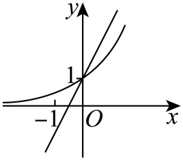
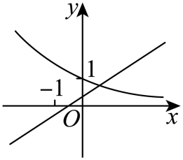
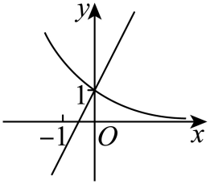
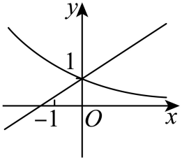
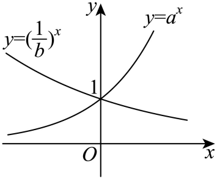
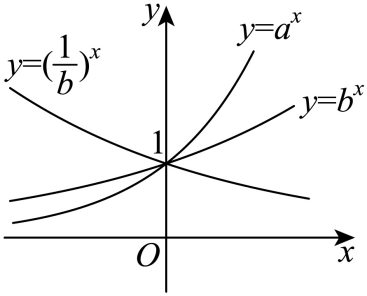

## 讲解

### 判据

题目给指数曲线候选图、要求比较底数，或把指数函数与同一参数的一次函数同画，适合将定义产生的必备特征组合核对。只看其中一条曲线像不像会漏掉共享参数的矛盾。

### 流程

1. 按每个实际表达式求定点、定义域、输出范围。标准指数过(0,1)，有平移的候选先计算真实截距与水平界，不能直接套标准点。
2. 根据指数曲线增减确定实际底数大于1还是介于0与1。若图中底数是1/a，这一步给的是1/a的范围，再换回a，不能直接写a的同样范围。
3. 将同一参数范围接回另一条曲线，例如一次式的系数与零点位置。使用图中明确标注的坐标和顺序，不按线条角度估算数值。
4. 比较两个正底数时，选同一正横坐标，利用正指数幂随底数增的性质读高低；负横坐标反向。倒数底数先取倒数或作原图关于y轴的对应反射。
5. 每个选项同时满足所有条件才保留。原图只给一部分时，仅用可见特征筛候选，不声称未知函数全域已被证明。
6. 核对答案是否唯一：某选项只陈述完整次序的一部分，也可能是真的。若原单选有两个真项，保留原说法并指出，而不强行按详解排除一个真命题。

## 例题

### 原题 6-0

> 来源ID HSMA-B1-C4-D51076550c7bd-P0260；原件 `专题4.2 指数函数（举一反三讲义）数学人教A版必修第一册（解析版）.docx`；DOCX正文段落 P0260—P0262；答案与详解 P0263—P0269。年份、地区和试题标签沿原资料记载，未独立核实。

**原资料题干与选项：**

【例6】（24-25高一上·山西吕梁·期末）已知$a>0$且$a\ne 1$，则在同一直角坐标系中，函数$y=ax+1$和$y={\left( \frac{1}{a}\right)}^{x}$的图象可能是（    ）

A．  B．

C．  D．

**原资料答案与详解（完整保留，公式转写为LaTeX）：**

【答案】C

【解题思路】易得两个函数的图象都经过定点$\left( 0,1\right)$，即可排除B；再分$0<a<1$和$a>1$两种情况讨论即可得解.

【解答过程】题目所给的两个函数的图象都经过定点$\left( 0,1\right)$，故B错误；

因为$a>0$且$a\ne 1$，所以$y=ax+1$为增函数，

当$0<a<1$时，$y={\left( \frac{1}{a}\right)}^{x}$为增函数，此时$y=ax+1$的零点$-\frac{1}{a}<-1$，故A错误；

当$a>1$时，$y={\left( \frac{1}{a}\right)}^{x}$为减函数，此时$y=ax+1$的零点$-\frac{1}{a}\in \left( -1,0\right)$，故C正确，D错误.

故选：C.

**展开解析与核验（依据原详解补足，勘误另标）：**

两图首先都应过(0,1)，且直线因a正一直递增，直线零点是$-1/a$。B的直线未过(0,1)，先排。再共用同一参数分类：$0<a<1$时指数底数1/a大于1，曲线应递增，同时直线零点应小于−1；A虽画两者递增，直线零点却在−1与0之间，矛盾。a大于1时曲线递减，同时零点在(−1,0)，C两项吻合。D曲线递减要求a大于1，却把直线零点画在−1左侧，矛盾。原图的−1、0标记是判据；不凭画出的倾斜角估算一个具体a。选C。

### 原题 6-1

> 来源ID HSMA-B1-C4-D51076550c7bd-P0270；原件 `专题4.2 指数函数（举一反三讲义）数学人教A版必修第一册（解析版）.docx`；DOCX正文段落 P0270—P0272；答案与详解 P0273—P0279。年份、地区和试题标签沿原资料记载，未独立核实。

**原资料题干与选项：**

【变式6-1】（25-26高一上·全国·课前预习）已知函数$y={a}^{x}$（$a>0$，且$a\ne 1$）与函数$y={\left( \frac{1}{b}\right)}^{x}$（$b>0$，且$b\ne 1$）的图象如图所示，则（   ）

A．$a>b>1$  B．$a>1>b>0$  C．$b>1>a>0$  D．$b>a>1$

**原资料答案与详解（完整保留，公式转写为LaTeX）：**

【答案】A

【解题思路】由指数函数的图象与性质可得$a>1$，$b>1$.再根据函数$y={\left( \frac{1}{b}\right)}^{x}$（$b>0$，且$b\ne 1$）与函数$y={b}^{x}$（$b>0$，且$b\ne 1$）的图象的对称性，数形结合即可求解.

【解答过程】由图得$a>1$，$0<\frac{1}{b}<1$，所以$b>1$.

因为函数$y={\left( \frac{1}{b}\right)}^{x}$（$b>0$，且$b\ne 1$）的图象与函数$y={b}^{x}$（$b>0$，且$b\ne 1$）的图象关于$y$轴对称，如图所示，

由图可知：${a}^{1}>{b}^{1}$，则$a>b>1$.

故选：A.

**展开解析与核验（依据原详解补足，勘误另标）：**

原a底数曲线递增，故$a>1$；原1/b底数曲线递减，故$0<1/b<1$、$b>1$。这已排B与C。要比较a、b，不能直接把原两条曲线的右侧高度当成a和b，因为递减曲线的底数是1/b。

由$b^{-x}=(1/b)^x$，将这条原曲线关于y轴反射，得到$b^x$；原详解提供的反射配图完整保留。在同一正横坐标处，该反射曲线低于$a^x$曲线，所以用正指数幂随底数递增的性质得到$b<a$。A正确，D将两底数高低反排。这里读的是题图表达的同横坐标输出顺序；没有把示意图斜率数值当作某个精确底数。

## 易错

- 指数底数为1/a，却把增减条件直接给a。
- 图上不同横坐标高度直接比较底数。
- 两图各自可能，却不能共享同一个参数。
- 局部图当成未知函数的完整定义域或全域走势。
