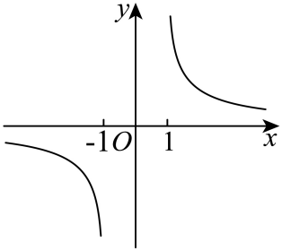
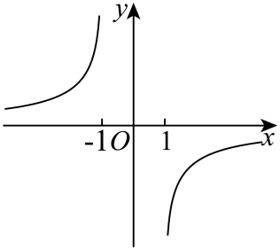
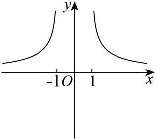
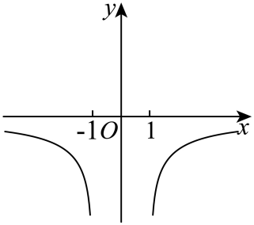
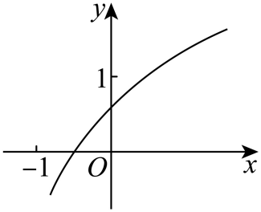
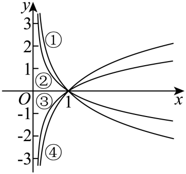

## 讲解

### 判据

题给对数型解析式与几幅候选图，或同图画出不同底的曲线，适合用原式的域、定点、符号和共享参数逐项排除。图上明确标出的点与区间可作条件；曲线倾角、未标的高度和绘图比例不能自动视为精确数据。

### 流程

1. 求原域与禁值边界，判断有几支、能否跨纵轴。标准函数仅在x>0；分式真数可产生两个分支，不能照搬标准正侧图。
2. 代可用定点或由真数=1求零点；标准函数与y=1的交点横坐标为底。原图仅说明交点在某区间，就推参数区间，不造一个精确点。
3. 按原域证明输出符号及奇偶性或反射关系；奇性先查域对称，两个倒数底的标准图是x轴反射，指对反函数图是y=x反射，二者分清。
4. 固定同一横坐标比较多底曲线高度，或用同一y=1横线读底；用完整曲线延续确认编号，而非只看编号旁某段的符号。
5. 对每个候选指出具体冲突，余下候选再核查方向与共享参数能否同时满足。局部示意图不能直接推出题式未保证的全域性质；两断开的支分别单调也须另查跨支比较。

### 补足判断依据

读多个标准图象的底数时，固定y=1最省条件，因为$\log_a x=1$按定义给x=a。不同曲线在同一水平线上的左右顺序直接就是各底数的顺序。若改为固定x看高度，则分子$\ln x$的正负会改变排序，须先说明横坐标位于1的哪一侧。

## 例题

### 原题 6-0

> 来源ID HSMA-B1-C4-D691361d63db8-P0304；原件 `专题4.4 对数函数（举一反三讲义）数学人教A版必修第一册（解析版）.docx`；DOCX正文段落 P0304—P0306；答案与详解 P0307—P0312。年份、地区和试题标签沿原资料记载，未独立核实。

**原资料题干与选项：**

【例6】（24-25高一上·安徽亳州·期末）函数$f\left( x\right)=\ln \left( 1+\frac{2}{x-1}\right)$的图象大致为（    ）

A．  B．  

C．  D．

**原资料答案与详解（完整保留，公式转写为LaTeX）：**

【答案】A

【解题思路】根据题意，由函数$f\left( x\right)=\ln \left( 1+\frac{2}{x-1}\right)$的奇偶性排除两个选项，再利用$x=2$时函数值为正即可判断.

【解答过程】因$f\left( x\right)=\ln \frac{x+1}{x-1}$，由$\frac{x+1}{x-1}>0$可得$x\in (-\infty ,-1)\cup (1,+\infty )$，显然关于原点对称，

且$f\left( -x\right)=-\ln \frac{x+1}{x-1}=-f\left( x\right)$，所以$f\left( x\right)$是奇函数，故C，D错误；

又因为$f\left( 2\right)=\ln 3>0$．故可排除B项，A项符合要求．

故选：A.

**展开解析与核验（依据原详解补足，勘误另标）：**

先求真数$1+2/(x-1)=(x+1)/(x-1)$，分母须非零且整商正，得域$(-\infty,-1)\cup(1,\infty)$。域关于0对称；对域内x，$f(-x)=\ln[(x-1)/(x+1)]=-f(x)$，所以图象关于原点对称。x>1时真数大于1，f正；x<−1时真数在0与1之间，f负。

据这些题式结论逐项对照原图：A右支正、左支负且中心对称，吻合；B把两侧符号倒置；C两支均正，不是所需奇对称；D两支均负，也不合。故A。每一侧真数$1+2/(x-1)$递减，外层ln递增，故各侧f递减；这里不能把两段并集宣称全域递减，因为左侧输出负、右侧输出正，跨段由左到右反而升高。两条禁值边界是−1与1，也不能只查分母x≠1。

### 原题 6-1

> 来源ID HSMA-B1-C4-D691361d63db8-P0313；原件 `专题4.4 对数函数（举一反三讲义）数学人教A版必修第一册（解析版）.docx`；DOCX正文段落 P0313—P0316；答案与详解 P0317—P0324。年份、地区和试题标签沿原资料记载，未独立核实。

**原资料题干与选项：**

【变式6-1】（24-25高一上·福建泉州·期末）函数$f\left( x\right)={\log }_{a}\left( x+b\right)(a>0$且$a\ne 1)$的图象如图所示，则必有（    ）

A．$a>1,1<b<2$  B．$0<a<1,1<b<2$

C．$a>1,-2<b<-1$  D．$0<a<1,-2<b<-1$

**原资料答案与详解（完整保留，公式转写为LaTeX）：**

【答案】A

【解题思路】根据对数函数的知识以及图象来确定正确答案.

【解答过程】由图象可知，$f\left( x\right)$在定义域上单调递增，而$y=x+b$是增函数，

根据复合函数单调性同增异减可知，$a>1$，

$f\left( 0\right)={\log }_{a}b\in \left( 0,1\right)$，所以$1<b<a$，$-b<-1$，

由图可知当$y=0$时，$x+b=1,x=1-b\in \left( -1,0\right),-b\in \left( -2,-1\right),b\in \left( 1,2\right)$，

所以A选项正确.

故选：A.

**展开解析与核验（依据原详解补足，勘误另标）：**

图示曲线随x增大而上升；内层x+b严格递增，故合法底数必须a>1。设与横轴交点横坐标r，原图明确它在−1与0之间。零输出等价$x+b=1$，所以r=1−b，$-1<1-b<0$得$1<b<2$。因此A正确；B、D底小于1应下降；C的b在负区间，与已求b正且大于1冲突。图中纵轴截距又在0与1之间，只能补出$0<\log_a b<1$、即$1<b<a$，不能根据示意高度给a或b一个精确数值。

### 原题 6-2

> 来源ID HSMA-B1-C4-D691361d63db8-P0325；原件 `专题4.4 对数函数（举一反三讲义）数学人教A版必修第一册（解析版）.docx`；DOCX正文段落 P0325—P0327；答案与详解 P0328—P0334。年份、地区和试题标签沿原资料记载，未独立核实。

**原资料题干与选项：**

【变式6-2】（24-25高一上·广东茂名·期末）如图，①②③④中不属于函数$y={\log }_{\frac{1}{2}}x, y={\log }_{2}x, y={\log }_{3}x$的一个是（    ）

A．①  B．②  C．③  D．④

**原资料答案与详解（完整保留，公式转写为LaTeX）：**

【答案】B

【解题思路】根据对数函数的图象性质与底数之间的关系判断即可.

【解答过程】根据题意函数$y={\log }_{\frac{1}{2}}x, y={\log }_{2}x, y={\log }_{3}x$中两个底数$a>1$，图象单调递增，故③，④满足题意.

根据增长规律，“在定点右边，顺时针底数越来越大”，知道③对应$y={\log }_{3}x$，④对应$y={\log }_{2}x$.

由于函数$y={\log }_{\frac{1}{2}}x=-{\log }_{2}x$，则它与$y={\log }_{2}x$关于x轴对称，且①与④关于x轴对称.故函数$y={\log }_{\frac{1}{2}}x$图象为①.

则②不属于函数$y={\log }_{\frac{1}{2}}x, y={\log }_{2}x, y={\log }_{3}x$的一个.

故选：B.

**展开解析与核验（依据原详解补足，勘误另标）：**

四条原曲线都在x正侧经过(1,0)。底1/2的曲线递减，底2和3的曲线递增。固定取同一横坐标x>1，分子$\ln x>0$，而$\ln2<\ln3$，所以$\log_2x>\log_3x$；依原图延续同一曲线，右侧较高的上升支为④，较低为③。再用$\log_{1/2}x=-\log_2x$，其曲线应为④关于x轴的反射，即①。

因此①属于底1/2、③属于底3、④属于底2；②不属于题列三个函数，选B。A、C、D分别排除①、③、④，均错误。图中编号靠左侧放置，须沿曲线识别两侧，不能把编号旁的局部正负误认作函数在x>1侧的正负。

### 原题 6-3

> 来源ID HSMA-B1-C4-D691361d63db8-P0335；原件 `专题4.4 对数函数（举一反三讲义）数学人教A版必修第一册（解析版）.docx`；DOCX正文段落 P0335—P0337；答案与详解 P0338—P0342。年份、地区和试题标签沿原资料记载，未独立核实。

**原资料题干与选项：**

【变式6-3】（24-25高一·全国·课后作业）如图所示的曲线是对数函数$y={\log }_{a}x$，$y={\log }_{b}x$，$y={\log }_{c}x$，$y={\log }_{d}x$的图象，则a，b，c，d，1的大小关系为（    ）

A．b>a>1>c>d  B．a>b>1>c>d  C．b>a>1>d>c  D．a>b>1>d>c

**原资料答案与详解（完整保留，公式转写为LaTeX）：**

【答案】C

【解题思路】根据对数函数的图象性质即可求解.

【解答过程】由图可知a>1，b>1，0<c<1，0<d<1．

过点$\left( 0,1\right)$作平行于x轴的直线，则直线与四条曲线交点的横坐标从左到右依次为c，d，a，b，显然b>a>1>d>c．

故选：C．

**展开解析与核验（依据原详解补足，勘误另标）：**

对每个标准对数函数，$\log_a a=1$，所以与同一水平线y=1交点的横坐标就是底数a。原图这条水平线的交点从左到右为c、d、a、b；下降的两条对应0<c,d<1，上升的两条对应a,b>1。故$0<c<d<1<a<b$，反写$b>a>1>d>c$，C正确。A把c、d反置；B既把a、b反置又把c、d反置；D把a、b反置。排序依据是标出的共同行y=1及对数恒等式，不是测量曲线倾角或图上长度。

## 易错

- 只查一个分母禁值，遗漏对数真数的另一个零边界。
- 用曲线角度或比例读取未标明的参数。
- 将互为倒数底的反射与指对反函数的反射认作同一条轴。
