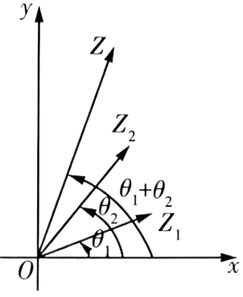
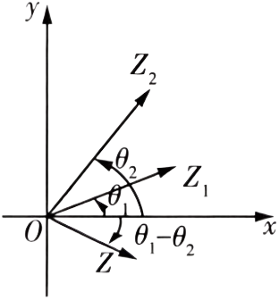

## 讲解

### 是什么

设非零复数 $z_1=r_1(\cos\theta_1+i\sin\theta_1)$、$z_2=r_2(\cos\theta_2+i\sin\theta_2)$，$r_1,r_2>0$。乘法是模相乘、辐角相加；除法是模相除、辐角相减：

$$\begin{aligned}
z_1z_2&=r_1r_2[\cos(\theta_1+\theta_2)+i\sin(\theta_1+\theta_2)],\\
\frac{z_1}{z_2}&=\frac{r_1}{r_2}[\cos(\theta_1-\theta_2)+i\sin(\theta_1-\theta_2)].
\end{aligned}$$

这里相加相减得到一个辐角；若要求主值，还需按 $[0,2\pi)$ 归一，主值的和不一定本身是积的主值。除数必须非零；不要求两个复数不同。

### 怎么来的

先按代数乘法展开括号。因i²=−1，实部为 $r_1r_2(\cos\theta_1\cos\theta_2-\sin\theta_1\sin\theta_2)$，虚部系数为 $r_1r_2(\sin\theta_1\cos\theta_2+\cos\theta_1\sin\theta_2)$。分别使用余弦和角、正弦和角公式，才得到上面的乘法式。

当z₂非零时，将 $z_2$ 乘以 $(1/r_2)(\cos\theta_2-i\sin\theta_2)$，括号积因平方和为1而得到1，因此该因子是 $1/z_2$。把负正弦改为 $\sin(-\theta_2)$，再乘z₁，用乘法式得到商的公式。

### 什么时候能用

固定乘数 $q=s(\cos\alpha+i\sin\alpha)$ 且s>0，映射 $z\mapsto qz$ 把非零位置向量绕原点旋转α，再将长度伸缩为s倍；α正取逆时针、负取顺时针。s=1是纯旋转。除以q则旋转−α、伸缩为1/s倍。旋转伸缩顺序可交换，因为两种操作都以同一原点为中心。

上图来源 Dfa815e8c632b-P0195（乘法）、P0202（除法），是所给讲义的原图。公式适用于z₁=0时得到0，但这时不能谈输出向量的方向；q=0的乘法把所有点压到原点，不是普通旋转伸缩，除以0不成立。若绕别的中心c旋转，需要先平移到原点，式为 $c+q(z-c)$，不能仍只乘q。

## 易错

- 两个复数对应向量的夹角不是辐角简单相加；乘法才加，向量夹角要比较方向差。
- 来源 Dfa815e8c632b-P0198 的 image20 原载体写 $z_1\ne z_2$。正确的除法存在条件应为 $z_2\ne0$：相等的非零复数可以相除得1；两数不等也不能排除除数零。原条件与勘误分开保留。

## 例题

### 原例：正角与负角相乘后主值归一

来源：`HSMA-B2-C7-Dfa815e8c632b-P0241-P0249`；原件《专题7.4 复数的三角表示（举一反三讲义）高一数学人教A版必修第二册（解析版）.docx》。题号、学年及地区均按讲义原标注，未另外核验。

以下完整保留原题、原答案与原详解（仅统一等价排版）：

【例5】（24-25高一·全国·课后作业）计算$2\left( \cos 75^{\circ}+i\sin 75^{\circ}\right)\cdot \left( \frac{1}{2}-\frac{1}{2}i\right)$的值是（    ）

A．$-\frac{\sqrt{6}}{2}+\frac{\sqrt{2}}{2}i$  B．$\frac{\sqrt{6}}{2}+\frac{\sqrt{2}}{2}i$

C．$\frac{\sqrt{2}}{2}-\frac{\sqrt{6}}{2}i$  D．$\frac{\sqrt{2}}{2}+\frac{\sqrt{6}}{2}i$

【答案】B

【解题思路】根据复数的三角运算公式运算即可.

【解答过程】因为$\frac{1}{2}-\frac{1}{2}i=\frac{\sqrt{2}}{2}\left( \frac{\sqrt{2}}{2}-\frac{\sqrt{2}}{2}i\right)=\frac{\sqrt{2}}{2}\left( \cos {315}^\circ+i\sin {315}^\circ\right)$

所以$2\left( \cos 75^{\circ}+i\sin 75^{\circ}\right)\cdot \left( \frac{1}{2}-\frac{1}{2}i\right)=2\left( \cos 75^{\circ}+i\sin 75^{\circ}\right)\cdot \frac{\sqrt{2}}{2}\left( \cos {315}^\circ+i\sin {315}^\circ\right)$，

所以$2\left( \cos 75^{\circ}+i\sin 75^{\circ}\right)\cdot \left( \frac{1}{2}-\frac{1}{2}i\right)=\sqrt{2}\left( \cos 390^{\circ}+i\sin 390^{\circ}\right)=\frac{\sqrt{6}}{2}+\frac{\sqrt{2}}{2}i$，

故选：B.

#### 补充讲解

第二因子模为√2/2，方向−45°或主值315°。乘法后模 $2(\sqrt2/2)=\sqrt2$，角75°−45°=30°；也可按原解75°+315°=390°，减360°仍为30°。实部√6/2、虚部√2/2，B正确。

A把实部符号变成负；C方向−60°且分量交换；D把30°错成60°，均不符合模√2、方向30°。这个例子也说明积主值30°而两因子主值之和390°，不能把两者的普通等号混写。

### 原例：乘法加角与除法减角的两问

来源：`HSMA-B2-C7-Dfa815e8c632b-P0257-P0265`；原件《专题7.4 复数的三角表示（举一反三讲义）高一数学人教A版必修第二册（解析版）.docx》。题号、学年及地区均按讲义原标注，未另外核验。

以下完整保留原题、原答案与原详解（仅统一等价排版）：

【变式5-2】（24-25高一下·全国·课后作业）计算：

(1)$2\left( \cos \frac{\pi }{6}+i\sin \frac{\pi }{6}\right)\times \frac{3}{4}\left( \cos \frac{2}{3}\pi +isin\frac{2}{3}\pi \right)$；

(2)$2\sqrt{3}\left( \cos \frac{\pi }{6}-i\sin \frac{\pi }{6}\right)\div \left[ \sqrt{3}\left( \cos \frac{\pi }{3}+isin\frac{\pi }{3}\right)\right]$．

【答案】(1)$-\frac{3\sqrt{3}}{4}+\frac{3}{4}i$

(2)$-2i$

【解题思路】（1）（2）利用复数运算的三角表示化简可得结果；

【解答过程】（1）原式$=2\times \frac{3}{4}\left[ \cos \left( \frac{\pi }{6}+\frac{2}{3}\pi \right)+i\sin \left( \frac{\pi }{6}+\frac{2}{3}\pi \right)\right]=\frac{3}{2}\left( \cos \frac{5}{6}\pi +i\sin \frac{5}{6}\pi \right)=-\frac{3\sqrt{3}}{4}+\frac{3}{4}i$．

（2）原式$=2\sqrt{3}\left[ \cos \left( -\frac{\pi }{6}\right)+i\sin \left( -\frac{\pi }{6}\right)\right]\div \left[ \sqrt{3}\left( \cos \frac{\pi }{3}+i\sin \frac{\pi }{3}\right)\right]$

$=2\left[ \cos \left( -\frac{\pi }{6}-\frac{\pi }{3}\right)+i\sin \left( -\frac{\pi }{6}-\frac{\pi }{3}\right)\right]=2\left[ \cos \left( -\frac{\pi }{2}\right)+i\sin \left( -\frac{\pi }{2}\right)\right]=-2i$．

#### 补充讲解

（1）模 $2\times3/4=3/2$，角 $\pi/6+2\pi/3=5\pi/6$，所以实部−3√3/4、虚部3/4。（2）先把被除数正弦项的负号写进角−π/6；模相除为2，角 $-\pi/6-\pi/3=-\pi/2$，代数式为−2i，主值可写3π/2。

两个原答案均正确。第二问不能只看“两个正角相减”写−π/6，因为被除数实际方向已是负π/6；分母模√3正，除法条件明确合法。
