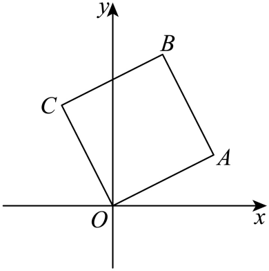

## 讲解

### 是什么

设 $z_1=a+bi,z_2=c+di$，其中 a、b、c、d 都是实数，i²=−1。复数加减分别合并实部与虚部系数：
$$z_1\pm z_2=(a\pm c)+(b\pm d)i.$$
加法满足交换律、结合律；减法不满足交换律。相反数 −z₁=−a−bi。去掉减号后的括号时，实部与整个虚部项都要变号。

### 为什么这样运算

复数的代数形式把实数部分与 i 的实系数部分分开。相同类型的项相加，分别使用实数加法，得到 (a+c)+(b+d)i。减法作为加法的逆运算：要求 $z_2+(x+yi)=z_1$，复数相等迫使 c+x=a、d+y=b，故 x=a−c、y=b−d。这个推导说明差的两个符号为什么必须一起改变。

复平面中 z₁、z₂ 对应向量 (a,b)、(c,d)。向量相加也对应分量相加，所以复数的和可按平行四边形或首尾相接法画出；复数差对应从 z₂ 的点指向 z₁ 的点的位移。若 A、B 分别对应 z₁、z₂，则 AB 对应 z₂−z₁，BA 对应 z₁−z₂。

### 什么时候能用

加减适用于任意复数，无需非零。差的模 $|z_1-z_2|=\sqrt{(a-c)^2+(b-d)^2}$ 表示两个对应点的距离；反向位移的模相同，但复数本身通常相反。只有先确定是求点的位置、位移还是距离，才决定加减顺序以及是否取模。

## 例题

### 原例（HSMA-B2-C7-Dc6a19d318529-P0067–P0072）

> 原件：专题7.3 复数的四则运算（举一反三讲义）高一数学人教A版必修第二册（解析版）.docx。题源标注沿用原资料。原题、原答案、解题思路与详解保留，Unicode空格等价转写。

【变式1-1】（24-25高一下·全国·课后作业）复数$\left( 1-i\right)-\left( 2+i\right)+3i+6$等于（    ）

A．$5+i$  B．$7-i$  C．$6+i$  D．$6-i$

【答案】A

【解题思路】根据复数的加减法运算法则求解.

【解答过程】由题意可得：$\left( 1-i\right)-\left( 2+i\right)+3i+6=\left( 1-2+6\right)+\left( -1-1+3\right)i=5+i$.

故选：A.

**补讲：每一步的依据**

先去减号括号：−(2+i)=−2−i。实数项为 1−2+6=5，i 的系数为 −1−1+3=1，所以结果为 5+i，A 正确。B 的实、虚部都不符合这两次合并；C、D 的实部误写为 6，D 的虚部符号也不符。这里的“虚部”为 1，虚部项才是 i。

### 原例（HSMA-B2-C7-Dc6a19d318529-P0131–P0143）

> 原件：专题7.3 复数的四则运算（举一反三讲义）高一数学人教A版必修第二册（解析版）.docx。题源标注沿用原资料。原题、原答案、解题思路与详解保留，Unicode空格等价转写。

【变式2-3】（24-25高一下·四川成都·期中）如图所示，平行四边形$OABC$，顶点$O,A,C$分别表示$0,4+3i,-3+5i$，试求：

(1)对角线$\vec{CA}$所表示的复数；

(2)求$B$点对应的复数.

【答案】(1)$7-2i$

(2)$1+8i$.

【解题思路】（1）先由向量运算得$\vec{CA}=\vec{OA}-\vec{OC}$，再根据复数的向量表示以及复数加减法的几何意义直接转成复数减法运算即可得解.

（2）先由向量运算得$\vec{OB}=\vec{OA}+\vec{OC}$，再根据复数的向量表示以及复数加减法的几何意义将向量加法运算转化成复数加法运算即可得解.

【解答过程】（1）因为$\vec{CA}=\vec{OA}-\vec{OC}$，

所以$\vec{CA}$所表示的复数为$\left( 4+3i\right)-\left( -3+5i\right)=7-2i$.

（2）因为$\vec{OB}=\vec{OA}+\vec{AB}=\vec{OA}+\vec{OC}$，

所以$\vec{OB}$所表示的复数为$\left( 4+3i\right)+\left( -3+5i\right)=1+8i$，

即$B$点对应的复数为$1+8i$.

**补讲：每一步的依据**

(1)CA 是从 C 指向 A，所以 CA=OA−OC，复数为 (4+3i)−(−3+5i)=7−2i。次序若颠倒就得到相反位移 −7+2i，而非所求。

(2)平行四边形中 AB=OC，所以 OB=OA+AB=OA+OC，对应的复数为 (4+3i)+(−3+5i)=1+8i。这里求 B 的位置，不是对角线的长度，不能对 1+8i 再取模当作答案。

## 易错

- 减法去括号只改变实部符号：会错，应把括号内每一项都变号。
- 把“点 C 到点 A 的位移”写成 z_C−z_A：起终点颠倒；位移是终点复数减起点复数。
- $|z_1+z_2|$ 一般不等于 |z₁|+|z₂|。模与向量长度对应，应使用三角形条件而不是逐项加长度。

## 来源

- HSMA-B2-C7-Dc6a19d318529-P0015–P0032；原件《专题7.3 复数的四则运算（举一反三讲义）高一数学人教A版必修第二册（解析版）.docx》；知识与分类口径。
- HSMA-B2-C7-Dc6a19d318529-P0046–P0048；原件《专题7.3 复数的四则运算（举一反三讲义）高一数学人教A版必修第二册（解析版）.docx》；知识与分类口径。
- HSMA-B2-C7-Dc6a19d318529-P0060–P0143；原件《专题7.3 复数的四则运算（举一反三讲义）高一数学人教A版必修第二册（解析版）.docx》；知识与分类口径。
