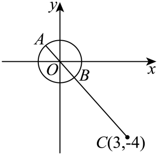

## 讲解

### 判据

题目给复数对应点在坐标轴、某象限，或给|z−z₀|等模条件时使用。把复数看成实坐标点以后，位置条件变成实部、虚部的等式或不等式，模条件变成距离。

### 流程

1. **写标准形式并标坐标。** z=A+Bi对应(A,B)，二坐标须为实数；原式中i项前的负号包含在纵坐标中。
2. **位置翻译为分量条件。** 实轴B=0，虚轴A=0；纯虚数还需B≠0。第一象限A>0且B>0；第二A<0且B>0；第三两者负；第四A>0且B<0。象限用严格不等号，不包括坐标轴。
3. **模翻译为距离。** |z−(c+di)|是点到(c,d)的距离，先整体括起固定复数再读中心，避免虚部符号错。圆的等号条件同时确认半径非负。
4. **选代数或几何解。** 求参数范围通常解两分量不等式组并取交集；求圆上点到固定点最值，比较固定点与圆心的距离，再找最近、最远的共线位置。代数平方消根时，两边均是非负距离，才可保持等价。
5. **核验端点与取等。** 象限端点可能落轴上，须排除；模最值的下界必须说明存在取等点，不能只给一个距离不等式。

## 例题
### 原例：从实虚部条件到第二象限

来源：HSMA-B2-C7-D82afdac12b19-P0149—P0163；原件《专题7.2 复数的几何意义（举一反三讲义）高一数学人教A版必修第二册（解析版）.docx》。题干、全部选项和小问、原答案、原解题思路与原解答过程完整保留。

【变式4-2】（24-25高一下·江苏南京·期中）已知复数$z=\left( 2+i\right){m}^{2}-3\left( i+1\right)m-2\left( 1-i\right)$，根据下列条件求实数$m$的值．

(1)$z$是实数；

(2)$z$是纯虚数；

(3)$z$在复平面内对应的点在第二象限．

【答案】(1)1或2

(2)$-\frac{1}{2}$

(3)$\left( -\frac{1}{2},1\right)$

【解题思路】（1）根据题意得$z=\left( 2m+1\right)\left( m-2\right)+\left( m-1\right)\left( m-2\right)i$，根据复数的概念列式即可求解；

（2）根据复数的概念列式即可求解；

（3）根据复数的几何意义列式即可求解.

【解答过程】（1）由题意$z=\left( 2+i\right){m}^{2}-3\left( i+1\right)m-2\left( 1-i\right)=\left( 2{m}^{2}-3m-2\right)+\left( {m}^{2}-3m+2\right)i$

$=\left( 2m+1\right)\left( m-2\right)+\left( m-1\right)\left( m-2\right)i$，

若$z$是实数，则$\left( m-1\right)\left( m-2\right)=0$，解得$m=1$或$m=2$

（2）若$z$是纯虚数，则$\left\{ \begin{aligned}\left( 2m+1\right)\left( m-2\right)=0\\\left( m-1\right)\left( m-2\right)\ne 0\end{aligned}\right.$，解得$m=-\frac{1}{2}$；

（3）若$z$在复平面内对应的点在第二象限，则$\left\{ \begin{aligned}\left( 2m+1\right)\left( m-2\right)<0\\\left( m-1\right)\left( m-2\right)>0\end{aligned}\right.$，解得$-\frac{1}{2}<m<1$.

**补讲**

先展开原式：实部$A(m)=2m^2-3m-2=(2m+1)(m-2)$，虚部$B(m)=m^2-3m+2=(m-1)(m-2)$。

（1）实数令B(m)=0，得1或2。（2）纯虚数令A(m)=0，得−1/2或2；再用B(m)≠0排除2，留下−1/2。（3）第二象限要求A(m)<0，给−1/2<m<2；还要求B(m)>0，给m<1或m>2。交集为−1/2<m<1。m=−1/2在虚轴上、m=1在实轴上，都不属于象限，故两端不取。

### 原例：单位圆到固定点的最短距离

来源：HSMA-B2-C7-D82afdac12b19-P0339—P0347；原件《专题7.2 复数的几何意义（举一反三讲义）高一数学人教A版必修第二册（解析版）.docx》。题干、全部选项和小问、原答案、原解题思路与原解答过程完整保留。

【例9】（24-25高一下·广东深圳·期中）复数$z$满足$\left| z\right|=1$，则$\left| z-3+4i\right|$（i为虚数单位）的最小值为（   ）

A．4  B．5  C．2  D．3

【答案】A

【解题思路】首先根据复数的几何意义求复数$z$对应的点$Z$的轨迹，再利用数形结合求模的最小值.

【解答过程】设复数$z$在复平面内对应的点为$Z$，由$\left| z\right|=1$知，点$Z$的轨迹为以原点为圆心，

半径为1的圆，$\left| z-3+4i\right|$表示圆上的点到点$C\left( 3,-4\right)$的距离，如下图，

如图，最小值为$\left| BC\right|=\left| OC\right|-1=5-1=4$.

故选：A.

**补讲**

|z|=1给点Z在单位圆，z−3+4i=z−(3−4i)给固定点C(3,−4)。OC=5大于半径1，C在圆外。任意Z满足ZC≥OC−OZ=4；取单位圆上朝C方向的交点B，O、B、C依次共线，BC=4，故最小值确能达到，答案A。B把OC当作最近距离，C、D低于距离下界。

## 易错

- 虚轴包括原点，但纯虚数不包括0；这两类条件不能直接互换。
- $|z-c+di|$的固定点为(c,−d)，先改写为$|z-(c-di)|$再画。
- 圆内固定点到圆上最近距离是半径减圆心距；只有固定点在圆外时，才能直接用圆心距减半径。

## 来源定位

- 知识与分类依据：HSMA-B2-C7-D82afdac12b19-P0016—P0028；P0059—P0175；P0223—P0239；P0338—P0347，《专题7.2 复数的几何意义（举一反三讲义）高一数学人教A版必修第二册（解析版）.docx》。按知识主线补足理由、适用条件与边界。
- 原题所标考试年份、校次及名称沿用资料，未另作外部来源认证；补讲与资料勘误不改写原答案、原解。
