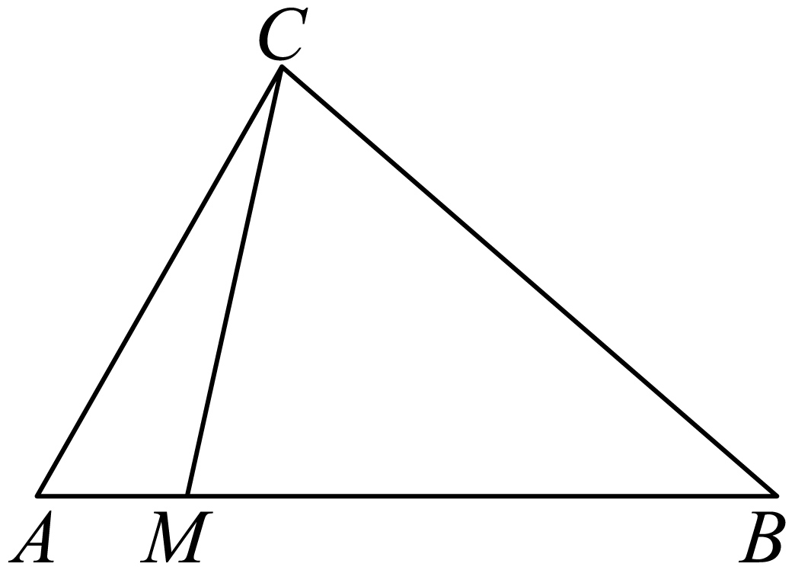

## 讲解

### 判据

题目给出同一向量两种线性表示，或用未知系数表示一个几何向量时，可先把所有表达式放在同一非共线基底下。若两个表达式的向量相等，两个对应系数分别相等；这来自基本定理的唯一性。

### 流程及理由

1. 选基底并说明为何不共线。非退化三角形从同一顶点出发的两边自然不共线；不要因为出现两个名字就默认能比较。
2. 用线性运算把原条件中的向量转成该基底。利用 AB=CB−CA 等共同起点关系，减少额外方向。
3. 长度比例先核对方向再变为向量比例。点在线段内部时向量方向已明确，可算分点系数；在延长线上则要保留正负号。
4. 对同一向量写出两种表示，逐项列方程。列的是两个独立方向的系数，不是把两个向量“消掉”。
5. 解方程并代回原分点及范围条件；若所求只是系数和，不必把几何上无关的所有长度求一遍。

## 例题

### 原例（HSMA-B2-C6-Dbc0593bfd8c6-P0130–P0140）

> 原件：专题6.4 平面向量基本定理及坐标表示（举一反三讲义）高一数学人教A版必修第二册（解析版）.docx。题源标注沿用原资料。下文保留原题、原答案、原解题思路与原详解。

【变式3-1】（25-26高一上·四川绵阳·期中）如图，在$\triangle ABC$中，$M$为线段$AB$上的一点，$\vec{CM}=m\vec{CA}+n\vec{CB}$（$m$，$n\in R$）且$\vec{BM}=4\vec{MA}$，则（   ）

A．$m=\frac{3}{4}$，$n=\frac{1}{4}$                     B．$m=\frac{4}{5}$，$n=\frac{1}{5}$  

C．$m=\frac{1}{5}$，$n=\frac{4}{5}$                     D．$m=\frac{1}{4}$，$n=\frac{3}{4}$

【答案】B

【解题思路】根据平面向量的线性运算与共线定理用基底表示向量，结合平面向量基本定理即可得$m,n$的值.

【解答过程】因为$\vec{BM}=4\vec{MA}$，

所以$\vec{AM}=\frac{1}{5}\vec{AB}$，

则$\vec{CM}=\vec{CA}+\vec{AM}=\vec{CA}+\frac{1}{5}\vec{AB}=\vec{CA}+\frac{1}{5}\left( \vec{CB}-\vec{CA}\right)=\frac{4}{5}\vec{CA}+\frac{1}{5}\vec{CB}$，

故$m=\frac{4}{5}$，$n=\frac{1}{5}$.

故选：B.

**补讲：把原解中的理由补完整**

三角形 ABC 非退化，所以 CA、CB 不共线。M 在 AB 上，BM=4MA 给出 AB=AM+MB=5AM，从而 AM=AB/5。现在目标 CM 与给定基底有共同起点 C：CM=CA+AM，而 AB=CB−CA。代入得 CM=$4CA/5+CB/5$。由于基底不共线，m、n 只能分别为 4/5、1/5，B 正确。A、D 的分母 4 不符合五份划分；C 交换了两个基底的系数。

## 易错

- 用两种不同基底写出的系数不能直接比较，先统一基底。
- “系数相等”只来自唯一分解，不是任意两个向量的表达式都可消去向量符号。
- 分点比例要写清方向，BM=4MA 的两向量沿 BA 同向，换成 AM 会反向。

## 来源

- HSMA-B2-C6-Dbc0593bfd8c6-P0016–P0023；原件《专题6.4 平面向量基本定理及坐标表示（举一反三讲义）高一数学人教A版必修第二册（解析版）.docx》；知识及分类口径。
- HSMA-B2-C6-Dbc0593bfd8c6-P0129–P0140；原件《专题6.4 平面向量基本定理及坐标表示（举一反三讲义）高一数学人教A版必修第二册（解析版）.docx》；知识及分类口径。
