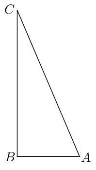

## 讲解

### 是什么

向量是既有大小又有方向的量，例如位移、力；只有大小而没有空间方向的量称为数量（标量），例如长度、质量、路程。正负号本身不能证明有方向：温度的正负表示相对于零度的数值，不能作为空间方向。

本章讨论**自由向量**，只关心大小和方向，不固定作用位置。可以用带箭头的线段表示：$\overrightarrow{AB}$从始点A指向终点B；也可记作$\vec a$。有向线段本身有始点、长度和方向三要素，但平移后的有向线段仍表示同一个自由向量。反转箭头通常改变向量。

向量的大小叫**模**，记作$|\vec a|$。若$\vec a=\overrightarrow{AB}$，则$|\vec a|=AB$，是一个非负的数；长度单位由题目规定，位移的模可以用米或千米。向量与向量不比较“大于、小于”，模与模可以比较。

### 怎么来的

从A到B的移动，既需要说明“多远”，又需要说明“往哪里”；仅用长度AB无法区分从A到B和从B到A。因此用箭头保留方向，用线段长度表示大小，再把位置不同而长度、方向相同的箭头视为同一向量。这就是向量表示与自由平移的依据。

模只取表示线段的长度，所以$|\overrightarrow{AB}|=|\overrightarrow{BA}|$；向量还保留方向，所以A、B不同点时$\overrightarrow{AB}\ne\overrightarrow{BA}$。位移只取“初位置到末位置”的箭头，路程累计实际走过的各段长度，二者只有在沿同一方向直线运动时才同模。

### 什么时候能用

判断一个量是否为向量，要问它能否同时确定大小和空间方向；无穷延伸的坐标轴有方向，却没有一个确定长度，不能直接当作向量。求模可以转为求线段长度，再用勾股定理等几何关系。比较路程和位移时，先统一单位、分清实际路线和始末点，不直接比较数与向量。

## 例题
### 原例：识别向量

来源：HSMA-B2-C6-D1fe2f2fc24fe-P0035—P0042；原件《专题6.1 平面向量的概念（举一反三讲义）数学人教A版必修第二册（解析版）.docx》。下列题干、选项、原答案、原解题思路与原解答过程完整保留。

【例1】（24-25高一下·河南·月考）下列量中是向量的为（    ）

A．课桌的高度  B．一段路程的公里数

C．上课时老师敲击黑板的频率  D．小汽车受到路面的弹力

【答案】D

【解题思路】由向量的概念，可得答案.

【解答过程】因为向量是既有大小，又有方向的量，而高度、公里数、频率只有大小，没有方向，

弹力既有大小，又有方向，所以弹力是向量.

故选：D．

**补讲**

A、B都只给长度，C的频率只给每单位时间发生次数；这些量没有向东、向西等空间方向。D的弹力须说明大小和作用方向，所以选D。箭头是表示方式，“数值有正负”与“量有空间方向”是两件事。
### 原例：路程与位移的模

来源：HSMA-B2-C6-D1fe2f2fc24fe-P0116—P0125；原件《专题6.1 平面向量的概念（举一反三讲义）数学人教A版必修第二册（解析版）.docx》。下列题干、选项、原答案、原解题思路与原解答过程完整保留。

【例3】（24-25高一下·山东菏泽·月考）如果一架飞机向西飞行$150km$，再向南飞行$350km$，记飞机飞行的路程为$s$，位移为$\vec{a}$，则（    ）

A．$s>\left| \vec{a}\right|$  B．$s=\left| \vec{a}\right|$  C．$s<\left| \vec{a}\right|$  D．$s$与$\left| \vec{a}\right|$不能比较大小

【答案】A

【解题思路】根据题意，作图，结合向量的几何意义，可得答案.

【解答过程】由题意，作图如下：

则该飞机由$A$先飞到$B$，再飞到$C$，则$AB=150km$，$BC=350km$，$\vec{a}=\vec{AC}$，

则飞机飞行的路程为$s=500km$，$\left| \vec{a}\right|=\sqrt{{150}^{2}+{350}^{2}}=50\sqrt{58}km$，

所以$s>\left| \vec{a}\right|$.

故选：A.

**补讲**

路程沿两段路线相加：150+350=500 km。位移从A指向C，图中两段飞行互相垂直，所以以150与350为两直角边，用勾股定理得到$|\vec a|=50\sqrt{58}$ km。因$58<100$，所以$50\sqrt{58}<500$，选A；B、C与这个比较相反。D错在把模也当成不可比较的向量：$|\vec a|$与s都是长度，可以比较。

## 易错

- $\vec a$是向量，$|\vec a|$是数；“向量长5米”应写$|\vec a|=5$米，而不是$\vec a=5$。
- 从A走到B再走到C，位移是$\overrightarrow{AC}$，不是把两段路程相加就得到位移的模。转弯时应先确定始末点。
- 自由向量可以平移；力的实际作用效果还可能依赖作用点，不能把本章的自由平移规则直接用于所有力学情境。

## 来源定位

- 知识与分类依据：HSMA-B2-C6-D1fe2f2fc24fe-P0013—P0033；P0115，《专题6.1 平面向量的概念（举一反三讲义）数学人教A版必修第二册（解析版）.docx》。本条据其知识主线补足理由和适用条件。
- 原例标注的校次与考试名称为资料原标注，未作外部来源认证。原题原解与补讲、勘误分别列出。
