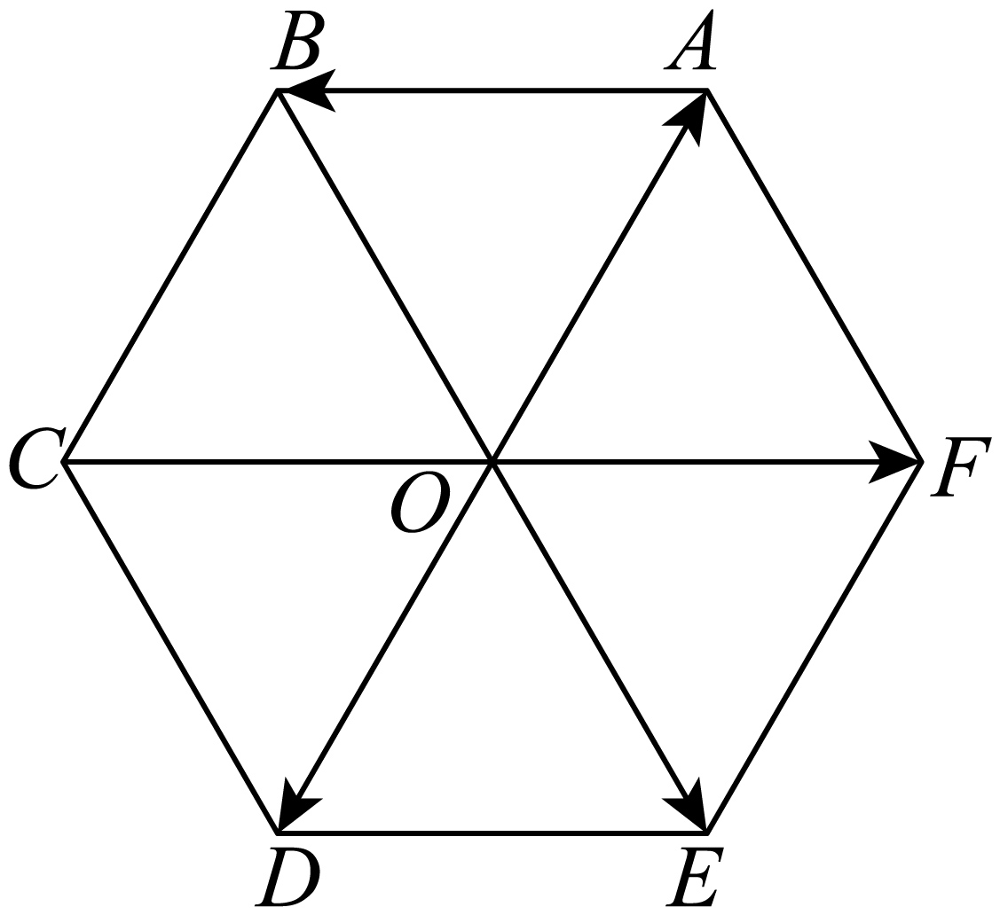
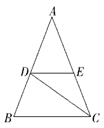

## 讲解

### 是什么

两个向量长度相等且方向相同，称为相等向量，记作$\vec a=\vec b$。长度相等且方向相反的非零向量互为相反向量，记作$\vec b=-\vec a$；零向量的相反向量仍是零向量。

方向相同或相反的非零向量称为共线向量，也叫平行向量，记作$\vec a\parallel\vec b$。另规定零向量与任意向量共线。共线不要求模相等；相等必共线，共线不一定相等。

### 怎么来的

把两个非零向量平移到同一起点O。若箭头沿同一条射线，说明同向；若沿相反射线，说明反向。沿同一条直线即共线。在此基础上再检查两个箭头长度：同向又同长才相等，反向又同长才互为相反向量。

平移不改变自由向量，所以几条代表箭头可以位于不同直线上，只要方向平行，仍是共线向量。“向量共线”不等于原图的几条线段都在同一条直线上。

### 什么时候能用

识别相等向量时同时查方向与长度；只已知模相等，不能推相等或共线。向量平行要推出两条不同直线平行，还需排除两直线重合；向量要推出三个点共线，应选有公共点的$\overrightarrow{AB}$与$\overrightarrow{AC}$，且A、B不同点。

相等关系有传递性；共线关系通过一个**非零**中间向量时才有传递性。若中间是$\vec0$，任意两方向的向量都与它共线，无法推出这两个方向平行。

## 例题
### 原例：正六边形中的相等向量

来源：HSMA-B2-C6-D1fe2f2fc24fe-P0178—P0188；原件《专题6.1 平面向量的概念（举一反三讲义）数学人教A版必修第二册（解析版）.docx》。下列题干、选项、原答案、原解题思路与原解答过程完整保留。

【例4】（24-25高一下·安徽马鞍山·月考）如图，O是正六边形ABCDEF的中心，下列向量中，与$\vec{DE}$相等的向量为（   ）

A．$\vec{AB}$  B．$\vec{OF}$  C．$\vec{OE}$  D．$\vec{OD}$

【答案】B

【解题思路】根据正六边形的性质，分别分析每个选项中的向量与$\vec{DE}$的模和方向是否都相同，从而找出与$\vec{DE}$相等的向量.

【解答过程】对于选项A，虽然$|\vec{AB}|=|\vec{DE}|$，但方向不同不满足向量相等的条件，所以$\vec{AB}$与$\vec{DE}$不相等.

对于选项B，$\vec{DE}$与$\vec{OF}$方向相同，并且由于$DE=OF$， 所以$\vec{DE}=\vec{OF}$.

对于选项C：$\vec{OE}$与$\vec{DE}$方向不同，所以$\vec{OE}$与$\vec{DE}$不相等.

对于选项D：$\vec{OD}$与$\vec{DE}$方向不同，所以$\vec{OD}$与$\vec{DE}$不相等.

与$\vec{DE}$相等的向量为$\vec{OF}$.

故选：B.

**补讲**

正六边形的中心到各顶点的距离等于边长，因此四个选项中的箭头都与DE等长，决定性的第二项条件是方向。DE指向右侧，OF也指向右侧，所以B满足两项条件。AB指向左侧，和DE反向；OE斜向右下，OD斜向左下，都不与DE同向，所以A、C、D不相等。
### 原例：中位线上的共线向量

来源：HSMA-B2-C6-D1fe2f2fc24fe-P0222—P0232；原件《专题6.1 平面向量的概念（举一反三讲义）数学人教A版必修第二册（解析版）.docx》。下列题干、选项、原答案、原解题思路与原解答过程完整保留。

【例5】（24-25高一·全国·课前预习）在$\triangle ABC$中，$AB=AC$，$D$、$E$分别是$AB$、$AC$的中点，则（   ）

A．$\vec{AB}$与$\vec{AC}$共线  B．$\vec{DE}$与$\vec{CB}$共线

C．$\vec{CD}$与$\vec{AE}$相等  D．$\vec{AD}$与$\vec{BD}$相等

【答案】B

【解题思路】利用共线向量、相等向量的概念逐项判断即可.

【解答过程】由题意可知，$\vec{AB}$与$\vec{AC}$不共线，A错；

因为$D$、$E$分别是$AB$、$AC$的中点，所以，$DE//BC$，故$\vec{DE}$与$\vec{CB}$共线，B对；

因为$CD$与$AE$不平行，所以$\vec{CD}$与$\vec{AE}$不相等，C错；

因为$\vec{AD}=\vec{DB}=-\vec{BD}$，D错．

故选：B.

**补讲**

A：AB与AC是三角形两边，从A沿不同方向出发，不共线。B：DE是中位线，平行BC；DE向右、CB向左，反向也属于共线，所以B正确。C：CD穿过三角形内部而AE在边AC上，两直线不平行，不可能是相等向量。D：D为AB中点，AD与BD等长却反向，应是$\overrightarrow{AD}=-\overrightarrow{BD}$，所以D错误。

## 易错

- “同模”只控制长度，“共线”只控制同向或反向；“相等”同时控制长度和同向。
- $\overrightarrow{AB}$与$\overrightarrow{BA}$在同一直线且同模，A、B不同点时互为相反向量，不相等。
- 原资料说“平面内相等向量无数多个”，本条按“同一个自由向量有无数个代表箭头”理解，避免把表示位置当成不同向量。

## 来源定位

- 知识与分类依据：HSMA-B2-C6-D1fe2f2fc24fe-P0029—P0033；P0165—P0176，《专题6.1 平面向量的概念（举一反三讲义）数学人教A版必修第二册（解析版）.docx》。本条据其知识主线补足理由和适用条件。
- 原例标注的校次与考试名称为资料原标注，未作外部来源认证。原题原解与补讲、勘误分别列出。
