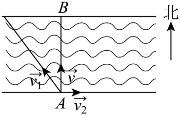

## 错法

看到两个力大小 $p,q$，直接写合力大小 $p+q$；或看静水速4、水速2就答实际船速6。原因是把“大小”当成向量全部信息，忽略方向可能抵消或横向偏转。

## 正解

先计算向量和，再求模。由数量积展开

$$|\mathbf u+\mathbf v|^2=|\mathbf u|^2+|\mathbf v|^2+2|\mathbf u||\mathbf v|\cos\theta.$$

其中 $\theta$ 是两个非零向量平移到共同起点后的夹角。只有同向 $\theta=0$ 才是模之和；反向为模之差的绝对值；垂直为平方和开方。存在零向量时直接计算，不给零向量定义夹角。一般满足 $\big||\mathbf u|-|\mathbf v|\big|\le|\mathbf u+\mathbf v|\le|\mathbf u|+|\mathbf v|$，能用来快速查错。

平衡所需力是合力的相反向量，它的模仍等于合力的模。渡河实际速度是船相对水速度与水相对岸速度的和，条件“正对岸”先限制方向，再决定模；不能选错夹角后套平方公式。

## 例题

### 原例：夹45°的两力合成

来源：`HSMA-B2-C6-Dc1e1bff55558-P0418-P0424`；原件《专题6.5 平面向量的应用（举一反三讲义）高一数学人教A版必修第二册（解析版）.docx》。括号中的地区、学年为讲义原标注，未另行核验。

以下保留原题、原答案与原详解（只统一公式排版）：

【变式7-2】（24-25高一下·河北保定·期中）平面上三个力$\vec{{F}_{1}}$，$\vec{{F}_{2}}$，$\vec{{F}_{3}}$作用于一点且处于平衡状态，$\left| \vec{{F}_{1}}\right|=1N,\left| \vec{{F}_{2}}\right|=\sqrt{2}N$，$\vec{{F}_{1}}$与$\vec{{F}_{2}}$的夹角为45°，则$\left| \vec{{F}_{3}}\right|$的大小为（    ）

A．$\sqrt{3}N$  B．5N  C．$\sqrt{5}N$  D．$\sqrt{6}N$

【答案】C

【解题思路】根据平衡状态得$\vec{{F}_{3}}=-\left( \vec{{F}_{1}}+\vec{{F}_{2}}\right)$，结合向量的数量积求解即可．

【解答过程】由题意得，$\vec{{F}_{3}}=-\left( \vec{{F}_{1}}+\vec{{F}_{2}}\right)$，

所以$\left| \vec{{F}_{3}}\right|=\left| -\left( \vec{{F}_{1}}+\vec{{F}_{2}}\right)\right|=\sqrt{{\left( \vec{{F}_{1}}+\vec{{F}_{2}}\right)}^{2}}=\sqrt{{\vec{{F}_{1}}}^{2}+2\vec{{F}_{1}}\cdot \vec{{F}_{2}}+{\vec{{F}_{2}}}^{2}}=\sqrt{1+2+2}=\sqrt{5}N$，

故选：C．

#### 补充讲解

若误加两个模，会得到 $1+\sqrt2$ N，而两个力夹45°，不是同向。正确平方为 $1+2+2\times1\times\sqrt2\times(\sqrt2/2)=5$，平衡力大小为 $\sqrt5$ N，C正确。A的 $\sqrt3$ 漏交叉项，B的5把模平方当模，D的 $\sqrt6$ 用错交叉项。

### 原例：货船准确到达正北港口

来源：`HSMA-B2-C6-Dc1e1bff55558-P0450-P0460`；原件《专题6.5 平面向量的应用（举一反三讲义）高一数学人教A版必修第二册（解析版）.docx》。括号中的地区、学年为讲义原标注，未另行核验。

以下保留原题、原答案与原详解（只统一公式排版）：

【变式8-1】（2025·广东广州·模拟预测）某货船执行从$A$港口到$B$港口的航行任务，$B$港口在$A$港口的正北方向，已知河水的速度为向东$2m/s$．若货船在静水中的航速为$4m/s$，船长调整船头方向航行，使得实际路程最短．则该船完成此段航行的实际速度为（   ）

A．$2m/s$  B．$2\sqrt{3}m/s$  C．$4m/s$  D．$2\sqrt{5}m/s$

【答案】B

【解题思路】利用船实际航行速度与水流速度垂直，结合向量数量积求出夹角及模即可求解.

【解答过程】设船在静水中的速度为$\vec{{v}_{1}}$，水流速度为$\vec{{v}_{2}}$，船实际航行速度为$\vec{v}$，则$|\vec{{v}_{1}}|=4,|\vec{{v}_{2}}|=2$，

且$\vec{v}=\vec{{v}_{1}}+\vec{{v}_{2}}$，设$\theta =\langle \vec{{v}_{2}},\vec{{v}_{1}}\rangle $，由船需要准确到达正北方向的B点，得$\vec{v}\perp \vec{{v}_{2}}$，

则$\vec{v}\cdot \vec{{v}_{2}}=(\vec{{v}_{1}}+\vec{{v}_{2}})\cdot \vec{{v}_{2}}=\vec{{v}_{1}}\cdot \vec{{v}_{2}}+{\vec{{v}_{2}}}^{2}=4\times 2\cos \theta +{2}^{2}=0$，解得$\cos \theta =-\frac{1}{2}$，而$0\le \theta \le \pi $，于是$\theta =\frac{2\pi }{3}$，

$\left| \vec{v}\right|=\sqrt{{\vec{{v}_{1}}}^{2}+{\vec{{v}_{2}}}^{2}+2\vec{{v}_{1}}\cdot \vec{{v}_{2}}}=\sqrt{{4}^{2}+{2}^{2}+2\times 4\times 2\times (-\frac{1}{2})}=2\sqrt{3}$，

所以该船完成此段航行的实际速度为$2\sqrt{3}m/s$.

故选：B.

#### 补充讲解

船必须沿正北实际运动，水向东，所以船相对水速度含向西分量。向量和与水流垂直得 $\cos\theta=-1/2$，两个速度不是同向。模平方为 $16+4-8=12$，实际速度 $2\sqrt3$ m/s，B正确。A只用了两个模之差，C保留静水速而忘水流改变，D对应船头与水流垂直的平方和，均不满足实际正北。
