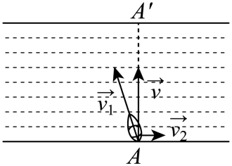
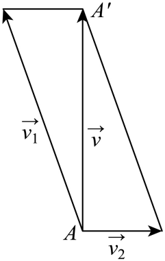

## 讲解

### 判据

河流、航船、平衡、恒力做功题的首个判断是“题中给的是哪个对象、哪种参考系、哪个方向”。航程最短是实际轨迹垂直河岸；用时最短则最大化横渡分速度，两个目标会产生不同船头方向。

### 流程与依据

1. 统一时间与长度单位，标清船相对水、水相对岸、船相对岸的速度。相加的是同时刻、同坐标轴的向量。
2. 将文字目标变成关系：平衡为合力零，正对岸为实际速度与河岸平行方向垂直，恒力功为力与从起点到终点位移的数量积。
3. 需要求模时先向量相加再平方；需要方向条件时先用分量或数量积建立等式，不能先相加模。
4. 渡河到正对岸时，船向上游分速度须抵消水速。设静水速 $u$、水速 $v$，必须 $u>v$ 才能保有正的横渡速度 $\sqrt{u^2-v^2}$；$u=v$ 只有零横渡速度，不能到达。
5. 用实际速度和正确距离算时间。速度为 km/h而河宽为m，先将河宽除以1000成为km，再计算小时，乘60成为分钟。

## 易错

“船头朝正对岸”描述相对水速度，而“正好到正对岸”描述相对岸速度。做功位移从 $A$ 到 $B$ 必为 $B-A$，反向会改变功的正负；原题若没给力与坐标单位，不把题设之外的单位当新增条件。

## 例题

### 原例：最短航程与渡河时间

来源：`HSMA-B2-C6-Dc1e1bff55558-P0461-P0474`；原件《专题6.5 平面向量的应用（举一反三讲义）高一数学人教A版必修第二册（解析版）.docx》。括号中的地区、学年为讲义原标注，未另行核验。

以下保留原题、原答案与原详解（只统一公式排版）：

【变式8-2】（24-25高一下·广东深圳·月考）如图所示，一条河两岸平行，河的宽度为400米，一艘船从河岸的A地出发，向河对岸航行．已知船的速度${{v}_{1}}^{\to }$的大小为$|{{v}_{1}}^{\to }|=8km/h$，水流速度${{v}_{2}}^{\to }$的大小为$|{{v}_{2}}^{\to }|=2km/h$，船的速度与水流速度的合速度为${v}^{\to }$，那么当航程最短时，下列说法正确的是（     ）

A．船头方向与水流方向垂直  B．$\cos <{{v}_{1}}^{\to },{{v}_{2}}^{\to }>=-\frac{1}{4}$

C．$|{v}^{\to }|=2\sqrt{17}km/h$  D．该船到达对岸所需时间为3分钟

【答案】B

【解题思路】由向量加法的平行四边形法则结合向量模的求法判断C；求解直角三角形可得判断A；结合诱导公式求得$\cos <{{v}_{1}}^{\to },{{v}_{2}}^{\to }>$判断B；求出船到达对岸的时间判断D.

【解答过程】解：如图，

${A}^{'}$是河对岸一点，且$A{A}^{'}$与河岸垂直，那么当这艘船实际沿$A{A}^{'}$方向行驶时船的航程最短，

${v}^{\to }={{v}_{1}}^{\to }+{{v}_{2}}^{\to }$，$|{v}^{\to }|=\sqrt{|{{v}_{1}}^{\to }{|}^{2}-|{{v}_{2}}^{\to }{|}^{2}}=\sqrt{{8}^{2}-{2}^{2}}=2\sqrt{15}$，故C错误；

设船头方向与$A{A}^{'}$的夹角为$\theta $，则$\sin \theta =\frac{2}{8}=\frac{1}{4}$，则船头方向与水流方向不垂直，故A错误；

$\cos <{{v}_{1}}^{\to },{{v}_{2}}^{\to }>=\cos (\frac{\pi }{2}+\theta )=-\sin \theta =-\frac{1}{4}$，故B正确；

该船到达对岸的时间为$t=\frac{400}{2\sqrt{15}\times 1000}\times 60=\frac{4\sqrt{15}}{5}$分钟，故D错误．

故选：B.

#### 补充讲解

最短航程是宽度0.4 km，实际速度沿法线。船头须向上游偏，因此A错误；数量积 $(\mathbf v_1+\mathbf v_2)\cdot\mathbf v_2=0$ 给 $8\times2\cos\theta+2^2=0$，得到 $\cos\theta=-1/4$，B正确。

实际速度 $\sqrt{8^2-2^2}=2\sqrt{15}$，C用了加号。时间 $t=0.4/(2\sqrt{15})$ h，乘60得 $12/\sqrt{15}=4\sqrt{15}/5$ min，约3.098 min，不能写精确3 min，所以D错误。原解的速度单位换算与结果一致。

### 原例：从初位置到末位置的负功

来源：`HSMA-B2-C6-Dc1e1bff55558-P0493-P0499`；原件《专题6.5 平面向量的应用（举一反三讲义）高一数学人教A版必修第二册（解析版）.docx》。括号中的地区、学年为讲义原标注，未另行核验。

以下保留原题、原答案与原详解（只统一公式排版）：

【变式9-1】（24-25高一下·宁夏银川·月考）一物体在力$\vec{F}$的作用下，由$A\left( 16,6\right)$移动到$B\left( 10,2\right)$.已知$\vec{F}=\left( 2,-1\right)$，则$\vec{F}$对该物体所做的功为（    ）$J$

A．$-8$  B．26  C．8  D．18

【答案】A

【解题思路】根据数量积公式$\vec{F}\cdot \vec{AB}$，即可求解.

【解答过程】由题意可知，$\vec{AB}=\left( -6,-4\right)$，$\vec{F}=\left( 2,-1\right)$，

所以$\vec{F}\cdot \vec{AB}=2\times \left( -6\right)-1\times \left( -4\right)=-8$，所以$\vec{F}$对该物体所做的功为$-8$ $J$.

故选：A.

#### 补充讲解

物体从 $A=(16,6)$ 到 $B=(10,2)$，位移为 $(-6,-4)$；力 $(2,-1)$ 与位移做数量积为 $-12+4=-8$ J。A正确；C的+8会对应反向位移，B、D不能从本题完整两分量数量积得到。原题的“J”约定力用N、坐标长度用m，计算时照此统一。负功说明这份力阻碍总体位移，不是说路程为负。
