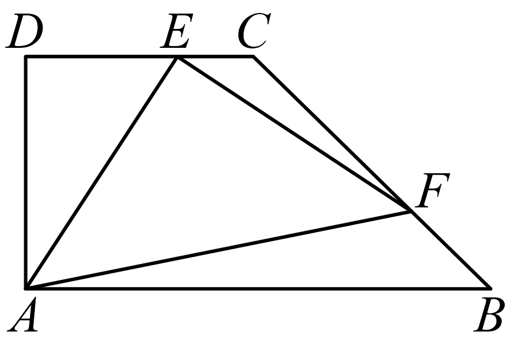
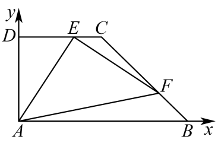

## 讲解

### 判据

动点沿线段运动且目标是数量积、向量模或线性系数之和，先把动点位置参数化。参数范围来自真实几何区域，它和代数表达式同等重要。

### 流程与依据

1. 选坐标或线性参数，让只有一个动点时尽量只保留一个未知数。例如 $E$ 沿水平线段运动，可设 $E=(x,h)$。
2. 将每个向量写成“终点减起点”。数量积展开常变成二次函数；模取极值时可先求模的平方，因为平方在非负数上保持大小关系。
3. 把动点的线段、边界或区域完整翻译成参数约束。线段含端点才是闭区间；不是把包围区域的长方形当真实可行域。
4. 若得到 $f(x)=\alpha(x-x_0)^2+k$，比较顶点是否在范围内。二次函数在闭区间的极值来自区间内顶点及两端点，而非总用顶点。
5. 说明每个端值对应的实际点能到达；在连续线段上二次函数连续，所有中间值也能取得，才能写完整值域。

## 易错

数量积可负，负值不表示线段长度负；它反映夹角为钝角。求一个上界不足以证明“最大值”，还须给可行的等号点。归一边长后求数量积，恢复尺度要乘边长平方。

## 例题

### 原例：梯形动点的数量积范围

来源：`HSMA-B2-C6-Dc1e1bff55558-P0270-P0282`；原件《专题6.5 平面向量的应用（举一反三讲义）高一数学人教A版必修第二册（解析版）.docx》。括号中的地区、学年为讲义原标注，未另行核验。

以下保留原题、原答案与原详解（只统一公式排版）：

【例5】（25-26高二上·河北邢台·开学考试）在直角梯形$ABCD$中，已知$AB//CD$，$\angle DAB={90}^\circ$，$AB=2AD=2CD=6$，点$F$是$BC$边靠近$B$点的三等分点，点$E$是$CD$边上一个动点．则$\vec{EA}\cdot \vec{EF}$的取值范围是（    ）

A．$\left[ -\frac{1}{2},0\right]$  B．$\left[ 0,3\right]$  C．$\left[ -\frac{1}{4},0\right]$  D．$\left[ -\frac{1}{4},6\right]$

【答案】D

【解题思路】如图，以点$A$为原点，分别以$AB$，$AD$所在直线为$x$，$y$轴，建立平面直角坐标系，设$E\left( x,3\right)$，则$x\in \left[ 0,3\right]$，且$\vec{EA}=\left( -x,-3\right)$，$\vec{EF}=\left( 5-x,-2\right)$，从而得到$\vec{EA}\cdot \vec{EF}={\left( x-\frac{5}{2}\right)}^{2}-\frac{1}{4}$，结合二次函数的性质即可求解.

【解答过程】如图，以点$A$为原点，分别以$AB$，$AD$所在直线为$x$，$y$轴，建立平面直角坐标系，

依题意，有$A\left( 0,0\right)$，$C\left( 3,3\right)$，$B\left( 6,0\right)$，$F\left( 5,1\right)$，

设$E\left( x,3\right)$，则$x\in \left[ 0,3\right]$，且$\vec{EA}=\left( -x,-3\right)$，$\vec{EF}=\left( 5-x,-2\right)$，

$\vec{EA}\cdot \vec{EF}=\left( -x\right)\left( 5-x\right)+6={x}^{2}-5x+6={\left( x-\frac{5}{2}\right)}^{2}-\frac{1}{4}$，

因$x\in \left[ 0,3\right]$，当$x=0$时，$\vec{EA}\cdot \vec{EF}=6$，当$x=\frac{5}{2}$时，$\vec{EA}\cdot \vec{EF}=-\frac{1}{4}$，

故$\vec{EA}\cdot \vec{EF}\in \left[ -\frac{1}{4},6\right]$．

故选：D．

#### 补充讲解

用题中 $AB=2AD=2CD=6$，先得到 $AD=CD=3$；$F$ 靠近 $B$，是从 $B$ 往 $C$ 走1/3，所以 $F=B+(C-B)/3=(5,1)$。这一步若错取另一个三等分点，会整个改变二次式。

$(x-5/2)^2-1/4$ 的顶点 $x=5/2$ 在 $[0,3]$ 内，最小值 $-1/4$。两端 $x=0$ 得6、$x=3$ 得0，最大值6。动点包含端点，且函数连续，范围为 $[-1/4,6]$。A、B、C的下界或上界至少一处不合这三个候选值，D正确。负的最小数量积来自 $\overrightarrow{EA}$ 与 $\overrightarrow{EF}$ 夹角钝，不违反长度非负。
