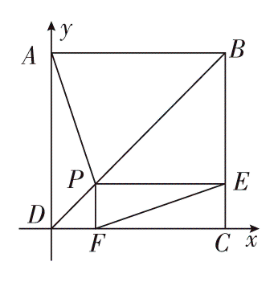
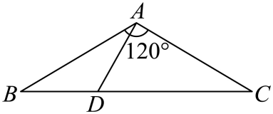

## 讲解

### 判据

题目关系主要是平行、分点、邻边表示，适合用不共线邻边作基底；出现直角、正方形、轴上滑动或直接给坐标，适合直角坐标。基底不是必须单位向量，非正交基底不能把系数当直角坐标直接做分量乘积。

### 流程与依据

1. 先定位目标：长度算模的平方，垂直算数量积，平行算共线；这让建系服务于目标而非增加未知量。
2. 选公共起点及基底或坐标轴。基底要不共线保证表示唯一；直角坐标两轴垂直、单位一致，才能用平方和与分量乘积。
3. 将中点、比例变成位置向量或坐标。点 $D$ 在 $BC$ 且 $BD:DC=1:2$ 时，从 $B$ 到 $D$ 是全程的1/3，故 $\overrightarrow{AD}=\overrightarrow{AB}+\frac13(\overrightarrow{AC}-\overrightarrow{AB})$。
4. 用已知长度与夹角给出基底数量积，或在正交坐标中直接计算，逐项代入并保持方向。
5. 将结果翻译回几何，复核点在要求的线段内、长度正、所求角由同一起点的两向量构成。

## 易错

正方形证明等长可令边长为1，是因为所有长度同步按同一比例缩放，目标“相等”不受缩放影响；若要求具体长度或功等带单位量，就不能擅自归一后忘记恢复尺度。夹角使用 $\overrightarrow{DA}$ 与 $\overrightarrow{DC}$ 等同起点向量，不应顺手换成只反向一条。

## 例题

### 原例：正方形内矩形的等长证明

来源：`HSMA-B2-C6-Dc1e1bff55558-P0048-P0059`；原件《专题6.5 平面向量的应用（举一反三讲义）高一数学人教A版必修第二册（解析版）.docx》。括号中的地区、学年为讲义原标注，未另行核验。

以下保留原题、原答案与原详解（只统一公式排版）：

【变式1-2】（24-25高一下·全国·课后作业）四边形$ABCD$是正方形，P是对角线DB上一点(不包括端点)，E，F分别在边BC，DC上，且四边形$PFCE$是矩形，试用向量法证明：$PA=EF$.

【答案】证明见解析.

【解题思路】根据给定条件，建立坐标系，利用向量的坐标表示推理计算即得.

【解答过程】在正方形$ABCD$中，建立如图所示的平面直角坐标系，

设正方形的边长为1，则$D(0,0),C(1,0),B(1,1),A(0,1)$，

由P是对角线DB上一点(不包括端点)，令$\vec{DP}=\lambda \vec{DB}(0<\lambda <1)$，

而$\vec{DB}=(1,1)$，则$\vec{DP}=(\lambda ,\lambda )$，即$P(\lambda ,\lambda )$，由四边形$PFCE$是矩形，得$E(1,\lambda ),F(\lambda ,0)$，

因此$\vec{AP}=(\lambda ,\lambda -1),\vec{FE}=(1-\lambda ,\lambda )$，

则$|\vec{AP}|=\sqrt{{\lambda }^{2}+{(\lambda -1)}^{2}}=\sqrt{2{\lambda }^{2}-2\lambda +1}$，$|\vec{FE}|=\sqrt{{(1-\lambda )}^{2}+{\lambda }^{2}}=\sqrt{2{\lambda }^{2}-2\lambda +1}$，

于是$|\vec{AP}|=|\vec{FE}|$，

所以$PA=EF$.

#### 补充讲解

这题全是水平与竖直边，坐标法能直接读出矩形顶点，故比引入两个斜基底更短。令边长1只用于证明比例不变的等长命题；一般边长 $s>0$ 时四个坐标都乘 $s$，两个模也都乘 $s$，结论仍成立。

由 $P$ 在对角线 $DB$ 上，两个坐标相等；由 $PFCE$ 是矩形，$PE$ 水平、$PF$ 竖直，于是 $E=(1,\lambda),F=(\lambda,0)$。两长度的平方都是 $\lambda^2+(1-\lambda)^2$，长度非负，故平方相等才能推出长度相等。$0<\lambda<1$ 排除了矩形退化的端点。

### 原例：三角形分点的长度与夹角

来源：`HSMA-B2-C6-Dc1e1bff55558-P0174-P0188`；原件《专题6.5 平面向量的应用（举一反三讲义）高一数学人教A版必修第二册（解析版）.docx》。括号中的地区、学年为讲义原标注，未另行核验。

以下保留原题、原答案与原详解（只统一公式排版）：

【变式3-2】（24-25高一·全国·课后作业）如图所示，在$\triangle ABC$中，$\angle BAC=120^{\circ}$，$AB=AC=3$，点$D$在线段BC上，且$DC=2BD$．求：

(1)AD的长；

(2)$\angle DAC$的大小．

【答案】(1)$AD=\sqrt{3}$

(2)$\angle DAC=90^{\circ}$

【解题思路】（1）设$\vec{AB}=\vec{a}$，$\vec{AC}=\vec{b}$，利用向量线性运算得$\vec{AD}=\frac{2}{3}\vec{a}+\frac{1}{3}\vec{b}$，然后利用数量积模的运算律求解即可.

（2）利用向量的夹角运算公式求解即可.

【解答过程】（1）设$\vec{AB}=\vec{a}$，$\vec{AC}=\vec{b}$，

则$\vec{AD}=\vec{AB}+\vec{BD}=\vec{AB}+\frac{1}{3}\vec{BC}=\vec{AB}+\frac{1}{3}(\vec{AC}-\vec{AB})=\frac{2}{3}\vec{AB}+\frac{1}{3}\vec{AC}=\frac{2}{3}\vec{a}+\frac{1}{3}\vec{b}$.

$\therefore |\vec{AD}{|}^{2}=\vec{A{D}^{2}}={\left( \frac{2}{3}\vec{a}+\frac{1}{3}\vec{b}\right)}^{2}=\frac{4}{9}{\vec{a}}^{2}+2\times \frac{2}{9}\vec{a}\cdot \vec{b}+\frac{1}{9}{\vec{b}}^{2}=\frac{4}{9}\times 9+2\times \frac{2}{9}\times 3\times 3\times \cos 120^{\circ}+\frac{1}{9}\times 9=3$，

$\therefore AD=\sqrt{3}$．

（2）设$\angle DAC=\theta $，则向量$\vec{AD}$与$\vec{AC}$的夹角为$\theta $．

$\because \cos \theta =\frac{\vec{AD}\cdot \vec{AC}}{|\vec{AD}||\vec{AC}|}=\frac{\left( \frac{2}{3}\vec{a}+\frac{1}{3}\vec{b}\right)\cdot \vec{b}}{\sqrt{3}\times 3}=\frac{\frac{1}{3}{\vec{b}}^{2}+\frac{2}{3}\vec{a}\cdot \vec{b}}{3\sqrt{3}}=\frac{\frac{1}{3}\times 9+\frac{2}{3}\times 3\times 3\times \cos 120^{\circ}}{3\sqrt{3}}=0$，

$\therefore \theta =90^{\circ}$，即$\angle DAC=90^{\circ}$．

#### 补充讲解

令 $\mathbf a=\overrightarrow{AB},\mathbf b=\overrightarrow{AC}$，两边夹120°，所以 $\mathbf a\cdot\mathbf b=3\times3\times(-1/2)=-9/2$。从 $DC=2BD$ 得 $BD=BC/3$，不是 $BD=2BC/3$。

把 $\overrightarrow{AD}=\frac23\mathbf a+\frac13\mathbf b$ 与自身做数量积：三项依次为4、$-2$、1，和为3。因此 $AD=\sqrt3$。再与 $\mathbf b$ 做数量积得 $\frac23(-9/2)+\frac13(9)=-3+3=0$。$AD,AC$ 都非零，故 $\angle DAC=90^\circ$。原解 $\vec{A{D}^{2}}$ 是向量平方排版写法，这里规范理解为 $|\overrightarrow{AD}|^2$，不是另一个名为“AD²”的向量。
