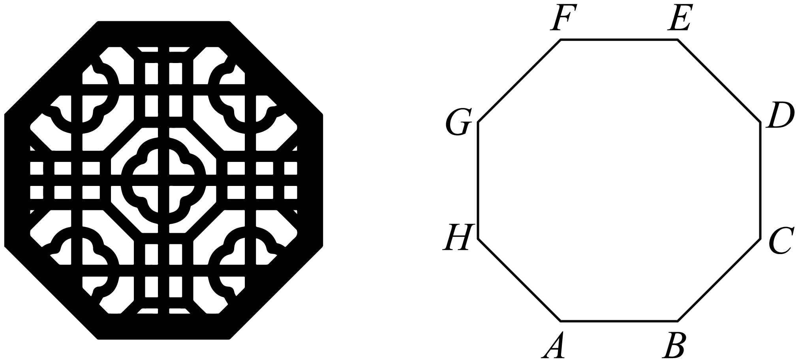
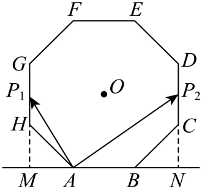

## 讲解

### 判据

动点、变夹角或线性组合参数使数量积变化，常见两条路线：用固定方向上的有向投影读极值；或用参数表达动向量，把数量积化为一次、二次函数。先判断哪些模、哪些方向固定，不能把有关联的量都当作独立自由量。

### 流程及理由

1. 确定变化条件及端点是否可取。点在线段上可设 $\overrightarrow{AP}=t\overrightarrow{AC}$，t∈[0,1]；在开线段上则 t∈(0,1)。这个范围来自同向且长度不超过 AC。
2. 将每个目标向量转成固定向量和参数的组合。共同起点不同可用向量减法，特别要注意 PA=−AP。
3. 用分配律代入固定向量的模及数量积，得到关于 t 的函数。若是二次式，配方找到顶点，再确认顶点是否在允许区间内，并比较区间端点。
4. 写出最值及取得条件；求范围要同时求上下界。连续函数在闭区间内取遍最小值与最大值之间的每个数，因此得到闭区间；开端点需另查是否还能在内部取得同值。
5. 若参照 b 固定且非零，a 在 b 方向的投影数量为 $(a\cdot b)/|b|$，分母是正常数，所以将数量积范围整体除以 |b| 即得投影数量范围。投影向量则要写出沿单位方向的向量集合；其模为投影数量绝对值，跨过 0 时不能只把两端点绝对值当新范围。

若两个向量均非零，只固定两模、允许所有夹角，$-1\le\cos\theta\le1$ 给出 $-|a||b|\le a\cdot b\le|a||b|$，等号对应反向和同向；实际动点限制可能不允许这两个方向，此时这些估计只是界，不一定是可取最值。若某一个向量为零，则数量积恒为 0，应直接讨论，不使用夹角。

## 例题

### 原例（HSMA-B2-C6-D241abfc2bdfc-P0108–P0124）

> 原件：专题6.3 向量的数量积（举一反三讲义）高一数学人教A版必修第二册（解析版）.docx。题源标注沿用原资料。下文保留原题、原答案、原解题思路与原详解。

【变式2-3】（24-25高一下·河南·月考）在$\triangle ABC$中，$AB=2,AC=4,\angle BAC=60^{\circ}$，$P$是$AC$上一动点，则 $\vec{PA}\cdot \vec{PB}$的最小值为（    ）

A．$\frac{1}{2}$  B．$-\frac{1}{2}$  C．$\frac{1}{4}$  D．$-\frac{1}{4}$

【答案】D

【解题思路】先设$\vec{AP}=\lambda \vec{AC}(0\le \lambda \le 1)$，将$\vec{PB}$用$\vec{AB}$与$\vec{AP}$表示出来，再根据向量数量积的运算律求出$\vec{PA}\cdot \vec{PB}$关于$\lambda $的表达式，最后根据二次函数的性质求出最小值.

【解答过程】设$\vec{AP}=\lambda \vec{AC}(0\le \lambda \le 1)$，因为$\vec{PB}=\vec{AB}-\vec{AP}$，所以$\vec{PB}=\vec{AB}-\lambda \vec{AC}$. 

因为$\vec{PA}=-\vec{AP}=-\lambda \vec{AC}$，所以$\vec{PA}\cdot \vec{PB}=(-\lambda \vec{AC})\cdot (\vec{AB}-\lambda \vec{AC})$.

则$\vec{PA}\cdot \vec{PB}=-\lambda \vec{AC}\cdot \vec{AB}+{\lambda }^{2}{\vec{AC}}^{2}$，

因为$\vec{AC}\cdot \vec{AB}=|\vec{AC}||\vec{AB}|\cos \angle BAC=4\times 2\times \cos 60^{\circ}=4\times 2\times \frac{1}{2}=4$，

${\vec{AC}}^{2}=|\vec{AC}{|}^{2}={4}^{2}=16$ .

所以$\vec{PA}\cdot \vec{PB}=-4\lambda +16{\lambda }^{2}=16{\lambda }^{2}-4\lambda $. 

令$y=16{\lambda }^{2}-4\lambda $，

这是一个二次函数，二次项系数$16>0$，函数图象开口向上，对称轴为$\lambda =-\frac{b}{2a}=-\frac{-4}{2\times 16}=\frac{1}{8}$.

因为$0\le \lambda \le 1$，所以当$\lambda =\frac{1}{8}$时，$y$取得最小值，

${y}_{\min }=16\times {\left( \frac{1}{8}\right)}^{2}-4\times \frac{1}{8}=16\times \frac{1}{64}-\frac{1}{2}=\frac{1}{4}-\frac{1}{2}=-\frac{1}{4}$.

即$\vec{PA}\cdot \vec{PB}$的最小值为$-\frac{1}{4}$. 

故选：D.

**补讲：把原解中的理由补完整**

看到“P 在 AC 上”，先设 AP=λAC，范围为 [0,1]；这是把二维动点压成一个实数变量。PA 指回 A，故为 −λAC，而 PB=AB−λAC。数量积于是为 $-\lambda(AC\cdot AB)+\lambda^2|AC|^2$。固定几何量分别是 4 和 16，代入得到 $16\lambda^2-4\lambda=16(\lambda-1/8)^2-1/4$。顶点 λ=1/8 在允许区间中，最小值为 −1/4；A、C 非负，B 的负值小于实际下界，D 正确。

本例若需要核对上界，端点 λ=0、1 对应数值 0、12，因此全范围是 [−1/4,12]。PA、PB 的模随同一个参数变化，不能误当两个互不相关的固定量。因为 PB 随 λ 变化，不能将该数量积范围直接除以一个“固定 |PB|”充作投影范围。

### 原例（HSMA-B2-C6-D241abfc2bdfc-P0334–P0349）

> 原件：专题6.3 向量的数量积（举一反三讲义）高一数学人教A版必修第二册（解析版）.docx。题源标注沿用原资料。下文保留原题、原答案、原解题思路与原详解。

【变式8-1】（24-25高一下·贵州毕节·月考）如图，某八角楼空窗的边框呈正八边形.已知正八边形$ABCDEFGH$的边长为$4,P$为正八边形内的一点（含边界），则$\vec{AP}\cdot \vec{AB}$的取值范围为（    ）

A．$\left[ 16-4\sqrt{2},8\sqrt{2}\right]$  B．$\left[ -8\sqrt{2},8\sqrt{2}\right]$

C．$\left[ 16-8\sqrt{2},16+8\sqrt{2}\right]$  D．$\left[ -8\sqrt{2},16+8\sqrt{2}\right]$

【答案】D

【解题思路】利用平面向量数量积的几何意义可解问题.

【解答过程】过点$H$、$C$分别作$AB$的垂线，垂足分别为点$M$、$N$，如下图所示：

  

其中$\angle HAM=\angle CBN=\frac{\pi }{4}$，故$AM=BN=4\cos \frac{\pi }{4}=2\sqrt{2}$，

当点$P$在线段$HG$上时，$\left| \vec{AP}\right|\cos \left\langle  \vec{AB},\vec{AP}\right\rangle $取最小值，

此时，$\vec{AB}\cdot \vec{AP}=\vec{AB}\cdot \vec{AM}=-\left| \vec{AB}\right|\cdot \left| \vec{AM}\right|=-4\times 2\sqrt{2}=-8\sqrt{2}$，

当点$P$在线段$CD$上时，$\left| \vec{AP}\right|\cos \vec{AB},\vec{AP}$取最大值，

此时，$\vec{AB}\cdot \vec{AP}=\vec{AB}\cdot \vec{AN}=\left| \vec{AB}\right|\cdot \left| \vec{AN}\right|=\left| \vec{AB}\right|\cdot \left( \left| \vec{AB}\right|+\left| \vec{BN}\right|\right)=4\times \left( 4+2\sqrt{2}\right)$

$=16+8\sqrt{2}$，

综上所述，$\vec{AB}\cdot \vec{AP}\in \left[ -8\sqrt{2},16+8\sqrt{2}\right]$.

故选：D.

**资料勘误与边界（与原文分开）**

P0345 的“$\cos\vec{AB},\vec{AP}$”缺少夹角括号，应读作 $\cos\langle\vec{AB},\vec{AP}\rangle$。另外 P 可为 A，此时 AP 为零，夹角无定义，应直接说投影数量为 0。两处均不改变原答案 D。

**补讲：把原解中的理由补完整**

这次 AB 是长度 4 的固定参照方向，可直接看 AP 在该方向上的有向投影 p。沿 A→B 指定正方向，左侧竖边 HG 上的点投影到 M，投影数量为 −AM=−2√2；右侧竖边 CD 上的点投影到 N，投影数量为 AN=4+2√2。正八边形全部在这两条竖线之间，所以任何允许的 P 都满足 $-2\sqrt2\le p\le4+2\sqrt2$。

两个边界都包括，且正八边形是凸的：任取一个左边界点与一个右边界点，它们之间的线段仍在允许区域内，P 沿该线段移动可取遍中间投影。因此投影数量的完整范围为 $[-2\sqrt2,4+2\sqrt2]$。数量积 AP·AB=4p，乘以正数 4 保持顺序，得到 $[-8\sqrt2,16+8\sqrt2]$，D 正确。A、B 的上界均不足，C 的下界遗漏左侧点取得的负值。

“投影向量范围”还需乘 AB 同向单位向量 e，写成集合 $\{t\vec e:-2\sqrt2\le t\le4+2\sqrt2\}$；它的模范围则是 [0,4+2√2]，因为投影数量跨过 0。不能把带正负的投影数量范围当作非负长度范围。

## 易错

- 数量积允许为负，不把最小值限制为 0。
- 顶点不在区间时应在端点取最值，不直接抄二次函数在全体实数上的极值。
- 投影数量、投影向量及其模的范围不是同一对象，先读清题目再计算。

## 来源

- HSMA-B2-C6-D241abfc2bdfc-P0083–P0124；原件《专题6.3 向量的数量积（举一反三讲义）高一数学人教A版必修第二册（解析版）.docx》；知识及分类口径。
- HSMA-B2-C6-D241abfc2bdfc-P0125–P0154；原件《专题6.3 向量的数量积（举一反三讲义）高一数学人教A版必修第二册（解析版）.docx》；知识及分类口径。
