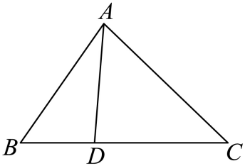

本条文字运算中的“AB”等两字母记号，简称从A指向B的向量；线段长度或正长度比另行说明。

## 讲解

### 是什么

固定参考点O，从O指向某点P的$\overrightarrow{OP}$叫P的位置向量。把各点都放在同一参考点下，线段向量就能写成终点的位置向量减起点的位置向量：$\overrightarrow{AB}=\overrightarrow{OB}-\overrightarrow{OA}$。

A、B不同，若$\overrightarrow{AP}=t\overrightarrow{AB}$，则t描述P在直线AB上的位置：t=0在A，t=1在B，0<t<1在线段内部，t<0在A外侧，t>1在B外侧。由方向与模公式可知$AP:PB=|t|:|1-t|$。

### 怎么来的

从O经A到P，按首尾相接有$\overrightarrow{OP}=\overrightarrow{OA}+\overrightarrow{AP}$；把分点条件和$\overrightarrow{AB}=\overrightarrow{OB}-\overrightarrow{OA}$代入：

$$\overrightarrow{OP}=\overrightarrow{OA}+t(\overrightarrow{OB}-\overrightarrow{OA})=(1-t)\overrightarrow{OA}+t\overrightarrow{OB}.$$

若P在线段AB内部且AP:PB=m:n（m、n为正数），AB=AP+PB，所以t=m/(m+n)。因而

$$\overrightarrow{OP}=\frac{n}{m+n}\overrightarrow{OA}+\frac{m}{m+n}\overrightarrow{OB}.$$

靠近A时AP小，B对应的系数t也小；这解释了端点位置向量的系数与相邻长度比次序相反。中点时t=1/2，得到位置向量的平均值。这一推导不要求O离开直线AB。

### 什么时候能用

系数和为1的式子$(1-t)\overrightarrow{OA}+t\overrightarrow{OB}$总能表示直线AB上的点（A≠B）。反方向推理要更谨慎：若已写$\overrightarrow{OP}=\lambda\overrightarrow{OA}+\mu\overrightarrow{OB}$，想从P、A、B共线推出λ+μ=1，须额外保证$\overrightarrow{OA}$与$\overrightarrow{OB}$不共线，即O不在直线AB上。因为只有在两个方向独立时，才能与标准分点表示逐项比较系数。

若O在直线AB上，两个参照向量可能互为倍数，系数表示不唯一，不能强迫λ+μ=1。内分比使用正长度；外分必须先确定t的区间，再用绝对值转长度比，不能把有符号系数直接当正长度。

### 资料疑点：系数和推论缺少条件

**原知识结论（P0218，公式据原WMF image47恢复）：**“$\overrightarrow{OA}=\lambda\overrightarrow{OB}+\mu\overrightarrow{OC}$（λ、μ为实数），若A、B、C三点共线，则λ+μ=1。”

**条件补注：**原表述未列出$\overrightarrow{OB}$、$\overrightarrow{OC}$不共线的前提。应在B、C不同点且O不在直线BC上时，才从上述共线关系推出给定系数和为1。若O=B，OB为零向量，λ乘OB始终为零，λ可以任意改动而不改变等式，所以不能强迫λ+μ=1。标准分点表示OA=(1−t)OB+tOC能推出A、B、C共线，这个方向不需要O在直线外；两方向的条件不能混用。本补注修正知识条件，下面的原题、原答案及原解保持原文。

### 三角形重心与角平分线的线性判据

三角形ABC的**重心G**是三条中线的交点。若D为BC中点，中点公式给$\overrightarrow{AD}=(\overrightarrow{AB}+\overrightarrow{AC})/2$。取$\overrightarrow{AG}=(\overrightarrow{AB}+\overrightarrow{AC})/3$，便有$\overrightarrow{AG}=2\overrightarrow{AD}/3$，所以G在中线AD上、AG:GD=2:1。同样从B、C出发可得相应比例，故该点同时在三条中线上。改成任意公共起点O，得到

$$\overrightarrow{OG}=\frac{\overrightarrow{OA}+\overrightarrow{OB}+\overrightarrow{OC}}3\quad\Longleftrightarrow\quad\overrightarrow{GA}+\overrightarrow{GB}+\overrightarrow{GC}=\vec0.$$

右边来自GA=OA−OG等三式相加；反过来，三项和为零也推出位置向量平均式。这是“重心”判据。只给GA=−2GD要先保证D为BC中点；否则2:1比例不自动成为重心条件。

另一个常见判据是**两个同起点的单位边向量之和指向内角平分线**。对非退化三角形，令$\vec u=\overrightarrow{AB}/|\overrightarrow{AB}|$、$\vec v=\overrightarrow{AC}/|\overrightarrow{AC}|$，在A处画两个长度均为1的箭头作为邻边，平行四边形成为菱形；从A出发的对角线向量就是u+v，菱形对角线平分邻边夹角。因此$\overrightarrow{AP}=t(\vec u+\vec v)$在t≥0时是一条内角平分射线，经过三角形内心；t遍历实数时是整条角平分线。三角形两边非零且不反向，保证和向量非零。若没有先除以两边各自的模，AB+AC只指向中线方向，一般不是角平分线。

这两种判断分别抓“中线”和“角平分线”；外心依据等距、垂心依据高线的垂直，不能单凭系数或点名混用。

## 例题
### 原例：将分点条件改写成同一起点

来源：HSMA-B2-C6-Da71b1905d92a-P0102—P0109；原件《专题6.2 平面向量的运算（举一反三讲义）数学人教A版必修第二册（解析版）.docx》。下列题干、选项、原答案、原解题思路与原解答过程完整保留。

【例2】（24-25高一下·浙江·期中）在$\triangle ABC$中，$\vec{BC}=3\vec{BD}$，则$\vec{AC}=$（   ）

A．$4\vec{AD}-3\vec{AB}$  B．$3\vec{AD}-4\vec{AB}$  C．$3\vec{AD}-2\vec{AB}$  D．$2\vec{AD}-3\vec{AB}$

【答案】C

【解题思路】根据向量的线性运算，可得答案.

【解答过程】

$\because \vec{BC}=3\vec{BD}$，$\therefore \vec{AC}-\vec{AB}=3\left( \vec{AD}-\vec{AB}\right)$，$\therefore \vec{AC}=-2\vec{AB}+3\vec{AD}$.

故选：C.

**补讲**

由BC=3BD，D在B到C的1/3处，BD与BC同向。改成A为公共起点时，BC=AC−AB，BD=AD−AB，所以$\overrightarrow{AC}-\overrightarrow{AB}=3\overrightarrow{AD}-3\overrightarrow{AB}$。两边加AB，得到AC=3AD−2AB，选C。A、B、D的系数不满足原分点条件；不要仅凭系数3就把AD与AC当成共线。
### 原例：线段内分的方向与比例

来源：HSMA-B2-C6-Da71b1905d92a-P0117—P0124；原件《专题6.2 平面向量的运算（举一反三讲义）数学人教A版必修第二册（解析版）.docx》。下列题干、选项、原答案、原解题思路与原解答过程完整保留。

【变式2-2】（24-25高一下·河南郑州·期中）点$C$在线段$AB$上，且$\frac{AC}{CB}=\frac{5}{2}$，则下列选项正确的是（   ）

A．$\vec{AC}=\frac{5}{7}\vec{AB}$  B．$\vec{AC}=\frac{2}{5}\vec{CB}$

C．$\vec{BC}=\frac{2}{7}\vec{AB}$  D．$\vec{BC}=-\frac{5}{2}\vec{BA}$

【答案】A

【解题思路】由向量的线性运算即可求解.

【解答过程】因为点$C$在线段$AB$上，且$\frac{AC}{CB}=\frac{5}{2}$，

所以$\vec{AC}=\frac{5}{5+2}\vec{AB}=\frac{5}{7}\vec{AB}$，$\vec{AC}=\frac{5}{2}\vec{CB}$，$\vec{BC}=\frac{2}{2+5}\vec{CA}=-\frac{2}{7}\vec{AB}$，故A正确，BCD错误.

故选：A.

**补讲**

C在线段AB内部，AC:CB=5:2，故AB分成7份，AC取5份、CB取2份；AC与AB同向，BC与AB反向，所以$\overrightarrow{AC}=5\overrightarrow{AB}/7$，$\overrightarrow{BC}=-2\overrightarrow{AB}/7$。A正确。B把AC与CB的5:2倒成2:5；C漏反向负号；D中的BC与BA同向，系数应为2/7而非−5/2。

**勘误（与原解分开）：**原解P0123写$\overrightarrow{BC}=\frac27\overrightarrow{CA}=-\frac27\overrightarrow{AB}$，中间项$\frac27\overrightarrow{CA}$错误，导致与它相连的两个等号均不成立。若保留该等式链，应将CA改为BA：$\overrightarrow{BC}=\frac27\overrightarrow{BA}=-\frac27\overrightarrow{AB}$；也可直接写$\overrightarrow{BC}=-\overrightarrow{CB}$。原答案A不变。

## 易错

- 内分公式中A的系数对应PB，B的系数对应AP，先从$\overrightarrow{OP}=\overrightarrow{OA}+\overrightarrow{AP}$推一次就不会倒。
- λ+μ=1不是所有共线位置向量表达式的无条件结论，反推时需要参考点在分点直线外。
- 本条仅需位置向量与线性运算，不要求先建立平面直角坐标系。

## 来源定位

- 知识与分类依据：HSMA-B2-C6-Da71b1905d92a-P0071；P0101—P0132；P0216—P0218；P0307—P0355，《专题6.2 平面向量的运算（举一反三讲义）数学人教A版必修第二册（解析版）.docx》。本条据其知识主线补足理由和适用条件。
- 原例标注的校次与考试名称为资料原标注，未作外部来源认证。原题原解与补讲、勘误分别列出。
