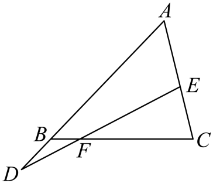

本条文字运算中的“AB”等两字母记号，简称从A指向B的向量；线段长度或正长度比另行说明。

## 讲解

### 判据

看到一点在线段上或在两条直线的交点上，且给出向量倍数、线段比例、两个方向的线性组合时使用。目的是把点的位置变成带符号的倍数t，再转成所求系数或长度比。

### 流程

1. **确定共线点及非零参照线段。** P在直线AB且A≠B，设AP=tAB；在内部则0<t<1，外部则t<0或t>1。倍数符号先体现方向。
2. **转为公共起点表示。** 任取O，OP=(1−t)OA+tOB来自OP=OA+AP，再代入AB=OB−OA。若给另一条共线关系，同样转到一个公共起点。
3. **比较交点的两种表示。** 参照方向不共线时，系数必须分别相等。若用“系数和=1”，须保证公共起点不在对应直线上，或直接由标准分点表示推得，不能将它当作无条件口令。
4. **还原长度比。** 由AP=tAB与PB=(1−t)AB，得到AP:PB=|t|:|1−t|；只有内分0<t<1时可去绝对值。若原式是OP=αOA+βOB且α+β=1，内分比AP:PB=β:α，注意系数与相邻长度次序。
5. **核对题目要的是向量比例还是正长度比。** 向量倍数可能负，长度比必须非负；不同起点的向量一般不能仅凭系数推出长度比。

## 例题
### 原例：线段内分的方向与比例

来源：HSMA-B2-C6-Da71b1905d92a-P0117—P0124；原件《专题6.2 平面向量的运算（举一反三讲义）数学人教A版必修第二册（解析版）.docx》。下列题干、选项、原答案、原解题思路与原解答过程完整保留。

【变式2-2】（24-25高一下·河南郑州·期中）点$C$在线段$AB$上，且$\frac{AC}{CB}=\frac{5}{2}$，则下列选项正确的是（   ）

A．$\vec{AC}=\frac{5}{7}\vec{AB}$  B．$\vec{AC}=\frac{2}{5}\vec{CB}$

C．$\vec{BC}=\frac{2}{7}\vec{AB}$  D．$\vec{BC}=-\frac{5}{2}\vec{BA}$

【答案】A

【解题思路】由向量的线性运算即可求解.

【解答过程】因为点$C$在线段$AB$上，且$\frac{AC}{CB}=\frac{5}{2}$，

所以$\vec{AC}=\frac{5}{5+2}\vec{AB}=\frac{5}{7}\vec{AB}$，$\vec{AC}=\frac{5}{2}\vec{CB}$，$\vec{BC}=\frac{2}{2+5}\vec{CA}=-\frac{2}{7}\vec{AB}$，故A正确，BCD错误.

故选：A.

**补讲**

已知内部点C，AC:CB=5:2，AB分7份，直接得到AC=5AB/7，CB=2AB/7。BC箭头反转，应为−2AB/7，所以A正确、C错；B倒置5:2，D方向和数值均错误。

**勘误（保留原解后另列）：**P0123的$\overrightarrow{BC}=\frac27\overrightarrow{CA}$错误。由CB占AB的2/7、BC与CB反向，正确等式链应把中间的CA改成BA：$\overrightarrow{BC}=\frac27\overrightarrow{BA}=-\frac27\overrightarrow{AB}$。原答案A不受影响。
### 原例：交点关系中的系数和

来源：HSMA-B2-C6-Da71b1905d92a-P0276—P0286；原件《专题6.2 平面向量的运算（举一反三讲义）数学人教A版必修第二册（解析版）.docx》。下列题干、选项、原答案、原解题思路与原解答过程完整保留。

【变式6-1】（25-26高二上·广西贵港·开学考试）如图，设$\vec{AB}=x\vec{AD}$，$\vec{AC}=y\vec{AE}$，线段$DE$与$BC$交于点F，且$\vec{BF}=\frac{1}{5}\vec{BC}$，则$4x+y=$（   ）

A．4  B．3  C．$\frac{5}{2}$  D．5

【答案】D

【解题思路】先计算出$\vec{AF}=\frac{1}{5}\vec{AC}+\frac{4}{5}\vec{AB}$，进而得到$\vec{AF}=\frac{1}{5}y\vec{AE}+\frac{4}{5}x\vec{AD}$，利用共线定理的推论得到$\frac{1}{5}y+\frac{4}{5}x=1$，得到答案.

【解答过程】$\vec{BF}=\vec{AF}-\vec{AB}$，$\vec{BC}=\vec{AC}-\vec{AB}$，

又$\vec{BF}=\frac{1}{5}\vec{BC}$，故$\vec{AF}-\vec{AB}=\frac{1}{5}\vec{AC}-\frac{1}{5}\vec{AB}$，所以$\vec{AF}=\frac{1}{5}\vec{AC}+\frac{4}{5}\vec{AB}$，

因为$\vec{AB}=x\vec{AD}$，$\vec{AC}=y\vec{AE}$，所以$\vec{AF}=\frac{1}{5}y\vec{AE}+\frac{4}{5}x\vec{AD}$，

因为$D,E,F$三点共线，所以$\frac{1}{5}y+\frac{4}{5}x=1$，

故$4x+y=5$.

故选：D.

**补讲**

BF=BC/5给出F在BC内部的1/5处，以A为公共起点推AF=AB+BF=AB+(AC−AB)/5=4AB/5+AC/5。再把AB=xAD、AC=yAE代入，AF=(4x/5)AD+(y/5)AE。

因图中A、D、E不共线，且F在直线DE上，可另设DF=tDE，则AF=(1−t)AD+tAE。两式比较系数，4x/5=1−t、y/5=t；相加得(4x+y)/5=1，所以4x+y=5，选D。这个证明明确给出了原解直接引用“推论”时的非共线前提；A、B、C都不满足交点的两种表示。

## 易错

- BF=BC/5对应BF:FC=1:4；不是BF:FC=1:5，分母5指整段BC。
- OP中A、B的系数与AP:PB次序相反，先找t对应哪一段。
- 公共起点位于分点直线上时，系数不唯一，不能由共线反推任意给定系数和为1。

## 来源定位

- 知识与分类依据：HSMA-B2-C6-Da71b1905d92a-P0117—P0124；P0210—P0218；P0267—P0286，《专题6.2 平面向量的运算（举一反三讲义）数学人教A版必修第二册（解析版）.docx》。本条据其知识主线补足理由和适用条件。
- 原例标注的校次与考试名称为资料原标注，未作外部来源认证。原题原解与补讲、勘误分别列出。
