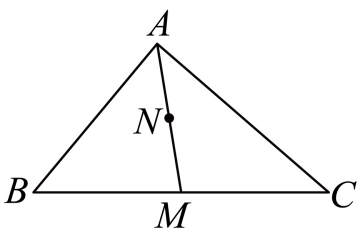

本条文字运算中的“AB”等两字母记号，简称从A指向B的向量；线段长度或正长度比另行说明。

## 讲解

### 判据

题目给某个向量是几个向量的线性组合，含λ、μ等未知系数；同时给中点、定比分点或一个向量方程时，先把几何条件变成线性式，再在同一组参照向量下比较。若只有一个非零参照向量，直接比较它的系数即可。

### 流程

1. **选公共起点和参照方向。** 三角形中常用AB、AC；因A、B、C不共线，这两个向量不共线，能比较系数。一般图形中要先证明所选参照不共线，不能只因名称不同就比较。
2. **把分点改成向量倍数。** M为BC中点，用AM=(AB+AC)/2；N为AM中点，用AN=AM/2。每次分点先写位置关系，再代入，保证比例跟着正确线段。
3. **将原方程全部改成同一表达方式。** 公共起点P时，AB=PB−PA；把非公共起点的向量换掉，才能合并同类项。
4. **展开与移项，每行说明依据。** 同一参照方向的系数合并；由不共线向量表示的两式相等，差式只能各系数为0。若右边只有一个向量，须证明它非零才能消去。
5. **代回原条件。** 核验系数对应哪一个向量，再计算题目真正要求的组合，如λ+2μ，避免把已求的λ或μ直接当答案。

## 例题
### 原例：两次取中点求系数

来源：HSMA-B2-C6-Da71b1905d92a-P0173—P0182；原件《专题6.2 平面向量的运算（举一反三讲义）数学人教A版必修第二册（解析版）.docx》。下列题干、选项、原答案、原解题思路与原解答过程完整保留。

【例4】（24-25高一下·甘肃定西·期末）在$\triangle ABC$中，M为边$BC$中点，N为$AM$的中点，$\vec{AN}=\lambda \vec{AB}+\mu \vec{AC}$，则$\lambda +2\mu =$（　　）

A．$\frac{1}{4}$  B．$\frac{1}{2}$  C．$\frac{3}{4}$  D．1

【答案】C

【解题思路】由向量的线性运算即可求解.

【解答过程】

因为在$\triangle ABC$中，M为边$BC$中点，N为$AM$的中点，

所以$\lambda \vec{AB}+\mu \vec{AC}=\vec{AN}=\frac{1}{2}\vec{AM}=\frac{1}{2}\cdot \frac{1}{2}\left( \vec{AB}+\vec{AC}\right)=\frac{1}{4}\vec{AB}+\frac{1}{4}\vec{AC}$，

所以$\lambda +2\mu =\frac{3}{4}$.

故选：C.

**补讲**

M中点给AM=(AB+AC)/2，N再取中点给AN=AM/2，因此AN=(AB+AC)/4。三角形的AB、AC不共线，所以λ=μ=1/4；题目要λ+2μ=1/4+2/4=3/4，选C。A只取一个系数；B相当于遗漏系数2；D与两次取中点的结果不符。
### 原例：公共起点消去求参数

来源：HSMA-B2-C6-Da71b1905d92a-P0183—P0190；原件《专题6.2 平面向量的运算（举一反三讲义）数学人教A版必修第二册（解析版）.docx》。下列题干、选项、原答案、原解题思路与原解答过程完整保留。

【变式4-1】（24-25高三上·安徽宣城·期末）在$\triangle ABC$所在平面中有一点P满足$\vec{PA}=\lambda \vec{BC}$，且$\vec{PA}+\vec{PB}+\vec{PC}=2\vec{AB}$，则$\lambda =$（   ）

A．$\frac{1}{2}$  B．$-\frac{1}{2}$  C．$-\frac{1}{3}$  D．$\frac{1}{3}$

【答案】C

【解题思路】应用向量加减的运算法则得$3\vec{PA}=-\vec{BC}$，结合已知即可得答案.

【解答过程】由题设$\vec{PA}+\vec{PB}+\vec{PC}=2(\vec{PB}-\vec{PA})$，则$3\vec{PA}+\vec{PC}=\vec{PB}$，

即$3\vec{PA}=\vec{PB}-\vec{PC}=\vec{CB}=-\vec{BC}$，则$\vec{PA}=-\frac{1}{3}\vec{BC}$，

又$\vec{PA}=\lambda \vec{BC}$，所以$\lambda =$ $-\frac{1}{3}$.

故选：C.

**补讲**

原式右边AB改为PB−PA，是公共起点P的减法关系。移项具体为：PA+PB+PC=2PB−2PA；两边加2PA、减PB，得3PA+PC=PB；再减PC，得3PA=PB−PC=CB=−BC。故PA=−BC/3。三角形中B≠C，所以BC非零，与PA=λBC比较得λ=−1/3，选C；A、B、D代回均不能使3PA=−BC成立。

## 易错

- 系数比较依赖参照向量不共线；共线参照可有不同系数组合表示同一个向量。
- 从PA=λBC转到AP时要变号：AP=−PA；参数正负由题目箭头方向决定。
- 参数值求出后代回原式核验，尤其检查中点是否连续取了两次。

## 来源定位

- 知识与分类依据：HSMA-B2-C6-Da71b1905d92a-P0172—P0190；P0213—P0217，《专题6.2 平面向量的运算（举一反三讲义）数学人教A版必修第二册（解析版）.docx》。本条据其知识主线补足理由和适用条件。
- 原例标注的校次与考试名称为资料原标注，未作外部来源认证。原题原解与补讲、勘误分别列出。
