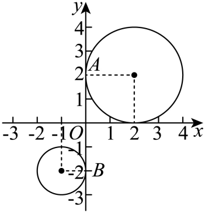

## 讲解

### 是什么

两真实圆半径r₁、r₂>0，中心距d≥0。五种关系通常针对两个不同圆：外离d>r₁+r₂；外切d=r₁+r₂；相交|r₁−r₂|<d<r₁+r₂；内切d=|r₁−r₂|且d>0；内含0≤d<|r₁−r₂|。同心不等半径属于内含；d=0且r₁=r₂为重合，有无穷公共点，不能塞进内切。

公切线与两圆都相切。两圆心在切线同侧是外公切线、异侧是内公切线；外切时过公共切点的切线两圆心异侧，属于一条内公切线。所谓公切线长指两切点之间线段长度，直线本身无限。

### 怎么来的

设d>0。在第一圆周上动点X，到O₂的距离最小|d−r₁|、最大d+r₁，沿圆心连线两端取得；沿两侧半圆弧，距离由余弦或连续变化逐步扫过两端之间。因此r₂严格在该区间内部时有关于圆心连线对称的两个交点；在端点只有一个共线接触点；超出区间无交点。等价改写就得到上面半径和/差五种条件；d=0时到O₂恒为r₁，半径相等全圆重合，不等则无公共点。

公切线为单位法向量n·X=c，选择n的朝向使第一个圆心的有向距离n·O₁−c=r₁。第二个圆心同侧时有向距离为r₂，异侧时为−r₂；相减得n·(O₂−O₁)分别为r₂−r₁或−(r₁+r₂)。长度d的圆心差在单位n上的投影能在[−d,d]变化，指定投影值的绝对值小于d时有两个对称方向、等于d时合为一个、超过d时无方向。每个方向以c=n·O₁−r₁确定一条线；把方程整体乘−1仍是同一线，不能按法向量的写法重复计数。

因此两个不同圆外离有4条、外切3条、相交2条、内切1条、内含0条。重合时每条该圆的切线同时切两圆，公切线无穷；同心不等半径无公切线。原P0019及公切线表“五种”在此补不同圆前提，原内容与补边界分开。

两切点间距沿切线方向，圆心差的垂直分量同侧为半径差、异侧为半径和，由勾股得：

$$\ell_{\text{外}}=\sqrt{d^2-(r_1-r_2)^2},\qquad \ell_{\text{内}}=\sqrt{d^2-(r_1+r_2)^2}.$$

先有相应公切线才能套；等号时切点重合，线段长0而公切线仍存在。根号负则这种切线不存在。

### 什么时候能用

先配方检半径正，再比d与和/差；参数圆把真圆条件与关系不等式取交集。求公切线方程可用一般式Ax+By+C=0、A²+B²>0，令两个中心到线的距离分别为r₁、r₂；若设y=kx+b，另查竖直线是否同时相切。相切圆的公共切点在圆心连线上，半径方向作切线法向量，仍须回代圆与切线。

联立两圆后用Δ，只在相减得到有效直线且进一步消元为真实二次式时有效。它只告诉公共点数，不能仅靠Δ<0分清外离与内含、Δ=0分清内外切；同心常数式及重合恒等式必须先处理。

## 易错

- d=|r₁−r₂|不检d>0就写内切：等半径同心是重合。
- 切线条数默认最多4：重合圆无穷，先确认不同圆。
- 根号可平方就漏m使半径0或虚圆：真圆条件先保留。
- 外/内公切线分量差或和用反：看中心同侧还是异侧，有向距离相减给依据。

知识与分类依据：`HSMA-B3-C2-D5d38bc3a3785-P0016-P0051`（《专题2.8 圆与圆的位置关系（举一反三讲义）数学人教A版2019选择性必修第一册（解析版）.docx》）；`HSMA-B3-C2-D5d38bc3a3785-P0179-P0183`（《专题2.8 圆与圆的位置关系（举一反三讲义）数学人教A版2019选择性必修第一册（解析版）.docx》）；`HSMA-B3-C2-D5d38bc3a3785-P0184-P0184`（《专题2.8 圆与圆的位置关系（举一反三讲义）数学人教A版2019选择性必修第一册（解析版）.docx》）。原资料口径、补条件与勘误分别说明。

## 例题

### 原例：五种判据先查中心与半径

来源：`HSMA-B3-C2-D5d38bc3a3785-P0053-P0059`；原件《专题2.8 圆与圆的位置关系（举一反三讲义）数学人教A版2019选择性必修第一册（解析版）.docx》。题号、学年及地区按讲义原标注，未另作来源核验。

以下完整保留原题、原答案与原详解（仅统一等价公式排版及配图路径）：

【例1】（24-25高二上·江苏南京·期末）已知圆${C}_{1}$：${x}^{2}+{y}^{2}=4$，${C}_{2}$：${x}^{2}+{y}^{2}-6x-8y+9=0$，则两圆的位置关系为（    ）

A．相交  B．外切  C．内切  D．内含

【答案】A

【解题思路】求出两圆半径及圆心距，再判断两圆的位置.

【解答过程】圆${C}_{1}$：${x}^{2}+{y}^{2}=4$的圆心${C}_{1}(0,0)$，半径${r}_{1}=2$，圆${C}_{2}$：${(x-3)}^{2}+{(y-4)}^{2}=16$圆心${C}_{2}(3,4)$，半径${r}_{2}=4$，

而$|{C}_{1}{C}_{2}|=5\in (2,6)$，所以两圆相交.

故选：A.

#### 补充讲解

C₁为O₁(0,0)、r₁=2；C₂配方时x²−6x=(x−3)²−9、y²−8y=(y−4)²−16，因此(x−3)²+(y−4)²=25−9=16，O₂(3,4)、r₂=4。圆心距d=√(3²+4²)=5>0。

|r₂−r₁|=2<5<6=r₁+r₂，严格介于两边界，所以有两个不同公共点，相交选A。圆心不同已经排除同心及重合；若另题d=0且r₁=r₂，虽然也满足d=|r₁−r₂|，却是重合而不是内切，不能不看“两个不同圆”的前提。

### 原例：内公切线的长度与竖直实线核验

来源：`HSMA-B3-C2-D5d38bc3a3785-P0185-P0195`；原件《专题2.8 圆与圆的位置关系（举一反三讲义）数学人教A版2019选择性必修第一册（解析版）.docx》。题号、学年及地区按讲义原标注，未另作来源核验。

以下完整保留原题、原答案与原详解（仅统一等价公式排版及配图路径）：

【例4】（24-25高二上·湖南·阶段练习）圆${C}_{1}$：${\left( x+1\right)}^{2}+{\left( y+2\right)}^{2}=1$与圆${C}_{2}$：${\left( x-2\right)}^{2}+{\left( y-2\right)}^{2}=4$的内公切线长为（   ）

A．3  B．5  C．$\sqrt{26}$  D．4

【答案】D

【解题思路】在平面直角坐标系中作出两个圆，由图可知内公切线一条为$y$轴，求公切线的长即可.

【解答过程】如图：

由图可知圆${C}_{1}$与圆${C}_{2}$的内公切线有一条为$y$轴，

则公切线的长为$\left| AB\right|=4$，

方法二：$\left| {C}_{1}{C}_{2}\right|=\sqrt{{\left( 2+1\right)}^{2}+{\left( 2+2\right)}^{2}}=5$，

所以内公切线的长为：$\sqrt{{\left| {C}_{1}{C}_{2}\right|}^{2}-{\left( 2+1\right)}^{2}}=\sqrt{25-9}=4$

故选：D.

#### 补充讲解

两个真实圆O₁(−1,−2)、r₁=1与O₂(2,2)、r₂=2，圆心距d=√(3²+4²)=5>3=r₁+r₂，属外离，确有两条内公切线。

原图所示y轴x=0的两圆心距离分别1和2，均等半径，所以它真与两圆相切，不只凭图说相切。切点分别(0,−2)、(0,2)，线段长4。圆心位于该线异侧，两条半径在法向上的合量r₁+r₂=3，与沿切线的切点间距组成直角分解，所以切点间距²=d²−(r₁+r₂)²=25−9=16，另一条内公切线对应也为4，选D。这里“公切线长”约定是两切点之间线段的长，直线本身无限长。
