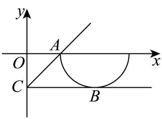
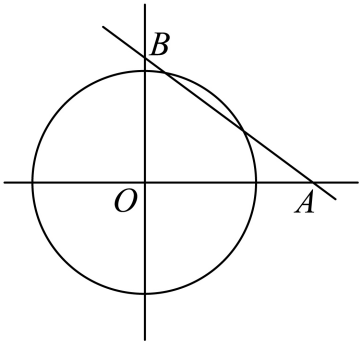
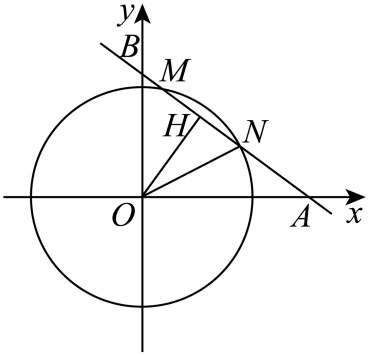

## 讲解

根号曲线、绝对值分段、指定圆弧或有限航线都含额外范围。完整圆Δ只判断放宽模型；目标应是原曲线与原路线的实际交点及可达长度。

### 判据与流程

1. 把原限制抄出：例如y=−√(r²−(x−a)²)同时要求a−r≤x≤a+r、y≤0；平方得到完整圆只是必要条件。反向用y≤0及圆方程能回原负根号，才等价。
2. 线族恒过点Q时，用允许弧上P的QP斜率或其他参数找范围；斜率商分母须非零。候选边界既可能是切点，也可能是弧端点，不能只找完整圆切线。
3. 若用消元Δ先给候选参数范围，再求根或用根位置条件逐个检原符号、区间和不同点个数；原图可提示位置，结论给坐标/不等式依据。
4. 圆形区域应用先建两条互相垂直坐标轴与统一单位。目标为路线内长度时，路线写A+t(B−A)、t∈[0,1]，联立圆解出边界参数；只保留区间内覆盖段。弧本身与圆盘区域分清。
5. 验端点及所有中间参数可达；连续弧上的连续斜率可在两个取得值之间遍历。时间=实际覆盖路程/速度，半径与路程统一km、速度km/h给h，不能把完整直线弦无条件拿来用。

## 易错

平方后丢上下半圆、边界本身不允许却取闭端、两个代数根只有一个在原弧、路线弦超有限AB，都会过计交点或路程。要求两个不同点与允许一个切点的题要分别处理。

知识与分类依据：`HSMA-B3-C2-D0c06f82afa09-P0393-P0393`（《专题2.7 直线与圆的位置关系（举一反三讲义）数学人教A版2019选择性必修第一册（解析版）.docx》）；`HSMA-B3-C2-D0c06f82afa09-P0589-P0589`（《专题2.7 直线与圆的位置关系（举一反三讲义）数学人教A版2019选择性必修第一册（解析版）.docx》）；`HSMA-B3-C2-D0c06f82afa09-P0018-P0042`（《专题2.7 直线与圆的位置关系（举一反三讲义）数学人教A版2019选择性必修第一册（解析版）.docx》）。原资料口径、补条件与勘误分别说明。

## 例题

### 原例：下半圆范围与完整圆多出的交点

来源：`HSMA-B3-C2-D0c06f82afa09-P0394-P0405`；原件《专题2.7 直线与圆的位置关系（举一反三讲义）数学人教A版2019选择性必修第一册（解析版）.docx》。题号、学年及地区按讲义原标注，未另作来源核验。

以下完整保留原题、原答案与原详解（仅统一等价公式排版及配图路径）：

【例8】（24-25高二上·河北·阶段练习）若直线$y=kx-1$与曲线$y=-\sqrt{1-{\left( x-2\right)}^{2}}$有公共点，则实数k的取值范围是（   ）

A．$\left( 0,\frac{4}{3}\right]$  B．$\left[ \frac{1}{3},\frac{4}{3}\right]$  C．$\left[ 0,\frac{1}{2}\right]$  D．$\left[ 0,1\right]$

【答案】D

【解题思路】结合题设易得直线$y=kx-1$为恒过点$C\left( 0,-1\right)$的直线，曲线$y=-\sqrt{1-{\left( x-2\right)}^{2}}$表示以$\left( 2,0\right)$为圆心，1为半径的半圆（$x$轴及其下方），进而结合图象求解即可.

【解答过程】由$y=-\sqrt{1-{\left( x-2\right)}^{2}}$，得${\left( x-2\right)}^{2}+{y}^{2}=1\left( y\le 0\right)$，

则曲线$y=-\sqrt{1-{\left( x-2\right)}^{2}}$表示以$\left( 2,0\right)$为圆心，1为半径的半圆（$x$轴及其下方），如图，

直线$y=kx-1$为恒过点$C\left( 0,-1\right)$的直线，

结合图形可知，当直线与圆相切于点$B\left( 2,-1\right)$时，斜率$k$取得最小值，此时$k=0$；

当直线与圆相交于点$A\left( 1,0\right)$时，斜率$k$最大，此时$k=\frac{-1-0}{0-1}=1$，

综上所述，所以实数$k$的取值范围是$\left[ 0,1\right]$.

故选：D.

#### 补充讲解

根号要求1≤x≤3，又因y=−√(1−(x−2)²)，须y≤0。完整圆方程(x−2)²+y²=1之外，这两个边界不能丢。曲线上有−1≤y≤0，且x>0，所以过固定点(0,−1)的斜率k=(y+1)/x满足0≤k≤1：分子在[0,1]内且分母至少1。

最低点(2,−1)给k=0，左端点(1,0)给k=1，均属于原曲线。半圆弧连续，x不为0，使(y+1)/x在整段连续，连接这两点的弧段上由连续性取遍0与1之间，因此每个k∈[0,1]都确有交点，选D。若只与完整圆比较距离，|2k−1|/√(k²+1)≤1平方给3k²−4k≤0，即[0,4/3]，其中(1,4/3]的交点只在上半圆，是误加的解。原图辅助定位，取值上界与可达性已另给依据。

### 原例：完整直线弦先回有限航线参数

来源：`HSMA-B3-C2-D0c06f82afa09-P0608-P0624`；原件《专题2.7 直线与圆的位置关系（举一反三讲义）数学人教A版2019选择性必修第一册（解析版）.docx》。题号、学年及地区按讲义原标注，未另作来源核验。

以下完整保留原题、原答案与原详解（仅统一等价公式排版及配图路径）：

【变式11-1】（24-25高二上·四川眉山·期中）如图，已知一艘停在海面上的海监船$O$上配有雷达，其监测范围是半径为$25km$的圆形区域，一艘轮船从位于海监船正东$30km$的$A$处出发，径直驶向位于海监船正北$40km$的$B$处岛屿，速度为$28km/h$．这艘轮船能被海监船监测到的时长为（    ）

A．1小时  B．0.75小时  C．0.5小时  D．0.25小时

【答案】C

【解题思路】以$O$为原点，东西方向为$x$轴建立直角坐标系，求出直线与圆的方程，计算圆心到直线的距离和半径比较，可知这艘轮船能否被海监船监测到；计算弦长，可求得持续时间为多长．

【解答过程】如图，以$O$为原点，东西方向为$x$轴建立直角坐标系，

由题意可知$A(30,0)$，$B(0,40)$，圆$O$方程${x}^{2}+{y}^{2}={25}^{2}$，半径$r=25$，

直线$AB$方程：$\frac{x}{30}+\frac{y}{40}=1$，即$4x+3y-120=0$，

设$O$到$AB$距离为$d$，

则$d=\frac{\left| -120\right|}{\sqrt{{4}^{2}+{3}^{2}}}=24<25$，故直线与圆相交，

所以外籍轮船能被海监船检测到，

如图，设直线与圆交点为$M,N$，取$MN$中点$H$，连接$OH$，则$OH\perp MN$，

所以$MN=2\sqrt{O{N}^{2}-O{H}^{2}}=2\sqrt{{r}^{2}-{d}^{2}}=2\sqrt{{25}^{2}-{24}^{2}}=14$，

设监测时间为$t$，则$t=\frac{14}{28}=\frac{1}{2}$（小时），

故轮船能被海监船检测到的时间是0.5小时．

故选：C．

#### 补充讲解

以O为原点，东西/南北方向互相垂直，长度单位km，圆心O、r=25。A(30,0)、B(0,40)，AB的截距式乘120得4x+3y−120=0，垂距120/5=24<25，因此完整直线有长度14的弦。

题中船只走线段AB，不是无限直线，还须核两交点在路线内。写X(t)=A+t(B−A)=(30−30t,40t)，0≤t≤1；其到O距离平方900−1800t+2500t²。令它=625，得2500t²−1800t+275=0，Δ=490000，根t=(1800±700)/5000=11/50、1/2，都在[0,1]。因此船确走过整条监测弦，不需要截掉其中部分。AB长50，路线参数差1/2−11/50=7/25，覆盖路程50×7/25=14km；恒速28km/h，时间14/28=0.5h，选C。圆形区域按含边界理解，瞬间进出边界不改变持续时长。
