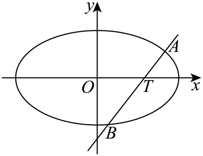
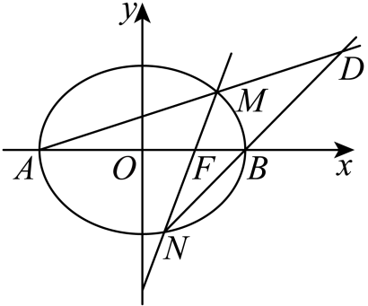

## 错法

画几条弦得到同一数便当定值；参数式只写一种方向而不检查漏线；把有向坐标积直接当距离乘积；证明中除未知坐标/交点因子，没说明它非零。

错因是原命题要求全部合法构型，有限试验只提供猜想。距离需要绝对值；零分母支路可能是原本合法的特殊方向，也可能原题已排除，但两种都要依据原条件说明，不能默默删掉。

## 正解

先列参数覆盖与合法域，联立确认二次与两不同根。用韦达转对称量时保根符号和距离绝对值。用两参数求候选常数后，代回恒等式证明任意参数成立；另查未覆盖方向。交点问题尽量用不除未知量的等式，若确需除，先从端点不是顶点、距离正或斜率存在证明因子非零。最后说明真实构型确实存在。

原解有笔误或省写前提时，原块保留，补讲另列勘误与可除理由，不把答案键或错行当证明。

## 例题

### 原例（HSMA-B3-C3-Da3556b33e2fa-P0529—P0550）

**原题与原解析（保留）**

【变式8-3】（24-25高二上·河南驻马店·阶段练习）已知过点$T\left( 1,0\right)$的直线$l$与椭圆$E:\frac{{x}^{2}}{{a}^{2}}+{y}^{2}=1\left( a>1\right)$交于$A,B$两点．当直线$AB$垂直于$x$轴时，$\left| AB\right|=\frac{2\sqrt{6}}{3}$．

(1)求$E$的方程．

(2)探究是否存在实数$\lambda $，使得$\frac{1}{{\left| AT\right|}^{2}}+\frac{1}{{\left| BT\right|}^{2}}-\frac{\lambda }{\left| AT\right|\cdot \left| BT\right|}$为定值．若存在，求出该定值；若不存在，说明理由．

【答案】(1)$\frac{{x}^{2}}{3}+{y}^{2}=1$

(2)存在，定值为$\frac{3}{2}$

【解题思路】（1）将$x=1$时，用$a$表示$A,B$纵坐标，再由$\left| AB\right|=\frac{2\sqrt{6}}{3}$解出$a$即可；

（2）设出直线$l$的方程为$x=my+1$，用韦达定理表示出$\frac{1}{{\left| AT\right|}^{2}}+\frac{1}{{\left| BT\right|}^{2}}-\frac{\lambda }{\left| AT\right|\cdot \left| BT\right|}$，若为定值，则结果要与$m$无关，从而求出实数$\lambda $．

【解答过程】（1）将$x=1$代入$E$的方程，得$\frac{1}{{a}^{2}}+{y}^{2}=1$，即$y=\pm \sqrt{1-\frac{1}{{a}^{2}}}$，

所以$\left| AB\right|=2\sqrt{1-\frac{1}{{a}^{2}}}=\frac{2\sqrt{6}}{3}$，解得${a}^{2}=3$，

所以椭圆$E$的方程为$\frac{{x}^{2}}{3}+{y}^{2}=1$．

（2）存在．

①当$l$不垂直于$y$轴时，设直线$l$的方程为$x=my+1$，$A\left( {x}_{1},{y}_{1}\right)$，$B\left( {x}_{2},{y}_{2}\right)$，

联立$\left\{ \begin{aligned}\frac{{x}^{2}}{3}+{y}^{2}=1,\\x=my+1,\end{aligned}\right.$得$\left( {m}^{2}+3\right){y}^{2}+2my-2=0$，

所以${y}_{1}+{y}_{2}=-\frac{2m}{{m}^{2}+3}$，${y}_{1}{y}_{2}=-\frac{2}{{m}^{2}+3}$，

又${\left| AT\right|}^{2}=\left( {m}^{2}+1\right){y}_{1}^{2}$，${\left| BT\right|}^{2}=\left( {m}^{2}+1\right){y}_{2}^{2}$，

所以$\frac{1}{{\left| AT\right|}^{2}}+\frac{1}{{\left| BT\right|}^{2}}-\frac{\lambda }{\left| AT\right|\cdot \left| BT\right|}=\frac{{y}_{1}^{2}+{y}_{2}^{2}+\lambda {y}_{1}{y}_{2}}{\left( {m}^{2}+1\right){y}_{1}^{2}{y}_{2}^{2}}=\frac{{\left( {y}_{1}+{y}_{2}\right)}^{2}+\left( \lambda -2\right){y}_{1}{y}_{2}}{\left( {m}^{2}+1\right){y}_{1}^{2}{y}_{2}^{2}}$，

所以$\frac{1}{{\left| AT\right|}^{2}}+\frac{1}{{\left| BT\right|}^{2}}-\frac{\lambda }{\left| AT\right|\cdot \left| BT\right|}=\frac{4{m}^{2}-2\left( \lambda -2\right)\left( {m}^{2}+3\right)}{4\left( {m}^{2}+1\right)}=\frac{\left( 4-\lambda \right){m}^{2}-3\left( \lambda -2\right)}{2\left( {m}^{2}+1\right)}$，

若为定值，则$4-\lambda =-3\left( \lambda -2\right)$，解得$\lambda =1$，

代入得$\frac{1}{{\left| AT\right|}^{2}}+\frac{1}{{\left| BT\right|}^{2}}-\frac{1}{\left| AT\right|\cdot \left| BT\right|}=\frac{3}{2}$；

②当$l$垂直于$y$轴时，由①知$\lambda =1$，不妨令$\left| AT\right|=\sqrt{3}+1$，$\left| BT\right|=\sqrt{3}-1$，有$\frac{1}{{\left| AT\right|}^{2}}+\frac{1}{{\left| BT\right|}^{2}}-\frac{1}{\left| AT\right|\cdot \left| BT\right|}=\frac{3}{2}$．

综上所述，存在$\lambda =1$使得$\frac{1}{{\left| AT\right|}^{2}}+\frac{1}{{\left| BT\right|}^{2}}-\frac{\lambda }{\left| AT\right|\cdot \left| BT\right|}$为定值$\frac{3}{2}$．

### 补讲

（1）竖直线x=1的两交点纵坐标±√(1−1/a²)，弦长给2√(1−1/a²)=2√6/3。两边非负，平方得到1−1/a²=2/3，故a²=3>1，方程x²/3+y²=1。

（2）T(1,0)在内部，所有过T的直线都有两不同端点，AT、BT均正。非水平线写x=my+1，m任意实数，包含竖直m=0；代入得(m²+3)y²+2my−2=0，二次项正，Δ=12m²+24>0。两根之积p=−2/(m²+3)<0，所以y₁、y₂异号且均非零；和s=−2m/(m²+3)。

距离AT=√(m²+1)|y₁|、BT=√(m²+1)|y₂|。其乘积=−(m²+1)p>0，故原表达式为[s²+(λ−2)p]/[(m²+1)p²]。代韦达得到[4m²−2(λ−2)(m²+3)]/[4(m²+1)]，展开−2(λ−2)后得到[(4−λ)m²−3(λ−2)]/[2(m²+1)]。

要对全部m恒定，取m=0与m=1比较，等价于4−λ=−3(λ−2)，解λ=1；再代回任意m，分子3m²+3恰为分母的3/2倍，所以全体非水平线的值3/2。这里比较两参数只是推出必要λ，代回恒等式才证明充分。

水平线y=0不在上述参数式中，端点(±√3,0)，两距离r=√3+1、s=√3−1，rs=2、r²+s²=8，所以1/r²+1/s²−1/(rs)=8/4−1/2=3/2。所有方向均覆盖，λ=1存在，定值3/2。

### 原例（HSMA-B3-C3-Da3556b33e2fa-P0552—P0574）

**原题与原解析（保留）**

【例9】（24-25高二上·河北石家庄·期中）已知$F(1,0)$为椭圆$C:\frac{{x}^{2}}{{a}^{2}}+\frac{{y}^{2}}{{b}^{2}}=1(a>b>0)$的右焦点，$A,B$分别为椭圆C的左、右顶点，且椭圆C过点$T\left( \frac{2}{3},-\frac{2\sqrt{6}}{3}\right)$．

(1)求椭圆C的标准方程；

(2)过点F作直线l与椭圆C交于$M,N$两点（不同于$A,B$），设直线$AM$与直线$BN$交于点D，证明：点D在定直线上．

【答案】(1)$\frac{{x}^{2}}{4}+\frac{{y}^{2}}{3}=1$

(2)证明见解析

【解题思路】（1）由椭圆定义得到$2a=\left| TA\right|+\left| TB\right|=4$，求出$a=2$，结合焦点坐标，得到$c=1,{b}^{2}={a}^{2}-{c}^{2}=3$，得到椭圆方程；

（2）设直线l的方程为$x=my+1$，联立椭圆方程，设$M\left( {x}_{1},{y}_{1}\right),N\left( {x}_{2},{y}_{2}\right)$，得到两根之和，两根之积，表达出直线$AM$和直线$BN$的方程，联立求出$\frac{x+2}{x-2}=3$，解得$x=4$，故点D在定直线$x=4$上.

【解答过程】（1）$F(1,0)$，由椭圆定义知

$2a=\sqrt{{\left( \frac{2}{3}+1\right)}^{2}+{\left( -\frac{2\sqrt{6}}{3}-0\right)}^{2}}+\sqrt{{\left( \frac{2}{3}-1\right)}^{2}+{\left( -\frac{2\sqrt{6}}{3}-0\right)}^{2}}=\frac{7}{3}+\frac{5}{3}=4$，

所以$a=2$，又$c=1,{b}^{2}={a}^{2}-{c}^{2}=3$，

所以椭圆C的标准方程为$\frac{{x}^{2}}{4}+\frac{{y}^{2}}{3}=1$

（2）若直线l的斜率为0，此时$M,N$两点与$A,B$重合，不合题意，舍去，

$F(1,0)$，设直线l的方程为$x=my+1$，

由$\left\{ \begin{aligned}\frac{{x}^{2}}{4}+\frac{{y}^{2}}{3}=1\\x=my+1\end{aligned}\right.$，得$\left( 3{m}^{2}+4\right){y}^{2}+6my-9=0$．

显然$\Delta =36{m}^{2}+36\left( 3{m}^{2}+4\right)>0$恒成立，设$M\left( {x}_{1},{y}_{1}\right),N\left( {x}_{2},{y}_{2}\right)$，

所以有${y}_{1}+{y}_{2}=-\frac{6m}{3{m}^{2}+4},{y}_{1}{y}_{2}=-\frac{9}{3{m}^{2}+4}$①

直线$AM$的方程为$y=\frac{{y}_{1}}{{x}_{1}+2}(x+2)$，直线$BN$的方程为$y=\frac{{y}_{2}}{{x}_{2}-2}(x-2)$，

联立两方程可得，所以$\frac{{y}_{1}}{{x}_{1}+2}(x+2)=\frac{{y}_{2}}{{x}_{2}-2}(x+2)$，

$\frac{x+2}{x-2}=\frac{{x}_{1}+2}{{y}_{1}}\cdot \frac{{y}_{2}}{{x}_{2}-2}=\frac{\left( m{y}_{1}+3\right){y}_{2}}{{y}_{1}\left( m{y}_{2}-1\right)}=\frac{m{y}_{1}{y}_{2}+3{y}_{2}}{m{y}_{1}{y}_{2}-{y}_{1}}$，

由①式可得$m{y}_{1}{y}_{2}=\frac{3}{2}\left( {y}_{1}+{y}_{2}\right)$，

代入上式可得$\frac{x+2}{x-2}=\frac{\frac{3}{2}\left( {y}_{1}+{y}_{2}\right)+3{y}_{2}}{\frac{3}{2}\left( {y}_{1}+{y}_{2}\right)-{y}_{1}}=\frac{\frac{3}{2}{y}_{1}+\frac{9}{2}{y}_{2}}{\frac{{y}_{1}}{2}+\frac{3{y}_{2}}{2}}=3$，

即$x+2=3x-6$，解得$x=4$，故点D在定直线$x=4$上.

### 补讲

（1）右焦点F(1,0)给c=1，左焦点是(−1,0)。T到两焦点的距离分别7/3、5/3，和4，故a=2、b²=4−1=3。原题A、B是长轴顶点，不能把TA+TB说成焦半径和；原详解实际计算用的是(±1,0)，补讲按焦点定义说明。

（2）水平焦点弦的端点正是A、B，已被原条件排除，全部合法l可写x=my+1。代回得到(3m²+4)y²+6my−9=0，二次项正，Δ=144(m²+1)>0，任意m都有两不同端点；积p=−9/(3m²+4)<0，故y₁、y₂均非零。和s=−6m/(3m²+4)，给mp=(3/2)s。

AM、BN斜率分别u=y₁/(x₁+2)、v=y₂/(x₂−2)。M≠A、N≠B保证分母非零（椭圆上x=−2只能是A，x=2只能是B），y₁≠0还给u≠0。代xᵢ=myᵢ+1，计算

$$v-3u=\frac{y_2(my_1+3)-3y_1(my_2-1)}{(my_2-1)(my_1+3)}=\frac{-2mp+3s}{(my_2-1)(my_1+3)}=0.$$

故v=3u且u≠0，两直线不平行，确有唯一交点D。直线方程y=u(x+2)、y=3u(x−2)联立，同除已知非零u，得x+2=3(x−2)，即x=4。这个证明未除未知的x−2，也不遗漏m=0的竖直焦点弦；D总在定直线x=4上。

### 资料说明（与原解分开）

原3.3 P0557思路把A、B（原题为顶点）写成用于椭圆定义的两焦点，标签误用；P0560实际计算的定点是(±1,0)，其数值正确。另P0570联立右侧末因子原写(x+2)，依P0569的BN方程应为(x−2)。原块保留两处原文，以上补讲另作勘误，不把原错行当推导依据。

## 来源

原件：专题3.3 直线与椭圆的位置关系（举一反三讲义）数学人教A版选择性必修第一册（解析版）.docx；来源 ID：Da3556b33e2fa。

知识与分类定位：HSMA-B3-C3-Da3556b33e2fa-P0423—P0443, HSMA-B3-C3-Da3556b33e2fa-P0528—P0528, HSMA-B3-C3-Da3556b33e2fa-P0551—P0551。

选用原例：HSMA-B3-C3-Da3556b33e2fa-P0529—P0550, HSMA-B3-C3-Da3556b33e2fa-P0552—P0574。
