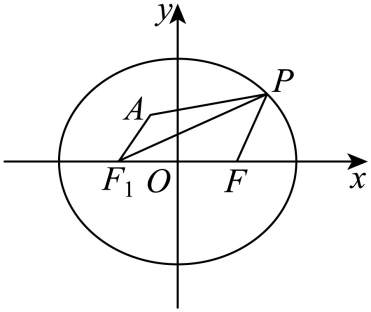

## 错法

配方得到非负平方，或三角不等式给出一个界，就把界称为最大/最小；等号仅写“三点共线”，不核顺序、区间、原曲线及附加限制。

错因是下界/上界只说所有点受到限制，最值还说某个合法点实际取得界。二次式顶点可能在允许区间外；共线点不同排列给不同距离等式；删去退化点的题可能恰好删掉等号点。

## 正解

写清不等式来源和全部等号条件。代数中先保坐标范围，再将等号横坐标代回椭圆求实纵坐标；几何中把等号位置写成正确线段/射线顺序，并证明该射线与原允许曲线相交。只有界可达才报最大/最小，不可达时重新优化或说明仅为上/下确界。

## 例题

### 原例（HSMA-B3-C3-D5e6f03c30626-P0349—P0356）

**原题与原解析（保留）**

【变式8-1】（24-25高二上·河南开封·期中）椭圆$\frac{{x}^{2}}{9}+\frac{{y}^{2}}{5}=1$上任一点P到点$Q(1,0)$的距离的最小值为（    ）

A．$\sqrt{3}$  B．$\frac{\sqrt{15}}{2}$  C．2  D．$\frac{2\sqrt{5}}{3}$

【答案】B

【解题思路】设$P(m,n)$，结合点在椭圆上利用两点距离公式得$|PQ|=\sqrt{\frac{4}{9}{\left( m-\frac{9}{4}\right)}^{2}+\frac{15}{4}}$，根据二次函数性质求解最值即可.

【解答过程】设点P的坐标为$(m,n)$，其中$m\in [-3,3]$，由$\frac{{m}^{2}}{9}+\frac{{n}^{2}}{5}=1$，可得${n}^{2}=5-\frac{5{m}^{2}}{9}$，

又由$|PQ|=\sqrt{{(m-1)}^{2}+{n}^{2}}=\sqrt{{(m-1)}^{2}+5-\frac{5}{9}{m}^{2}}=\sqrt{\frac{4}{9}{m}^{2}-2m+6}=\sqrt{\frac{4}{9}{\left( m-\frac{9}{4}\right)}^{2}+\frac{15}{4}}$，

当$m=\frac{9}{4}$时，$|PQ|$取得最小值，最小值为$|PQ{|}_{\min }=\frac{\sqrt{15}}{2}$.

故选：B.

### 补讲

由椭圆得到y²=5−5x²/9，且−3≤x≤3。距离平方为(x−1)²+y²=4x²/9−2x+6。

把二次项系数提出并完成平方：4x²/9−2x+6=(4/9)(x−9/4)²+15/4，所以距离平方至少15/4。等号要求x=9/4，此值在[−3,3]内；代回椭圆得y²=35/16>0，确有两点(9/4,±√35/4)。距离非负，取平方根得最小值√15/2，选B。配方给下界后，必须把等号条件带回曲线，才是最小值。

### 原例（HSMA-B3-C3-D5e6f03c30626-P0375—P0385）

**原题与原解析（保留）**

【例9】（24-25高二上·河北·阶段练习）已知椭圆$C:\frac{{x}^{2}}{4}+\frac{{y}^{2}}{3}=1$的右焦点为$F$，$P$为椭圆$C$上任意一点，点$A$的坐标为$\left( -\frac{2}{5}, \frac{4}{5}\right)$，则$\left| PA\right|+\left| PF\right|$的最大值为（    ）

A．$\frac{21}{5}$  B．5  C．$\frac{28}{5}$  D．$\frac{33}{5}$

【答案】B

【解题思路】根据椭圆的定义，将$\left| PA\right|+\left| PF\right|$转化为$\left| PA\right|+4-\left| P{F}_{1}\right|$，当$P,A,{F}_{1}$三点共线时，$\left| PA\right|+\left| PF\right|$取最大值即$\left| A{F}_{1}\right|+4$，再利用两点距离公式就可求解.

【解答过程】由题意，椭圆$C$的左焦点为${F}_{1}\left( -1,0\right)$，

由椭圆定义可得$\left| P{F}_{1}\right|+\left| PF\right|=4$，所以$\left| PF\right|=4-\left| P{F}_{1}\right|$，

因为$\frac{\frac{4}{25}}{4}+\frac{\frac{16}{25}}{3}<1$,故$A\left( -\frac{2}{5},\frac{4}{5}\right)$在椭圆内，

所以$\left| PA\right|+\left| PF\right|=\left| PA\right|+4-\left| P{F}_{1}\right|\le \left| A{F}_{1}\right|+4=\sqrt{{\left( -\frac{2}{5}+1\right)}^{2}+{\left( \frac{4}{5}\right)}^{2}}+4=5$，

当$P,A,{F}_{1}$三点共线时，等号成立.

故选：B.

### 补讲

左焦点F₁=(−1,0)，右焦点F=(1,0)，由定义PF=4−PF₁，所以PA+PF=4+(PA−PF₁)。三角不等式PA≤PF₁+F₁A给PA−PF₁≤F₁A，而F₁A=√((3/5)²+(4/5)²)=1。因此总量≤5。

等号要求**F₁在线段PA上**，即P从F₁向背离A的方向取点，不是任意三点共线。F₁在椭圆内部；沿射线P=F₁−t(3/5,4/5)，t>0，代椭圆的左边是随t的二次式，t=0时为1/4<1，t足够大时大于1，故连续性给正根与椭圆相交。相交点满足P、F₁、A依次排列，PA=PF₁+F₁A，实际取得5，选B。原图是构型示意，不是该最大值取点的证明。

### 资料说明（与原解分开）

原3.1 P0378、P0383把等号条件简写为P、A、F₁三点共线，缺少顺序。上界等号必须F₁在P与A之间；若A在P与F₁之间，PA−PF₁=−F₁A，不取得这里的最大值。原答案5保留，补讲单独补顺序及可达性。

## 来源

原件：专题3.1 椭圆及其标准方程（举一反三讲义）数学人教A版选择性必修第一册（解析版）.docx；来源 ID：D5e6f03c30626。

知识与分类定位：HSMA-B3-C3-D5e6f03c30626-P0342—P0342, HSMA-B3-C3-D5e6f03c30626-P0374—P0374。

选用原例：HSMA-B3-C3-D5e6f03c30626-P0349—P0356, HSMA-B3-C3-D5e6f03c30626-P0375—P0385。
