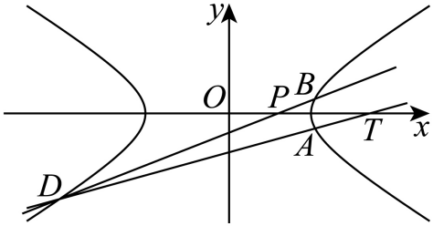

## 讲解

### 是什么

定点是变化中的所有合法直线/曲线都经过的同一坐标点；定直线是所有合法动点都落在的同一条直线；定值是目标不随合法参数变化的同一数。几幅图或几个特例只给候选，不能代替“对所有合法参数”的证明。

向量关系含方向。若$\overrightarrow{MF}=\lambda\overrightarrow{FN}$，坐标式为F−M=λ(N−F)，移项得M+λN=(1+λ)F；不能直接按两个非负距离同号代换。数量积可将垂直、锐钝角转成坐标；例如P=(x,y)、F₁=(−c,0)、F₂=(c,0)、c>0时，$\overrightarrow{PF_1}\cdot\overrightarrow{PF_2}=x^2+y^2-c^2$，正负由点相对以原点为心、c为半径的圆决定，非零两向量才谈角。

### 怎么来的

定点常从“参数项系数”找出。若动线写成y=kx+t且已证t=αk+β，就变为y=k(x+α)+β，所有合法k都让(−α,β)成立。必须确认原参数范围包含的竖直方向是否已在此设法中；未表示的合法成员单独核，不能默认斜率覆盖所有直线。

定值用消元得到只含参数的表达式，再以根和、根积或原几何关系证明恒等。对每个分母先说明不为0；不能把分母为0的合法图形一并删除，应回未除法的几何或坐标式单列。定直线则把动点坐标(x,y)表示出来，证明固定A₀x+B₀y+C₀=0，且(A₀,B₀)不全0；一个点恰在候选线上不够。

向量分点式、两端曲线式和韦达可联用。先保两不同实交点及支条件，再把有向分点转成坐标关系；数量积展开需保同一个坐标基和端点。若题只给$|\vec u|=\lambda|\vec v|$，λ>0且两向量共线，可有$\vec u=\lambda\vec v$或$\vec u=-\lambda\vec v$两种，长度等式不能确定方向。

### 什么时候能用

先列合法参数集合：真实双曲线、交点二次项非零、Δ>0、同支、各线定义与分母非零；再证明目标恒等。最后把设斜率时遗漏的竖直线、约去参数前的零值分别回原条件。如果某个值确不符合原几何，应明确排除依据；若符合，就证明结论在该退化代数分支仍成立。

所选定点原例k=0时AD是x轴，仍过定点；不能因中间式约去k就将这条合法成员扔掉。所选定值原例m=0时弦竖直，而其所求两条顶点连线斜率有效，不必排除m=0。这两个问题体现“特殊的是设法，合法范围由原题决定”。

## 易错

- 特例所得常数当证明：须写一般合法参数恒等式。
- 长度比当有向向量比：会漏反向支或改变分点位置。
- 为约分随意剔除0参数：先核原图形是否真的退化。

## 例题

### 原例：HSMA-B3-C3-D1d13a9e27467-P0420–P0438

**原题、原答案、原思路与原详解**（原次序保留，仅作等价符号规范）：

【例7】（24-25高三上·江苏·阶段练习）已知点$(\sqrt{6},1)$在离心率为$\frac{2\sqrt{3}}{3}$的双曲线$C:\frac{{x}^{2}}{{a}^{2}}-\frac{{y}^{2}}{{b}^{2}}=1(a,b>0)$上．

(1)求$C$的方程；

(2)过点$P(1,0)$的直线与$C$相交于$B,D$两点，$B$关于$x$轴的对称点为$A$，求证：直线$AD$过$x$轴上的定点，并求出该定点坐标．

【答案】(1)$\frac{{x}^{2}}{3}-{y}^{2}=1$；

(2)证明见解析，定点坐标为$(3,0)$.

【解题思路】（1）根据给定条件，利用离心率及双曲线所过点求出$a,b$即可.

（2）设出直线$BD$的方程，与双曲线方程联立，结合韦达定理，求出直线$AD$与$x$轴交点横坐标即可推理得证.

【解答过程】（1）由双曲线$C:\frac{{x}^{2}}{{a}^{2}}-\frac{{y}^{2}}{{b}^{2}}=1$的离心率为$\frac{2\sqrt{3}}{3}$，得$\frac{{a}^{2}+{b}^{2}}{{a}^{2}}=\frac{4}{3}$，解得${a}^{2}=3{b}^{2}$，

又点$(\sqrt{6},1)$在双曲线$C:\frac{{x}^{2}}{{a}^{2}}-\frac{{y}^{2}}{{b}^{2}}=1$上，则$\frac{6}{{a}^{2}}-\frac{1}{{b}^{2}}=1$，解得${a}^{2}=3,{b}^{2}=1$，

所以$C$的方程为$\frac{{x}^{2}}{3}-{y}^{2}=1$.

（2）显然直线$BD$的斜率存在，设其方程为$y=k(x-1)$，$B({x}_{1},{y}_{1}),D({x}_{2},{y}_{2})$，则$A({x}_{1},-{y}_{1})$，

由$\left\{ \begin{aligned}y=k(x-1)\\{x}^{2}-3{y}^{2}=3\end{aligned}\right.$消去$y$并整理得$(3{k}^{2}-1){x}^{2}-6{k}^{2}x+3({k}^{2}+1)=0$，

$\left\{ \begin{aligned}3{k}^{2}-1\ne 0\\\Delta =36{k}^{4}-12(3{k}^{2}-1)({k}^{2}+1)>0\end{aligned}\right.$，解得${k}^{2}<\frac{1}{2}$且${k}^{2}\ne \frac{1}{3}$，$\left\{ \begin{aligned}{x}_{1}+{x}_{2}=\frac{6{k}^{2}}{3{k}^{2}-1}\\{x}_{1}{x}_{2}=\frac{3({k}^{2}+1)}{3{k}^{2}-1}\end{aligned}\right.$，

当直线$BD$与$x$轴不重合时，${y}_{1}+{y}_{2}\ne 0$，直线$AD$：$y-{y}_{2}=\frac{{y}_{2}+{y}_{1}}{{x}_{2}-{x}_{1}}(x-{x}_{2})$，

令$y=0$，得$x={x}_{2}-\frac{{y}_{2}({x}_{2}-{x}_{1})}{{y}_{2}+{y}_{1}}=\frac{{x}_{1}{y}_{2}+{x}_{2}{y}_{1}}{{y}_{1}+{y}_{2}}=\frac{{x}_{1}\cdot k({x}_{2}-1)+{x}_{2}\cdot k({x}_{1}-1)}{k({x}_{1}-1)+k({x}_{2}-1)}$

$=\frac{2{x}_{1}{x}_{2}-({x}_{1}+{x}_{2})}{{x}_{1}+{x}_{2}-2}=\frac{2\cdot \frac{3({k}^{2}+1)}{3{k}^{2}-1}-\frac{6{k}^{2}}{3{k}^{2}-1}}{\frac{6{k}^{2}}{3{k}^{2}-1}-2}=3$，此时直线$AD$过定点$T(3,0)$，

当直线$BD$与$x$轴重合时，直线$AD$为$x$轴，也过点$T(3,0)$，

所以直线$AD$过$x$轴上的定点，该定点坐标为$(3,0)$.

**补讲与核验**

第一问e²=4/3给a²+b²=(4/3)a²，所以a²=3b²；将题给点(√6,1)代标准式得6/a²−1/b²=1，代a²=3b²后2/b²−1/b²=1，得到b²=1、a²=3，是真双曲线。

第二问竖直线x=1代曲线无实点，所以所有合法BD斜率确存在。设y=k(x−1)，消元二次式系数为A=3k²−1、B=−6k²、C=3(k²+1)，Δ=12−24k²。两不同交点的合法范围是k²<1/2且k²≠1/3，k=0也在内。记S=x₁+x₂=6k²/(3k²−1)、T=x₁x₂=3(k²+1)/(3k²−1)，A点是B=(x₁,y₁)反射所得(x₁,−y₁)。

k≠0时，y₁+y₂=k(S−2)=2k/(3k²−1)≠0，AD与x轴交点可写横坐标(2T−S)/(S−2)。分别代韦达：2T−S=6/(3k²−1)，S−2=2/(3k²−1)，比值恒3，与合法k无关。x₁≠x₂来自两不同根，所以连线AD有效。

k=0不能约去k，应回几何：BD是x轴，两端不同，B的轴反射仍是自身，AD也为x轴，仍经过(3,0)。因此不是用几条特例猜定点，而是覆盖全部合法非零k与零k，证明统一经过T=(3,0)。

### 原例：HSMA-B3-C3-D1d13a9e27467-P0439–P0460

**原题、原答案、原思路与原详解**（原次序保留，仅作等价符号规范）：

【变式7-1】（24-25高二上·湖北武汉·阶段练习）已知双曲线$C:\frac{{x}^{2}}{4}-{y}^{2}=1$的左、右顶点分别为${A}_{1}$，${A}_{2}$，直线$l:x=my+\frac{5}{2}$与C的右支交于$M$，$N$两点.

(1)求实数$m$的取值范围；

(2)若直线${A}_{1}M$，${A}_{2}N$的斜率分别为${k}_{1}$，${k}_{2}$，证明：$\frac{{k}_{1}}{{k}_{2}}$是定值.

【答案】(1)$-2<m<2$

(2)$\frac{{k}_{1}}{{k}_{2}}$是定值$-\frac{1}{9}$

【解题思路】（1）设$M\left( {x}_{1},{y}_{1}\right)$，$N\left( {x}_{2},{y}_{2}\right)$，直线$l:x=my+\frac{5}{2}$，联立双曲线方程，得到两根之积小于$0$即可求解；

（2）对$\frac{{k}_{1}}{{k}_{2}}$进行配凑得$\frac{{k}_{1}}{{k}_{2}}=\frac{2m{y}_{1}{y}_{2}+\left( {y}_{1}+{y}_{2}\right)-{y}_{2}}{2m{y}_{1}{y}_{2}+9{y}_{2}}$，代入$\left\{ \begin{aligned}{y}_{1}+{y}_{2}=\frac{-5m}{{m}^{2}-4}\\{y}_{1}\cdot {y}_{2}=\frac{\frac{9}{4}}{{m}^{2}-4}\end{aligned}\right.$计算即可.

【解答过程】（1）设$M\left( {x}_{1},{y}_{1}\right)$，$N\left( {x}_{2},{y}_{2}\right)$，直线$l:x=my+\frac{5}{2}$，

由$\left\{ \begin{aligned}x=my+\frac{5}{2}\\\frac{{x}^{2}}{4}-{y}^{2}=1\end{aligned}\right.$，消元得：$\frac{{\left( my+\frac{5}{2}\right)}^{2}}{4}-{y}^{2}=1$，

整理得：$\left( {m}^{2}-4\right){y}^{2}+5my+\frac{9}{4}=0$.

因为直线$l$过定点$\left( \frac{5}{2},0\right)$且与双曲线右支有两个交点，

因为$\left( \frac{5}{2},0\right)$在$x$轴上，且在双曲线的内，

所以有：$m\ne \pm 2$，$\Delta =16{m}^{2}+36>0$，且${y}_{1}{y}_{2}=\frac{\frac{9}{4}}{{m}^{2}-4}<0$，

则${m}^{2}-4<0$，解得：$-2<m<2$.

（2）

${A}_{1}\left( -2,0\right)$，$A\left( 2,0\right)$，$M\left( {x}_{1},{y}_{1}\right)$，$N\left( {x}_{2},{y}_{2}\right)$，

由（1）可知，直线与双曲线联立消元可得：$\left( {m}^{2}-4\right){y}^{2}+5my+\frac{9}{4}=0$，

所以$\left\{ \begin{aligned}{y}_{1}+{y}_{2}=\frac{-5m}{{m}^{2}-4}\\{y}_{1}\cdot {y}_{2}=\frac{\frac{9}{4}}{{m}^{2}-4}\end{aligned}\right.$，根据已知条件有：

$\frac{{k}_{1}}{{k}_{2}}=\frac{\frac{{y}_{1}}{{x}_{1}+2}}{\frac{{y}_{2}}{{x}_{2}-2}}=\frac{{y}_{1}\left( {x}_{2}-2\right)}{{y}_{2}\left( {x}_{1}+2\right)}=\frac{{y}_{1}\left( m{y}_{2}+\frac{1}{2}\right)}{{y}_{2}\left( m{y}_{1}+\frac{9}{2}\right)}=\frac{m{y}_{1}{y}_{2}+\frac{1}{2}{y}_{1}}{m{y}_{1}{y}_{2}+\frac{9}{2}{y}_{2}}=\frac{2m{y}_{1}{y}_{2}+\left( {y}_{1}+{y}_{2}\right)-{y}_{2}}{2m{y}_{1}{y}_{2}+9{y}_{2}}$

$=\frac{\frac{\frac{9}{2}m}{{m}^{2}-4}-\frac{5m}{{m}^{2}-4}-{y}_{2}}{\frac{\frac{9}{2}m}{{m}^{2}-4}+9{y}_{2}}=\frac{-\frac{\frac{m}{2}}{{m}^{2}-4}-{y}_{2}}{\frac{\frac{9}{2}m}{{m}^{2}-4}+9{y}_{2}}=-\frac{1}{9}$，

所以$\frac{{k}_{1}}{{k}_{2}}$是定值$-\frac{1}{9}$.

**补讲与核验**

完整保留第一问，因为第二问的定值合法性依赖两点确在右支。代x=my+5/2到曲线x²/4−y²=1，乘4得到(m²−4)y²+5my+9/4=0。Δ=16m²+36>0；m=±2退成一次，只能一个点，先排除。设两根和S=−5m/(m²−4)、积T=(9/4)/(m²−4)。

|m|<2时T<0，两个y异号；两交点的x值是my₁+5/2、my₂+5/2，其和为20/(4−m²)>0、积为(4m²+25)/(4−m²)>0，所以两个x都正，曲线本身又要求|x|≥2，确同在右支。|m|>2时x积负，则左右各一，不能符合原题。因此合法范围恰−2<m<2，不是仅由“y积负”无条件推同支。

右支端点不可能是顶点(2,0)，因为原线在y=0时x=5/2；故y₁,y₂都非零、x₁,x₂都大于2。k₁=y₁/(x₁+2)、k₂=y₂/(x₂−2)，两斜率有效，k₂也非零，可取比。

原解将比值变成[2mT+S−y₂]/[2mT+9y₂]。代S、T得分子−m/[2(m²−4)]−y₂，分母9m/[2(m²−4)]+9y₂，是分子乘−9，所以比为−1/9。分母原等于2y₂(x₁+2)，已确认非零；m=0的竖直MN也合法，上述式不除m，直接得−1/9。全部合法m均已覆盖。

## 来源

原件：专题3.6 直线与双曲线的位置关系（举一反三讲义）数学人教A版选择性必修第一册（解析版）.docx。

知识与题型口径：HSMA-B3-C3-D1d13a9e27467-P0398–P0418；完整原例见各例段落号。

原件：专题3.6 直线与双曲线的位置关系（举一反三讲义）数学人教A版选择性必修第一册（解析版）.docx。

知识与题型口径：HSMA-B3-C3-D1d13a9e27467-P0600–P0679；完整原例见各例段落号。
