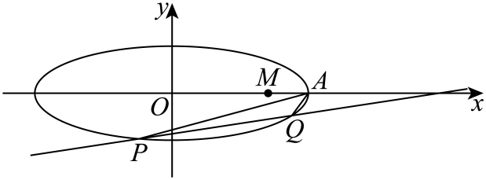

## 讲解

### 是什么

“直线过定点”指存在一个坐标不随允许参数改变的点，**所有满足原条件的直线**都过它；“量为定值”指所有合法构型算得同一数；“点在定直线上”指动点始终满足一个无可变参数的直线方程。有限次代值或画图只能启发猜想，不能替代全称证明。

向量条件表达方向与比例。把点的位置信息写成坐标后，须保留原方向、正负及射线范围，再用椭圆方程确定参数；模相等比向量相等弱，不能互换。

### 怎么来的

定点问题先用能覆盖全部合法直线的参数形式，把条件转成参数恒等式。若写y=kx+d会漏竖直线，写x=my+n会漏水平线；应证明所漏方向不满足原条件，或另列该方向。若化成u(k)x+v(k)y+w(k)=0，固定点(X,Y)须使此式对允许k全部成立；分离独立的参数系数是一种证明办法，前提是原允许域已说明。

定值常把端点坐标设为联立二次方程的两根，用韦达写对称量，再证明所得表达式在全部允许参数域恒等。分母涉及端点距离、斜率或坐标差时，应先证明非零。平方根的模不能丢；例如点在弦内部时，两有向坐标参数异号，距离的乘积需要取负号才能为正。

向量MA=tBM以共同基点坐标表示为A−M=t(M−B)，若1+t≠0得M=(A+tB)/(1+t)；这是从向量等式移项而来。t=−1须返回原式另查，不能使用分点分式。若OP=λOM，则P=λM；代椭圆后再按λ的原范围筛正负根，防止从射线放大到整条直线。

### 什么时候能用

先列真椭圆与全部几何定义域，固定点应是原构型存在时的结论；证明完可核一组真实参数，防止所有参数其实都被排除。除法丢去的参数返回原条件验证，不凭“通常”省略。资料原解少写覆盖或零分母说明时，保留原解并在补讲中补足。

## 例题

### 原例（HSMA-B3-C3-Da3556b33e2fa-P0445—P0467）

**原题与原解析（保留）**

【例8】（24-25高二上·云南曲靖·阶段练习）已知椭圆$C$：$\frac{{x}^{2}}{{a}^{2}}+\frac{{y}^{2}}{{b}^{2}}=1$（$a>b>0$）的长轴长是短轴长的3倍，左、右焦点分别为${F}_{1}$，${F}_{2}$．且椭圆$C$经过点$M\left( 1,\frac{2\sqrt{2}}{3}\right)$．

(1)求椭圆的方程；

(2)设$A$是椭圆$C$的右顶点，$P$，$Q$是椭圆$C$上不同的两点，直线$AP$，$AQ$的斜率分别为${k}_{1}$，${k}_{2}$，且${k}_{1}{k}_{2}=\frac{1}{3}$，证明：直线$PQ$过定点．

【答案】(1)$\frac{{x}^{2}}{9}+{y}^{2}=1$

(2)证明见解析

【解题思路】（1）由$a=3b$，再由点在椭圆上即可求解；

（2）设$P\left( {x}_{1},{y}_{1}\right)$，$Q\left( {x}_{2},{y}_{2}\right)$，直线$PQ$的方程为$x=my+n$，联立椭圆方程，结合韦达定理，由${k}_{1}{k}_{2}=\frac{1}{3}$，求得$n=6$，即可求解；

【解答过程】（1）由题意，得$a=3b$，

所以离心率$e=\frac{c}{a}=\sqrt{\frac{{c}^{2}}{{a}^{2}}}=\sqrt{\frac{{a}^{2}-{b}^{2}}{{a}^{2}}}=\sqrt{\frac{{\left( 3b\right)}^{2}-{b}^{2}}{{\left( 3b\right)}^{2}}}=\frac{2\sqrt{2}}{3}$．

椭圆$C$的方程为$\frac{{x}^{2}}{9{b}^{2}}+\frac{{y}^{2}}{{b}^{2}}=1$．因为椭圆$C$经过点$M\left( 1,\frac{2\sqrt{2}}{3}\right)$，

所以$\frac{1}{9{b}^{2}}+\frac{8}{9{b}^{2}}=1$，解得$b=1$，$a=3$，

所以椭圆$C$的方程为$\frac{{x}^{2}}{9}+{y}^{2}=1$．

（2）

易知$A\left( 3,0\right)$，设$P\left( {x}_{1},{y}_{1}\right)$，$Q\left( {x}_{2},{y}_{2}\right)$，直线$PQ$的方程为$x=my+n$，且$n\ne 3$．

联立$\left\{ \begin{aligned}x=my+n\\\frac{{x}^{2}}{9}+{y}^{2}=1\end{aligned}\right.$，消去$x$得$\left( {m}^{2}+9\right){y}^{2}+2mny+{n}^{2}-9=0$．

由$\Delta >0$，得${m}^{2}-{n}^{2}+9>0$．

所以${y}_{1}+{y}_{2}=\frac{-2mn}{{m}^{2}+9}$，${y}_{1}{y}_{2}=\frac{{n}^{2}-9}{{m}^{2}+9}$．

因为${k}_{1}{k}_{2}=\frac{{y}_{1}}{{x}_{1}-3}\cdot \frac{{y}_{2}}{{x}_{2}-3}=\frac{1}{3}$，

所以$3{y}_{1}{y}_{2}=\left( {x}_{1}-3\right)\left( {x}_{2}-3\right)=\left( m{y}_{1}+n-3\right)\left( m{y}_{2}+n-3\right)$．

化简得$\left( {m}^{2}-3\right){y}_{1}{y}_{2}+m\left( n-3\right)\left( {y}_{1}+{y}_{2}\right)+{\left( n-3\right)}^{2}=0$．

所以$\frac{\left( {m}^{2}-3\right)\left( {n}^{2}-9\right)}{{m}^{2}+9}-\frac{2{m}^{2}n\left( n-3\right)}{{m}^{2}+9}+{\left( n-3\right)}^{2}=0$，又$n\ne 3$，

化简得$6n-36=0$，解得$n=6$，即直线$PQ$恒过定点$\left( 6,0\right)$．

### 补讲

第一问设x²/a²+y²/b²=1，a=3b。代入已知点(1,2√2/3)：1/(9b²)+(8/9)/b²=1，左边合为1/b²，因此b²=1、a²=9。

第二问先核直线写法。若PQ水平，两交点横坐标相反，设纵坐标h，则x₁+x₂=0、x₁x₂=−9(1−h²)。当h≠0时，kAP·kAQ=h²/[(x₁−3)(x₂−3)]=h²/(9h²)=1/9，与1/3不符；h=0则一端是A，AP或AQ斜率未定义。因此合法PQ均不水平，可写x=my+n，这一写法同时覆盖竖直线。

代入椭圆得(m²+9)y²+2mny+n²−9=0。二次项m²+9>0，且P、Q不同，须Δ=36(m²−n²+9)>0；韦达给s=y₁+y₂=−2mn/(m²+9)、p=y₁y₂=(n²−9)/(m²+9)。因两条AP、AQ斜率有定义，(x₁−3)(x₂−3)≠0，于是斜率积1/3可乘分母成3y₁y₂=(x₁−3)(x₂−3)。

把xᵢ=myᵢ+n代右侧，得(3−m²)p−m(n−3)s−(n−3)²=0。代s、p并乘正数m²+9，等价于

$$ (m^2-3)(n^2-9)-2m^2n(n-3)+(n-3)^2(m^2+9)=0. $$

其中m²的系数为(n²−9)−2n(n−3)+(n−3)²=0；剩余−3(n²−9)+9(n−3)²=6(n−3)(n−6)。所以n=3或6。n=3说明PQ过A，因A在椭圆上会是端点，违反原斜率条件；故n=6，所有合法PQ都过(6,0)。这不是通过画几条弦猜定点。

存在性还可从n=6代回判别式核对：Δ=36(m²−27)>0即|m|>3√3。这些参数给两个不同端点，直线不过A，所需斜率均有定义；结论不是空的全称命题。

### 原例（HSMA-B3-C3-Da3556b33e2fa-P0657—P0667）

**原题与原解析（保留）**

【例10】（24-25高二上·重庆·期中）椭圆$C:\frac{{x}^{2}}{{a}^{2}}+\frac{{y}^{2}}{{b}^{2}}=1\left( a>b>0\right)$的右顶点为A，上顶点为$B$，$\vec{MA}=2\vec{BM}$，点$P$为椭圆$C$上一点且$\vec{OP}=\lambda \vec{OM}\left( \lambda >0\right)$，则$\lambda $的值为（    ）

A．$\frac{3\sqrt{5}}{5}$  B．$\frac{4\sqrt{5}}{5}$  C．$\frac{3}{2}$  D．2

【答案】A

【解题思路】由椭圆方程可知点$A,B$的坐标，根据向量可得$M\left( \frac{a}{3},\frac{2b}{3}\right)$，$P\left( \frac{\lambda a}{3},\frac{2\lambda b}{3}\right)$，将$P$代入椭圆方程运算求解即可.

【解答过程】椭圆$C:\frac{{x}^{2}}{{a}^{2}}+\frac{{y}^{2}}{{b}^{2}}=1\left( a>b>0\right)$的右顶点$A\left( a,0\right)$，上顶点$B\left( 0,b\right)$，

设$M\left( {x}_{0},{y}_{0}\right)$，则$\vec{MA}=\left( a-{x}_{0},-{y}_{0}\right),\vec{BM}=\left( {x}_{0},{y}_{0}-b\right)$，

由$\vec{MA}=2\vec{BM}$可得$\left\{ \begin{aligned}a-{x}_{0}=2{x}_{0}\\-{y}_{0}=2\left( {y}_{0}-b\right)\end{aligned}\right.$，解得$\left\{ \begin{aligned}{x}_{0}=\frac{a}{3}\\{y}_{0}=\frac{2b}{3}\end{aligned}\right.$，即$M\left( \frac{a}{3},\frac{2b}{3}\right)$，

又由$\vec{OP}=\lambda \vec{OM}$，则$P\left( \frac{\lambda a}{3},\frac{2\lambda b}{3}\right)$，

将$P$代入椭圆方程$\frac{{x}^{2}}{{a}^{2}}+\frac{{y}^{2}}{{b}^{2}}=1$，得$\frac{{\left( \frac{\lambda a}{3}\right)}^{2}}{{a}^{2}}+\frac{{\left( \frac{2\lambda b}{3}\right)}^{2}}{{b}^{2}}=1$，

即$\frac{{\lambda }^{2}}{9}+\frac{4{\lambda }^{2}}{9}=1$，解得$\lambda =\frac{3\sqrt{5}}{5}$或$-\frac{3\sqrt{5}}{5}$（舍），所以$\lambda =\frac{3\sqrt{5}}{5}$.

故选：A.

### 补讲

原关系MA=2BM是向量等式。以O为原点写成A−M=2(M−B)，移项得3M=A+2B，故M=(a/3,2b/3)。这一步方向不能把BM擅改成MB。

OP=λOM给P=(λa/3,2λb/3)。代入x²/a²+y²/b²=1，得到λ²/9+4λ²/9=1，所以λ²=9/5。原条件λ>0，只保留λ=3/√5=3√5/5，选A；负根在反向射线上，已被原条件排除。a、b均正，代入时约去a²、b²合法。

## 易错

- 猜定点后须代回对全部合法参数证明，图示不是证据。
- 参数表达漏水平/竖直线须单独检查。
- 约去因子前先证明不为0；原向量方向及正参数不能丢。

## 来源

原件：专题3.3 直线与椭圆的位置关系（举一反三讲义）数学人教A版选择性必修第一册（解析版）.docx；来源 ID：Da3556b33e2fa。

知识与分类定位：HSMA-B3-C3-Da3556b33e2fa-P0423—P0443, HSMA-B3-C3-Da3556b33e2fa-P0656—P0656。

选用原例：HSMA-B3-C3-Da3556b33e2fa-P0445—P0467, HSMA-B3-C3-Da3556b33e2fa-P0657—P0667。
