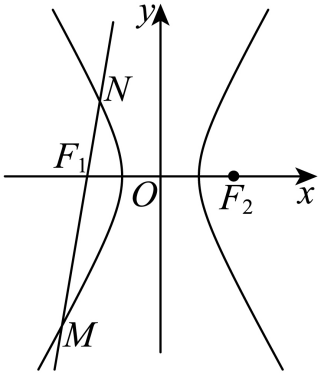

## 讲解

### 判据与流程

题给向量倍数、数量积、模长或分点关系，先辨方向与长度，再和双曲线式联用。

1. 点作坐标，向量用终点减起点。例如MF向量=λFN向量变成F−M=λ(N−F)，移项M+λN=(1+λ)F；先写这一步，避免凭图猜分点正负。
2. 若只给模长且两向量共线，正比例长度允许正向、反向两支，须都列；两向量不共线时模长关系不能直接转向量倍数。
3. 用点差、根和根积或数量积展开连接曲线。数量积为0是代数条件；要说两线/两非零向量垂直，须另核向量非零。
4. 韦达前核消元二次项非零与两实端点；比例带分母则先核相应距离/分量非零。支、斜率、y轴交点等原条件不得因向量转换而丢失。
5. 解出参数、形状或坐标后回代所有原向量/模长及曲线式，证明真实几何可实现；不同方向支带来的不同答案都保全。

## 例题

### 原例：HSMA-B3-C3-D1d13a9e27467-P0609–P0622

**原题、原答案、原思路与原详解**（原次序保留，仅作等价符号规范）：

【变式9-1】（24-25高二下·甘肃·期末）过双曲线$C:\frac{{x}^{2}}{{a}^{2}}-\frac{{y}^{2}}{{b}^{2}}=1(a>0,b>0)$的左焦点${F}_{1}$作斜率为2的直线$l$交$C$于$M,N$两点．若$\vec{M{F}_{1}}=3\vec{{F}_{1}N}$，则双曲线的离心率为（    ）

A．3  B．2  C．$\sqrt{2}$  D．$\frac{\sqrt{5}}{2}$

【答案】D

【解题思路】设$M\left( {x}_{1},{y}_{1}\right),N\left( {x}_{2},{y}_{2}\right)$，由$\vec{M{F}_{1}}=3\vec{{F}_{1}N}$，得${y}_{1}=-3{y}_{2}$，设直线$l$的方程为$x=\frac{1}{2}y-c$，代入双曲线方程化简，利用根与系数的关系，再结合${y}_{1}=-3{y}_{2}$可得到关于$a,b,c$的式子，化简后可求得离心率.

【解答过程】设$M\left( {x}_{1},{y}_{1}\right),N\left( {x}_{2},{y}_{2}\right)$，由$\vec{M{F}_{1}}=3\vec{{F}_{1}N}$，得${y}_{1}=-3{y}_{2}$，

设直线$l$的方程为$x=\frac{1}{2}y-c$，

由$\left\{ \begin{aligned}\frac{{x}^{2}}{{a}^{2}}-\frac{{y}^{2}}{{b}^{2}}=1,\\x=\frac{1}{2}y-c,\end{aligned}\right.$消去$x$，得$\left( \frac{{b}^{2}}{4}-{a}^{2}\right){y}^{2}-c{b}^{2}y+{b}^{2}{c}^{2}-{a}^{2}{b}^{2}=0$，

由根与系数的关系，得${y}_{1}+{y}_{2}=\frac{c{b}^{2}}{\frac{{b}^{2}}{4}-{a}^{2}},{y}_{1}{y}_{2}=\frac{{b}^{2}{c}^{2}-{a}^{2}{b}^{2}}{\frac{{b}^{2}}{4}-{a}^{2}}$，

所以$-2{y}_{2}=\frac{c{b}^{2}}{\frac{{b}^{2}}{4}-{a}^{2}},-3{y}_{2}^{2}=\frac{{b}^{2}{c}^{2}-{a}^{2}{b}^{2}}{\frac{{b}^{2}}{4}-{a}^{2}}$，

所以$-3\times \frac{1}{4}{\left( \frac{c{b}^{2}}{\frac{{b}^{2}}{4}-{a}^{2}}\right)}^{2}=\frac{{b}^{2}{c}^{2}-{a}^{2}{b}^{2}}{\frac{{b}^{2}}{4}-{a}^{2}}$，化简得$-\frac{3}{4}{c}^{2}=\frac{1}{4}{b}^{2}-{a}^{2}$，

所以$-3{c}^{2}={c}^{2}-{a}^{2}-4{a}^{2}$，得$4{c}^{2}=5{a}^{2}$，

所以${e}^{2}=\frac{5}{4}$，可得$e=\frac{\sqrt{5}}{2}$.

故选：D.

**补讲与核验**

给的是有向向量：F₁−M=3(N−F₁)，所以M+3N=4F₁，y₁=−3y₂；若只按长度MF₁=3F₁N却去掉方向，无法唯一得到这个负号。直线斜率2，写x=y/2−c；F₁不在曲线上且斜率非零，y₁,y₂均非零。

消元式二次项A=b²/4−a²，常数C=b²(c²−a²)=b⁴>0。两个不同端点意味着A≠0，可用S=cb²/A、T=b⁴/A；y₁=−3y₂给T=−3y₂²=−3S²/4。代入得−3c²b⁴/(4A²)=b⁴/A，b>0且A≠0，可约b⁴并乘A²，得到−3c²/4=A=b²/4−a²。再以b²=c²−a²代入，得到−3c²=c²−5a²，即4c²=5a²；e>1取e=√5/2，D正确。

还可核存在：上述比例使b²=a²/4、c²=5a²/4。两端可取M=(−6c/5,−2c/5)、N=(−14c/15,2c/15)，代曲线各得1，且M+3N=(−4c,0)=4F₁、连线斜率2；两点不同且在左支。因此原几何确能实现，不是只解出一个形式上的e。

### 原例：HSMA-B3-C3-D1d13a9e27467-P0623–P0642

**原题、原答案、原思路与原详解**（原次序保留，仅作等价符号规范）：

【变式9-2】（24-25高二上·全国·课后作业）已知双曲线的中心在原点，离心率为2，一个焦点为$F(-2,0)$．

(1)求双曲线的标准方程；

(2)设$Q$是双曲线上一点，且过点$F$，$Q$的直线$l$与$y$轴交于点$M$，若$|\vec{MQ}|=2|\vec{QF}|$，求直线$l$的方程．

【答案】(1)${x}^{2}-\frac{{y}^{2}}{3}=1$；

(2)$y=\pm \frac{\sqrt{21}}{2}(x+2)$或$y=\pm \frac{3\sqrt{5}}{2}(x+2)$.

【解题思路】（1）根据给定条件，结合双曲线离心率公式求出标准方程.

（2）设出直线$l$的方程，求出点$M$坐标，结合给定条件，利用向量坐标运算求出点$Q$的坐标，再代入双曲线方程求出直线$l$的斜率得解.

【解答过程】（1）依题意，设所求双曲线的标准方程为$\frac{{x}^{2}}{{a}^{2}}-\frac{{y}^{2}}{{b}^{2}}=1(a>0,b>0)$，

由离心率为2，得$\frac{\sqrt{{a}^{2}+{b}^{2}}}{a}=2$，则${b}^{2}=3{a}^{2}$， 

由焦点$F(-2,0)$，得${a}^{2}+{b}^{2}=4$，解得$a=1$，$b=\sqrt{3}$，

所以双曲线的标准方程为${x}^{2}-\frac{{y}^{2}}{3}=1$.

（2）依题意，直线$l$的斜率存在，设$l:y=k(x+2)$，

令$x=0$，则$y=2k$，即$M(0,2k)$，由$|\vec{MQ}|=2|\vec{QF}|$，且$M,Q,F$共线，

得$\vec{MQ}=2\vec{QF}$或$\vec{MQ}=-2\vec{QF}$，设点$Q({x}_{Q},{y}_{Q})$，

当$\vec{MQ}=2\vec{QF}$时，$({x}_{Q},{y}_{Q}-2k)=2(-2-{x}_{Q},-{y}_{Q})$，解得${x}_{Q}=-\frac{4}{3},{y}_{Q}=\frac{2}{3}k$，则$Q(-\frac{4}{3},\frac{2}{3}k)$，

又点$Q$在双曲线上，则$\frac{16}{9}-\frac{4{k}^{2}}{27}=1$，解得$k=\pm \frac{\sqrt{21}}{2}$；

当$\vec{MQ}=-2\vec{QF}$时，$({x}_{Q},{y}_{Q}-2k)=-2(-2-{x}_{Q},-{y}_{Q})$，解得${x}_{Q}=-4,{y}_{Q}=-2k$，则$Q(-4,-2k)$，

于是$16-\frac{4{k}^{2}}{3}=1$，解得$k=\pm \frac{3\sqrt{5}}{2}$，

所以所求直线$l$的方程为$y=\pm \frac{\sqrt{21}}{2}(x+2)$或$y=\pm \frac{3\sqrt{5}}{2}(x+2)$.

**补讲与核验**

第一问e=2、c=2给a=c/e=1，b²=c²−a²=3，所以x²−y²/3=1。第二问若l竖直，它为x=−2，不能与y轴交于M，原条件不允许，故有限斜率设法覆盖所有合法线：y=k(x+2)，M=(0,2k)。

题给两个向量的长度关系且三点共线，允许MQ向量=2QF向量或MQ向量=−2QF向量。第一支坐标方程Q−M=2(F−Q)，得到Q=(−4/3,2k/3)；代曲线得16/9−4k²/27=1，解k²=21/4。第二支Q−M=−2(F−Q)，得Q=(−4,−2k)，代曲线得16−4k²/3=1，解k²=45/4。

两支每个k都非零、两点位置确满足原长度式，得到四条原答案直线。第一支Q在M与F之间，第二支Q在F另一侧，是不同的点序；原条件只给长度，不能为了便利只保其中一种方向。

## 易错

- 把有向负号删成距离正比：会改变分点位置。
- 模长相等只留同向：共线时反向也可能成立。
- 点积0即谈角：零向量没有夹角，几何垂直需非零前提。

## 来源

原件：专题3.6 直线与双曲线的位置关系（举一反三讲义）数学人教A版选择性必修第一册（解析版）.docx。

知识与题型口径：HSMA-B3-C3-D1d13a9e27467-P0600–P0679；完整原例见各例段落号。
