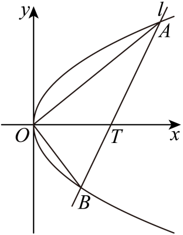

## 讲解

### 判据与流程

向量比例、点积、垂直都必须保留方向与非零条件。题中FP+λFQ=0若λ>0，是两端点位于F两侧的反向关系；单纯长度比不能表达这个符号。

1. 先写焦点坐标和曲线点参数，向量坐标“终点减起点”。把每个向量式拆成横、纵两条等式：右开口焦点(p/2,0)给x_P+λx_Q=(1+λ)p/2、y_P+λy_Q=0。
2. 联立弦线与曲线得到根和积。焦点弦根积−p²，与y_P=−λy_Q相合，先求y坐标平方与符号，再由x=y²/(2p)恢复x；核横分量，以防只解了一条等式。
3. 要判OA垂直OB，计算OA·OB=x₁x₂+y₁y₂，利用韦达把乘积代成常数；点积0且两向量均非零，才推出两真实直线垂直。零向量不能当作有直角夹角的直线。
4. 把所得参数回代真弦Δ>0、点/线段比值范围、全部分母。若对称性允许反射，可选一支方便计算，但说明另一支也合法及所求量是否同样；若所求向量本身在反射后改变，则不能擅称同值。

## 易错

向量减法写错一个纵分量会改变题意；把“反向”当“同向”会错端点符号。点积零只在非零向量下判方向垂直，约去未知坐标前先讨论零。

知识与分类依据：`HSMA-B3-C3-D66bc76a70856-P0668-P0668`（《专题3.8 直线与抛物线的位置关系（举一反三讲义）数学人教A版选择性必修第一册（解析版）.docx》）；`HSMA-B3-C3-D66bc76a70856-P0126-P0126`（《专题3.8 直线与抛物线的位置关系（举一反三讲义）数学人教A版选择性必修第一册（解析版）.docx》）。原资料口径、补条件与勘误分别说明。

## 例题

### 原例：反向三倍比核两个分量再算面积

来源：`HSMA-B3-C3-D66bc76a70856-P0669-P0679`；原件《专题3.8 直线与抛物线的位置关系（举一反三讲义）数学人教A版选择性必修第一册（解析版）.docx》。题号、学年及地区按讲义原标注，未另作来源核验。

以下完整保留原题、原答案与原详解（仅统一等价公式排版及配图路径）：

【例10】（24-25高二上·天津滨海新·阶段练习）在平面直角坐标系$xOy$中，已知抛物线$C:{y}^{2}=4x$的焦点为$F$，过点$F$的直线$l$与抛物线$C$交于$P,Q$两点，若$\vec{FP}+3\vec{FQ}=\vec{0}$，则$\triangle OPQ$的面积为（    ）

A．$\frac{2\sqrt{3}}{3}$  B．$\sqrt{3}$  C．$\frac{4\sqrt{3}}{3}$  D．$2\sqrt{3}$

【答案】C

【解题思路】$\triangle OPQ$可分割成上下两部分来求，于是只需求$P,Q$的纵坐标，设出直线方程，联立抛物线，结合题干条件进行求解.

【解答过程】显然直线$PQ$的斜率非零，可设$PQ:x=my+1$，联立抛物线可得${y}^{2}-4my-4=0$，

设$P({x}_{1},{y}_{1}),Q({x}_{2},{y}_{2})$，且不妨设$P$在$x$轴上方，即${y}_{1}>0$，

由题知，$F(1,0)$，又$\vec{FP}+3\vec{FQ}=\vec{0}$，即$({x}_{1}-1,{y}_{1})+3({x}_{2}-1,{y}_{1})=(0,0)$，

故${y}_{1}=-3{y}_{2}$，根据韦达定理，${y}_{1}{y}_{2}=-4$，解得${y}_{2}=-\frac{2}{\sqrt{3}},{y}_{1}=\frac{6}{\sqrt{3}}$，

于是${S}_{\triangle OPQ}={S}_{\triangle OPF}+{S}_{\triangle OQF}=\frac{1}{2}\left| OF\right|\left| {y}_{1}-{y}_{2}\right|=\frac{1}{2}\times \frac{8\sqrt{3}}{3}=\frac{4\sqrt{3}}{3}$.

故选：C.

#### 补充讲解

由FP+3FQ=0，FP=−3FQ，两向量反向，P、Q位于F两侧，且FP长为FQ长的3倍。设x=my+1可包括竖直通径；联立y²−4my−4=0给y₁y₂=−4<0。纵分量的正确等式是y₁+3y₂=0，代入根积得(−3y₂)y₂=−4，即y₂²=4/3。利用关于x轴的对称性可先算y₁>0分支：y₂=−2/√3、y₁=2√3；另一分支纵坐标全部反号，面积相同。再xᵢ=yᵢ²/4给x₁=3、x₂=1/3，横分量(3−1)+3(1/3−1)=0也成立，并非只解了纵分量。三角形OPQ以OF=1作共同底，面积1/2×(|y₁|+|y₂|)=4√3/3，选C；其余值与底高及比值不符。

**原详解勘误**：P0675把第二向量写为(x₂−1,y₁)，应为(x₂−1,y₂)。下一行和最终答案用的是正确的y₂关系；原块保留，规范向量分量在此另写。

### 原例：非焦点弦的根乘积给非零向量垂直

来源：`HSMA-B3-C3-D66bc76a70856-P0153-P0170`；原件《专题3.8 直线与抛物线的位置关系（举一反三讲义）数学人教A版选择性必修第一册（解析版）.docx》。题号、学年及地区按讲义原标注，未另作来源核验。

以下完整保留原题、原答案与原详解（仅统一等价公式排版及配图路径）：

【变式3-2】（24-25高二上·内蒙古赤峰·期末）在平面直角坐标系$xOy$中，过点$T\left( 2,0\right)$的直线$l$与抛物线$C:{y}^{2}=2x$相交于点$A$，$B$.

(1)若直线$l$的斜率为$1$，求$\left| AB\right|$；

(2)求证：$OA\perp OB$.

【答案】(1)$2\sqrt{10}$

(2)证明见解析

【解题思路】（1）直线$l$的方程为$y=x-2$，联立$C:{y}^{2}=2x$，求出两根之和，两根之积，利用弦长公式得到$\left| AB\right|$；

（2）当直线$l$的斜率为0时，不合要求，设直线$l$的方程为$x=2+ty$，与$C:{y}^{2}=2x$联立得${y}^{2}-2ty-4=0$，得到两根之和，两根之积，计算出${x}_{1}{x}_{2}=4$，得到$\vec{OA}\cdot \vec{OB}=0$，得到垂直关系.

【解答过程】（1）直线$l$的方程为$y=x-2$，

联立$C:{y}^{2}=2x$得${x}^{2}-6x+4=0$，显然$\Delta >0$，

设$A\left( {x}_{1},{y}_{1}\right),B\left( {x}_{2},{y}_{2}\right)$，则${x}_{1}+{x}_{2}=6,{x}_{1}{x}_{2}=4$，

则$\left| AB\right|=\sqrt{1+{1}^{2}}\times \sqrt{{\left( {x}_{1}+{x}_{2}\right)}^{2}-4{x}_{1}{x}_{2}}=\sqrt{2}\times \sqrt{36-16}=2\sqrt{10}$；

（2）当直线$l$的斜率为0时，与抛物线只有1个交点，不合要求，舍去，

设直线$l$的方程为$x=2+ty$，

与$C:{y}^{2}=2x$联立得${y}^{2}-2ty-4=0$，显然$\Delta >0$，

设$A\left( {x}_{1},{y}_{1}\right),B\left( {x}_{2},{y}_{2}\right)$，则${y}_{1}+{y}_{2}=2t,{y}_{1}{y}_{2}=-4$，

则${x}_{1}{x}_{2}=\left( 2+t{y}_{1}\right)\left( 2+t{y}_{2}\right)=4+2t\left( {y}_{1}+{y}_{2}\right)+{t}^{2}{y}_{1}{y}_{2}=4+4{t}^{2}-4{t}^{2}=4$，

故$\vec{OA}\cdot \vec{OB}={x}_{1}{x}_{2}+{y}_{1}{y}_{2}=4-4=0$，所以$\vec{OA}\perp \vec{OB}$，即$OA\perp OB$.

#### 补充讲解

(1)直线y=x−2代入y²=2x得到(x−2)²=2x；展开x²−4x+4=2x，移项为x²−6x+4=0，Δ=20>0。根差平方=根和平方−4根积=36−16=20，因y差=x差，弦长平方=2×20=40，故2√10。(2)参数x=2+ty覆盖所有非水平直线，包括竖直t=0。代入得y²−2ty−4=0，Δ=4t²+16>0，对每个实数t均有两不同端点。y₁y₂=−4；横坐标乘积展开为4+2t(y₁+y₂)+t²y₁y₂=4+4t²−4t²=4，所以OA·OB=4−4=0。A、B都不是O（O不在x=2+ty上），故零点积能推出两条真实直线垂直。本题T不是焦点(1/2,0)，不能使用焦点弦和式。
