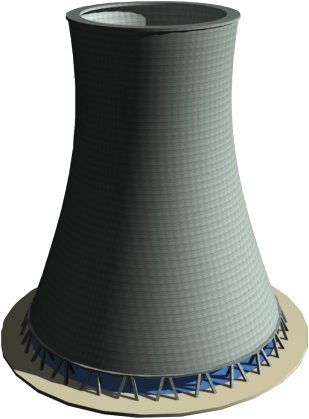
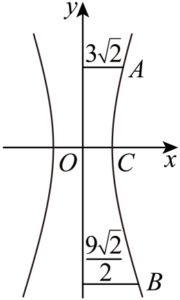

## 讲解

### 判据与流程

实际题出现两站声音到达时间差、距离差定位，或双曲线型构件的轴截面与尺寸。

1. 先从物理/几何条件列真实关系。相同传播速度的同时起行时间差对应距离差，方向未知用绝对值；双曲线截面不能仅凭外形断定，须原题已给模型或相应定义证据。
2. 建同单位的坐标，说明原点、焦轴或旋转轴。给焦距和整轴长先除2；给外直径换成半径才作横向坐标。
3. 定位模型核两焦点不同且0<距离差<焦距，求a,c再b²=c²−a²。构件模型用喉部/顶点、离心率及边界尺寸确定轴长。
4. 把尺寸点代方程，开根时按物体实际在原点上/下、左/右保符号；对高度取坐标差，而不是盲取两个正根相减。
5. 回核原时间差、完整两支/指定支、模型截取范围及单位。原题未给先后顺序不能新增一支限制；截面只是曲线一部分也不能把全曲线当实体范围。

## 例题

### 原例：HSMA-B3-C3-D066064c91145-P0230–P0240

**原题、原答案、原思路与原详解**（原次序保留，仅作等价符号规范）：

【变式5-2】（24-25高二上·四川成都·期末）相距1400m的A，B两个哨所，听到炮弹爆炸声的时间相差3s，已知声速是340m/s，炮弹爆炸点一定在曲线（    ）的方程上.

A．$\frac{{x}^{2}}{260100}-\frac{{y}^{2}}{229900}=1$ $\left( x\le -510\right)$  B．$\frac{{x}^{2}}{260100}-\frac{{y}^{2}}{229900}=1$ $\left( x\ge 510\right)$

C．$y=0(x\le -700$或$x\ge 700)$  D．$\frac{{x}^{2}}{260100}-\frac{{y}^{2}}{229900}=1$

【答案】D

【解题思路】根据双曲线的定义进行求解即可.

【解答过程】设炮弹爆炸点为$P$，

由题意可知：$\left| \left| PA\right|-\left| PB\right|\right|=3\times 340=1020<1400$，

显然点$P$的轨迹是以A，B的焦点的双曲线，因此有$2a=1020,2c=1400$，

可得：$a=510,c=700$，于是有$b=\sqrt{{c}^{2}-{a}^{2}}=\sqrt{490000-260100}=\sqrt{229900}$，

根据四个选项可知，只有选项D符合，

故选：D.

**补讲与核验**

声音距离=速度×时间，同一次爆炸发出的声同时起行，两哨所听到的时间差3s对应路程差绝对值1020m。两哨所相距1400m，0<1020<1400，满足真双曲线定义。题没说哪个先听到，所以不能只保某一支。

取AB中点为原点、AB为x轴、米为单位，A=(−700,0)、B=(700,0)，于是2c=1400、2a=1020，c=700、a=510。b²=c²−a²=490000−260100=229900，标准式x²/260100−y²/229900=1，两支都保留，D正确。A/B分别多限制了未给出的先后支，C对应距离差等于焦距1400而非1020的退化射线。

### 原例：HSMA-B3-C3-D1d89578e51c6-P0439–P0451

**原题、原答案、原思路与原详解**（原次序保留，仅作等价符号规范）：

【例9】（24-25高二上·江苏泰州·期中）3D打印是快速成型技术的一种，它是一种以数字模型文件为基础，运用粉末状金属或塑料等可粘合材料，通过逐层打印的方式来构造物体的技术，如图所示的塔筒为3D打印的双曲线型塔筒，该塔筒是由离心率为$\sqrt{5}$的双曲线的一部分围绕其旋转轴逐层旋转打印得到的，已知该塔筒（数据均以外壁即塔筒外侧表面计算）的上底直径为$6\sqrt{2}cm$，下底直径为$9\sqrt{2}cm$，喉部（中间最细处）的直径为8cm，则该塔筒的高为（   ）

    

A．$\frac{27}{2}cm$  B．18cm  C．$\frac{27\sqrt{2}}{2}cm$  D．$9\sqrt{2}cm$

【答案】D

【解题思路】根据模型建立平面直角坐标系，由已知条件先求双曲线的标准方程，再计算高度即可.

【解答过程】该塔筒的轴截面如图所示，以喉部的中点$O$为原点，建立平面直角坐标系，

设A与$B$分别为上，下底面对应点，设双曲线的方程为$\frac{{x}^{2}}{{a}^{2}}-\frac{{y}^{2}}{{b}^{2}}=1\left( a>0,b>0\right)$，

由双曲线的离心率为$\sqrt{5}$，得$\frac{\sqrt{{a}^{2}+{b}^{2}}}{a}=\sqrt{5}$，则${b}^{2}=4{a}^{2}$，

由喉部（中间最细处）的直径为$8cm$，得$2a=8,a=4$，

所以双曲线的方程为$\frac{{x}^{2}}{16}-\frac{{y}^{2}}{64}=1$，设点$A({x}_{A},{y}_{A}),B({x}_{B},{y}_{B})$，

由${x}_{A}=3\sqrt{2},{x}_{B}=\frac{9\sqrt{2}}{2}$，得${y}_{A}=2\sqrt{2},{y}_{B}=-7\sqrt{2}$，所以该塔筒的高为${y}_{A}-{y}_{B}=9\sqrt{2}$.

故选：D.

  

**补讲与核验**

轴截面选喉部中点O为原点，竖直旋转轴为y轴，水平半径方向为x轴，长度用cm。喉部直径8给最小外半径a=4；不是a=8。双曲线横焦轴、e=√5，c²/a²=5结合c²=a²+b²得b²=4a²=64，所以截面x²/16−y²/64=1。

上、下底给的是直径，故外壁半径分别x_A=3√2、x_B=9√2/2。代式：上底y_A²=64(18/16−1)=8，喉部以上取y_A=2√2；下底y_B²=64[(81/2)/16−1]=98，喉部以下取y_B=−7√2。总高是两有符号高度差y_A−y_B=9√2 cm，D正确。不能把两个正根直接相减，也不能将直径当x坐标。

## 易错

- 时间差只算a：速度乘时间差给2a，还要除2。
- 直径当半径：几何坐标会大一倍。
- 上下底高度均取正再相减：喉部两侧需相反符号。

## 来源

原件：专题3.4 双曲线及其标准方程（举一反三讲义）数学人教A版选择性必修第一册（解析版）.docx。

知识与题型口径：HSMA-B3-C3-D066064c91145-P0210–P0249；完整原例见各例段落号。

原件：专题3.5 双曲线的简单几何性质（举一反三讲义）数学人教A版选择性必修第一册（解析版）.docx。

知识与题型口径：HSMA-B3-C3-D1d89578e51c6-P0438–P0497；完整原例见各例段落号。
