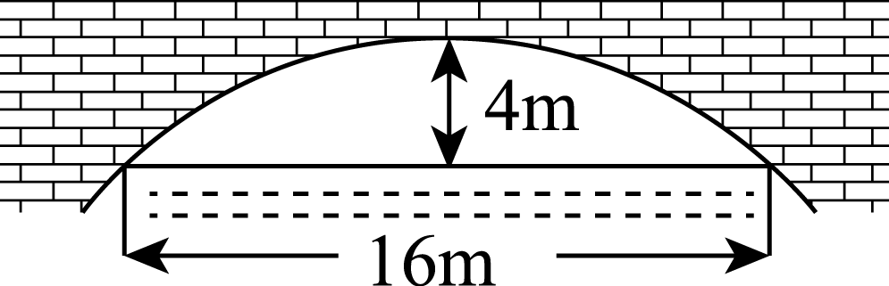
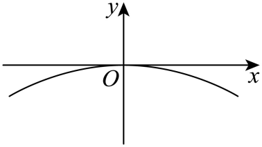
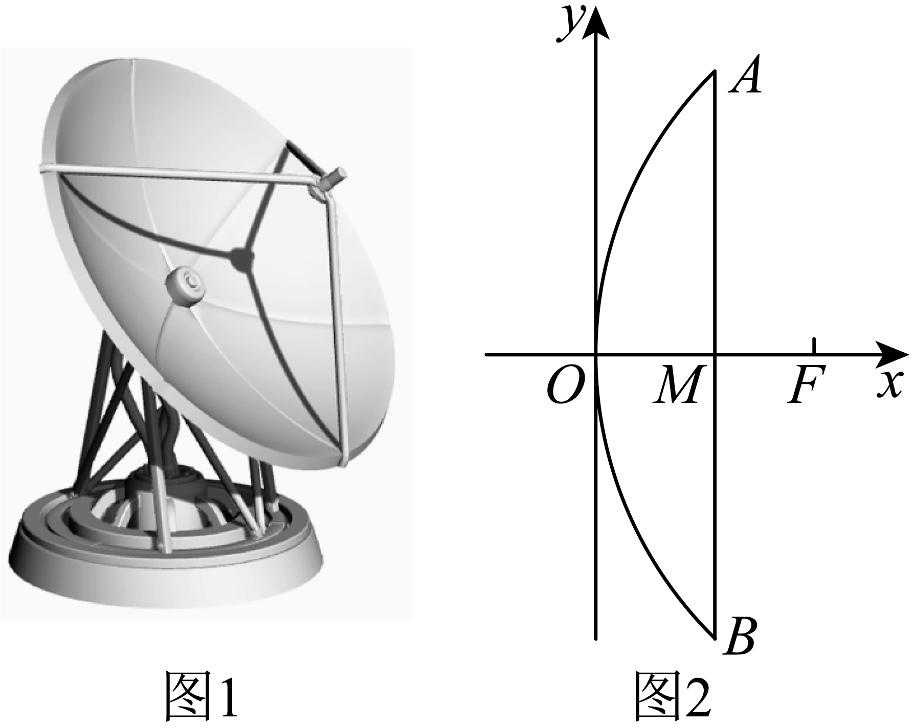

## 讲解

### 判据与流程

原题已经给抛物线形截面时，用坐标模型表示它。实际物体的整个外形不一定是无限抛物线，使用范围按题给的有效截面；没有题给依据不把任意弯曲线都假设成抛物线。

1. 以顶点为原点、对称轴为坐标轴，说明正方向。桥拱通常向下可写x²=−2py，p>0；侧向天线截面可写y²=2px。坐标与实际长度用相同单位。
2. 宽度或口径是两侧间距，先取一半作为端点横/纵坐标；深度/拱顶距水面作为轴向坐标，并依正方向带符号。完整端点代入标准式，确定唯一参数p。
3. 新水位先由“上升/下降”换成新坐标，再解方程求两对称交点；实际宽度取坐标差而非一个点的绝对坐标。要求焦点时读取p/2，不读系数2p。
4. 检查新位置在原给物理截面范围内，计算结果保非负长度及单位。原题给F是信号处理中心焦点，可按该条件求坐标；无须另断言真实设备的反射、遮挡或材料性能已核验。

## 易错

全宽直接当半宽会把方程参数放大四倍；下降量的坐标符号取反会得到错误宽度。数学模型结果以题给理想截面和尺度为条件，不能扩展为现实工程设计结论。

知识与分类依据：`HSMA-B3-C3-D5427c3b92fa2-P0451-P0451`（《专题3.7 抛物线的标准方程和性质（举一反三讲义）数学人教A版选择性必修第一册（解析版）.docx》）。原资料口径、补条件与勘误分别说明。

## 例题

### 原例：半宽与水位符号一起确定新宽度

来源：`HSMA-B3-C3-D5427c3b92fa2-P0452-P0463`；原件《专题3.7 抛物线的标准方程和性质（举一反三讲义）数学人教A版选择性必修第一册（解析版）.docx》。题号、学年及地区按讲义原标注，未另作来源核验。

以下完整保留原题、原答案与原详解（仅统一等价公式排版及配图路径）：

【例10】（24-25高二上·江苏扬州·期中）如图，一座抛物线形拱桥，当桥洞内水面宽16m时，拱顶距离水面4m，当水面下降1m后，桥洞内水面宽为（    ）

A．$4\sqrt{3}m$  B．$4\sqrt{5}m$  C．$8\sqrt{3}m$  D．$8\sqrt{5}m$

【答案】D

【解题思路】以抛物线的顶点为坐标原点，抛物线的对称轴为$y$轴，过原点且垂直于$y$轴的直线为$x$轴建立平面直角坐标系，设抛物线的方程为${x}^{2}=-2py\left( p>0\right)$，分析可知点$\left( 8,-4\right)$在该抛物线上，求出$p$的值，可得出抛物线的方程，将$y=-5$代入抛物线方程，即可得出结果.

【解答过程】以抛物线的顶点为坐标原点，抛物线的对称轴为$y$轴，过原点且垂直于$y$轴的直线为$x$轴建立如下图所示的平面直角坐标系，

设抛物线的方程为${x}^{2}=-2py\left( p>0\right)$，由题意可知点$\left( 8,-4\right)$在抛物线上，

所以$64=-2p\times \left( -4\right)$，可得$p=8$，所以抛物线的方程为${x}^{2}=-16y$，

当水面下降$1m$后，即当$y=-5$时，${x}^{2}=-16\times \left( -5\right)$，可得$x=\pm 4\sqrt{5}$，

因此，当水面下降$1m$后，桥洞内水面宽为$8\sqrt{5}m$.

故选：D.

#### 补充讲解

顶点取原点、向上为正，水面初始为y=−4。宽16对应两端x=±8，故64=−2p(−4)=8p、p=8；下降1是y=−5，不是−3。代入x²=−16y得x²=80，两端±4√5，水面宽为其横坐标差8√5 m，选D。B只算了半宽；A、C的根号3把下降方向用反（C又是该误算全宽）。图形是原题给定的理想抛物线截面，结论用于这段桥洞，单位为m。

### 原例：口径取半再辨焦顶距

来源：`HSMA-B3-C3-D5427c3b92fa2-P0464-P0471`；原件《专题3.7 抛物线的标准方程和性质（举一反三讲义）数学人教A版选择性必修第一册（解析版）.docx》。题号、学年及地区按讲义原标注，未另作来源核验。

以下完整保留原题、原答案与原详解（仅统一等价公式排版及配图路径）：

【变式10-1】（24-25高二上·陕西渭南·期中）图1为一种卫星接收天线，其曲面与轴截面的交线为抛物线的一部分，已知该卫星接收天线的口径$\left| AB\right|=6$，深度$\left| MO\right|=1$，信号处理中心$F$位于焦点处，以顶点$O$为坐标原点，建立如图2所示的平面直角坐标系$xOy$，则焦点$F$的坐标为（    ）

A．$\left( \frac{9}{2},0\right)$  B．$\left( \frac{9}{4},0\right)$  C．$\left( \frac{9}{8},0\right)$  D．$\left( \frac{3}{2},0\right)$

【答案】B

【解题思路】根据题意，设抛物线方程为${y}^{2}=2px$且$p>0$，结合点$(1,3)$在抛物线上求参数，即可得焦点坐标.

【解答过程】由题意，设抛物线方程为${y}^{2}=2px$且$p>0$，显然点$(1,3)$在抛物线上，

所以$2p=9$，则$\frac{p}{2}=\frac{9}{4}$，故焦点$F$的坐标为$\left( \frac{9}{4},0\right)$.

故选：B.

#### 补充讲解

AB=6是全口径，半口径为3；深度OM=1，故右开口截面的端点是(1,±3)。把(1,3)代入y²=2px得9=2p，先p=9/2，再焦顶距p/2=9/4，选B。A把p当焦顶距，C多除一次2，D无此几何关系。F的位置由原题“位于焦点处”给定，本题不需要证明信号反射规律，也不把真实天线的所有物理条件当已验证。
