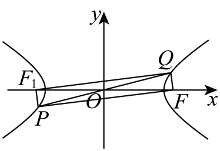

## 讲解

### 判据与流程

曲线点与顶点、焦点、弦或中心构成三角形/四边形，求面积或面积参数。

1. 先确认几何对象不退化；支与象限约束可能让端点必须严格离开坐标轴。中点、斜率或比例关系先转成坐标，保分母非零。
2. 底边在坐标轴时，用底长乘垂直坐标距离：S=(1/2)底长×|高|，不能把带符号y作面积。底不在轴可用点线距离作高，需有效非零法向。
3. 焦点夹角已知，可用(1/2)r₁r₂sinθ；结合定义与余弦定理求乘积。中心对称弦的两端互为负坐标，能转换距离或面积；证明对称后才能使用。
4. 四边形先核顶点顺序、不交叉，再拆成共享底或对角线的三角形。代数有向面积与通常非负面积不同，若求通常面积要取相应绝对值。
5. 解出点/参数后回核原象限、斜率、真实曲线与非退化。面积比还须分母面积非零，不能将两者同为0的方向收入范围。

## 例题

### 原例：HSMA-B3-C3-D1d13a9e27467-P0242–P0252

**原题、原答案、原思路与原详解**（原次序保留，仅作等价符号规范）：

【例5】（24-25高二上·广东·阶段练习）已知点P是曲线$Γ:\frac{{x}^{2}}{4}-\frac{{y}^{2}}{4}=1$在第一象限内的一点，A为$Γ$的左顶点，R为PA的中点，F为$Γ$的右焦点．若直线OR（O为原点）的斜率为$\sqrt{5}$，则$\triangle PAF$的面积为（    ）

A．$\sqrt{10}+\sqrt{5}$  B．$\sqrt{10}-\sqrt{5}$  C．$3\sqrt{2}+3$  D．$3\sqrt{2}-3$

【答案】A

【解题思路】设$P\left( {x}_{0},{y}_{0}\right),{x}_{0}>0,{y}_{0}>0$，根据条件列方程组求出$P$点坐标，进而可得$\triangle PAF$的面积.

【解答过程】设$P\left( {x}_{0},{y}_{0}\right),{x}_{0}>0,{y}_{0}>0$，

所以$R\left( \frac{{x}_{0}-2}{2},\frac{{y}_{0}}{2}\right),{x}_{0}^{2}-{y}_{0}^{2}=4$，

因为直线OR的斜率为$\sqrt{5}$，所以$\frac{{y}_{0}}{{x}_{0}-2}=\sqrt{5}$，

化简得，${y}_{0}=\sqrt{5}\left( {x}_{0}-2\right)$，与${x}_{0}^{2}-{y}_{0}^{2}=4$联立解得，${x}_{0}=2$或3，其中${x}_{0}=2$舍去，

所以P点的坐标为$(3,\sqrt{5})$，又$F(2\sqrt{2},0)$，

所以$\triangle PAF$的面积为$\frac{2\sqrt{2}-(-2)}{2}\times \sqrt{5}=\sqrt{10}+\sqrt{5}$．

故选：A．

**补讲与核验**

曲线为x²−y²=4，a=b=2，左顶点A=(−2,0)、右焦点F=(2√2,0)。设P=(x,y)在第一象限，故x>0,y>0。R是PA中点，R=((x−2)/2,y/2)，OR斜率√5给y/(x−2)=√5；这里还需x−2≠0，OR不能是零线段。

代y=√5(x−2)到x²−y²=4，得x²−5(x−2)²=4，展开并除−4得x²−5x+6=0，根2、3。x=2给y=0，既不在第一象限，又让R=O、斜率无定义，所以舍弃；x=3给y=√5全部合法。以AF为水平底，其长2√2+2，高√5，面积(1/2)(2√2+2)√5=√10+√5，A正确。

### 原例：HSMA-B3-C3-D1d89578e51c6-P0154–P0167

**原题、原答案、原思路与原详解**（原次序保留，仅作等价符号规范）：

【例3】（24-25高三上·江苏镇江·阶段练习）双曲线$C:\frac{{x}^{2}}{3}-{y}^{2}=1$的右焦点$F$，过原点$O$的直线与$C$相交于P，Q两点，若$PF\perp QF$，则$\triangle PFQ$的面积为（   ）

A．$\frac{1}{2}$  B．1  C．$\frac{3}{2}$  D．2

【答案】B

【解题思路】根据直角三角形的性质可得$\left| PQ\right|$，由双曲线的定义及对称性可得$\left| PF\right|-\left| QF\right|$，由此可求$\left| PF\right|\left| QF\right|$，进而可得$\triangle PFQ$的面积．

【解答过程】因为双曲线$C:\frac{{x}^{2}}{3}-{y}^{2}=1$，所以$a=\sqrt{3},b=1,c=2$，设左焦点为${F}_{1}$，

由题意可知$PF\perp QF$，$P,Q$关于原点$O$对称，所以$\left| PQ\right|=2\left| OF\right|=2c=4$，

由双曲线的对称性可得$\left| QF\right|=\left| P{F}_{1}\right|$，

由双曲线的定义可得$\left| \left| PF\right|-\left| P{F}_{1}\right|\right|=2a=2\sqrt{3}$，

所以$\left| \left| PF\right|-\left| QF\right|\right|=2\sqrt{3}$，可得${\left| PF\right|}^{2}+{\left| QF\right|}^{2}-2\left| PF\right|\left| QF\right|=12$，

又${\left| PF\right|}^{2}+{\left| QF\right|}^{2}={\left| PQ\right|}^{2}=16$，

所以$\left| PF\right|\left| QF\right|=2$，

所以$\triangle PFQ$的面积为$S=\frac{1}{2}\left| PF\right|\left| QF\right|=1$．

故选：B．

**补讲与核验**

过中心O的直线与这条中心对称双曲线相交于P、Q，两不同交点必关于O对称，因为反射保曲线和原直线且公共点恰两点。F=(2,0)，a=√3、c=2；在直角三角形PFQ中，O为斜边PQ中点，所以OF=PQ/2，PQ=4。

QF=PF₁由中心反射距离相等；定义给|PF−QF|=2a=2√3。平方得PF²+QF²−2PF·QF=12，而垂直给PF²+QF²=PQ²=16，相减得到PF·QF=2。面积(1/2)PF·QF=1，B正确。不能因Q在另一支就把距离差写成无符号的任意次序，也不能把PQ误作2a。

## 易错

- 代数候选在坐标轴上却保留：可能违反象限或让原斜率无定义。
- 只凭示意图认中点/垂直：每个面积转换须有题给或已证明的依据。
- 面积比遗漏零分母：退化三角形不产生合法比值。

## 来源

原件：专题3.6 直线与双曲线的位置关系（举一反三讲义）数学人教A版选择性必修第一册（解析版）.docx。

知识与题型口径：HSMA-B3-C3-D1d13a9e27467-P0241–P0306；完整原例见各例段落号。

原件：专题3.5 双曲线的简单几何性质（举一反三讲义）数学人教A版选择性必修第一册（解析版）.docx。

知识与题型口径：HSMA-B3-C3-D1d89578e51c6-P0153–P0206；完整原例见各例段落号。
