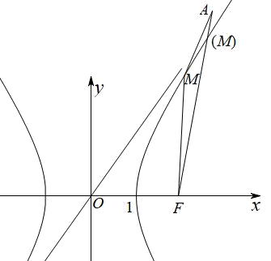

## 讲解

### 判据与流程

要求长度、比值、坐标或参数最大最小及范围，先建立合法集合，再比较目标。

1. 真双曲线a,b>0，范围与指定支/象限先列。涉及两交点时另有消元二次项非零、Δ>0、同支条件；目标分母如OP、焦半径、面积也先核非零。
2. 选择变量减少未知量：焦半径用t≥c−a，坐标用y²=b²(x²/a²−1)，两交点用根和根积。平方/开根始终保符号和原范围。
3. 代数比较目标在该区间的实际范围；基本不等式等号和配方顶点必须在合法区间。变量趋于无穷的值只能是极限边界。
4. 几何下界用三角或反向三角不等式，先写完整等号线段/射线，再证明与指定支确相交；可联立或用有限线段上的连续符号变化判存在。
5. 回构达到端点的曲线点/图形。如果端点不可达，用开区间或说明无该极值；如果无界，说明合法变量如何让目标无限变化，不能只靠图形感觉。

## 例题

### 原例：HSMA-B3-C3-D1d89578e51c6-P0375–P0385

**原题、原答案、原思路与原详解**（原次序保留，仅作等价符号规范）：

【例8】（2025·新疆·模拟预测）已知点$P$是双曲线${x}^{2}-\frac{{y}^{2}}{3}=1$上的动点，${F}_{1}$，${F}_{2}$分别为其左，右焦点，$O$为坐标原点.则$\frac{|P{F}_{1}|+|P{F}_{2}|}{|OP|}$的最大值是（    ）

A．7  B．6  C．5  D．4

【答案】D

【解题思路】设$P(x,y)$在右支上，根据双曲线的性质求得$|P{F}_{2}|=ex-a$、$|P{F}_{1}|=ex+a$且$|OP|=\sqrt{{x}^{2}+{y}^{2}}$，由已知双曲线有$\frac{|P{F}_{1}|+|P{F}_{2}|}{|OP|}=\frac{4}{\sqrt{4-\frac{3}{{x}^{2}}}}$，结合$x$的范围求范围，即可得结果.

【解答过程】由双曲线的对称性，假设$P(x,y)$在右支上，即$x\ge a$，

由$P$到$x=\frac{{a}^{2}}{c}$的距离为$d=x-\frac{{a}^{2}}{c}$，而$|P{F}_{2}|=\sqrt{{(x-c)}^{2}+{y}^{2}}$，

所以$\frac{|P{F}_{2}|}{d}=\frac{\sqrt{{(x-c)}^{2}+{y}^{2}}}{x-\frac{{a}^{2}}{c}}=\frac{\sqrt{{(x-c)}^{2}+\frac{{b}^{2}}{{a}^{2}}\cdot {x}^{2}-{b}^{2}}}{x-\frac{{a}^{2}}{c}}=\frac{\sqrt{\frac{{c}^{2}}{{a}^{2}}\cdot {x}^{2}-2cx+{a}^{2}}}{x-\frac{{a}^{2}}{c}}=\frac{\frac{cx}{a}-a}{x-\frac{{a}^{2}}{c}}$ $=\frac{c}{a}=e$，

综上，$|P{F}_{2}|=ex-a$，同理$|P{F}_{1}|=ex+a$，则$\frac{|P{F}_{1}|+|P{F}_{2}|}{|OP|}=\frac{ex-a+ex+a}{\sqrt{{x}^{2}+{y}^{2}}}=\frac{2ex}{\sqrt{{x}^{2}+{y}^{2}}}$，

对于双曲线${x}^{2}-\frac{{y}^{2}}{3}=1$，有${y}^{2}=3{x}^{2}-3$且$e=2$，

所以$\frac{|P{F}_{1}|+|P{F}_{2}|}{|OP|}=\frac{4x}{\sqrt{4{x}^{2}-3}}=\frac{4}{\sqrt{4-\frac{3}{{x}^{2}}}}$，而$x\ge 1$，即$\frac{|P{F}_{1}|+|P{F}_{2}|}{|OP|}\le \frac{4}{\sqrt{4-\frac{3}{1}}}=4$.

故选：D.

**补讲与核验**

目标对P的原点反射不变，所以可取右支x≥1。a=1、b²=3、c=2、e=2，焦半径和=(ex+a)+(ex−a)=4x；由曲线y²=3x²−3，OP²=4x²−3，所以比值R=4x/√(4x²−3)=4/√(4−3/x²)。

x≥1给0<1/x²≤1，于是1≤4−3/x²<4，开正根再取倒数得2<R≤4。x=1、y=0时R=4，左顶点对称也取得，故最大值4，D正确；A/B/C都超出范围。另一方面x趋向无穷时R趋近2，但有限x永不等于2，因此此同一原式没有最小值，只有下确界2。上界、下界与实际极值必须分开；原题只问最大值，补讲用它说明可达边界。

### 原例：HSMA-B3-C3-D1d13a9e27467-P0308–P0320

**原题、原答案、原思路与原详解**（原次序保留，仅作等价符号规范）：

【例6】（2025·四川内江·二模）已知双曲线C的一条渐近线为直线$\sqrt{3}x-y=0$，C的右顶点坐标为$\left( 1,0\right)$，右焦点为F.若点M是双曲线C右支上的动点，点A的坐标为$\left( 3,5\right)$，则$\left| MA\right|+\left| MF\right|$的最小值为（    ）

A．$\sqrt{26}-1$  B．$\sqrt{26}$  C．$\sqrt{26}+1$  D．$\sqrt{26}+2$

【答案】B

【解题思路】根据双曲线渐近线和顶点的定义求出双曲线的标准方程，进而求出右焦点坐标，再确定点A在双曲线的外部，结合三角形三边之间的关系可知当$A\text{、}M\text{、}F$三点共线时$\left| MA\right|+\left| MF\right|$取得最小值$\left| AF\right|$，利用两点坐标求距离公式计算即可.

【解答过程】设双曲线方程为$\frac{{x}^{2}}{{a}^{2}}-\frac{{y}^{2}}{{b}^{2}}=1(a>0,b>0)$，则$\left\{ \begin{aligned}a=1\\\frac{b}{a}=\sqrt{3}\end{aligned}\right.$，所以$\left\{ \begin{aligned}a=1\\b=\sqrt{3}\end{aligned}\right.$，

双曲线方程为${x}^{2}-\frac{{y}^{2}}{3}=1$，由${3}^{2}-\frac{{y}^{2}}{3}=1$，得$y=\pm 2\sqrt{6}$，$5>2\sqrt{6}$，

因此$A(3,5)$在双曲线外部（不含焦点的部分），

又$c=\sqrt{1+3}=2$，所以$F(2,0)$，

在$\triangle AMF$中，由三边之间的关系可知当$M$是线段$AF$与双曲线的交点，

即$A\text{、}M\text{、}F$三点共线时，$\left| MA\right|+\left| MF\right|$取得最小值，

且最小值为$\left| AF\right|=\sqrt{{(3-2)}^{2}+{(5-0)}^{2}}=\sqrt{26}$，

故选：B.

**补讲与核验**

右顶点(1,0)给a=1，渐近斜率√3=b/a给b²=3，c=2，右焦点F=(2,0)。总距离MA+MF≥AF=√[(3−2)²+5²]=√26，B为下界候选。

等号要求M在线段FA内并在右支。设F+t(A−F)=(2+t,5t)，0≤t≤1。曲线式x²−y²/3−1在t=0为3>0，在t=1为9−25/3−1=−1/3<0，连续性保证途中有零点，x=2+t>0所以为右支，且位于线段内。于是√26真正达到。无需把双曲线全平面笼统分成“内外”来代替这次交点证明；其余选项非实际最小值。

## 易错

- 等号目标变量合法但原曲线点不合法：还须反构点的支与范围。
- “趋向”当“取到”：渐近无穷远的点不在可取集合。
- 图上连线穿支便不联立：示意图没有存在性证明。

## 来源

原件：专题3.5 双曲线的简单几何性质（举一反三讲义）数学人教A版选择性必修第一册（解析版）.docx。

知识与题型口径：HSMA-B3-C3-D1d89578e51c6-P0369–P0437；完整原例见各例段落号。

原件：专题3.6 直线与双曲线的位置关系（举一反三讲义）数学人教A版选择性必修第一册（解析版）.docx。

知识与题型口径：HSMA-B3-C3-D1d13a9e27467-P0307–P0397；完整原例见各例段落号。
