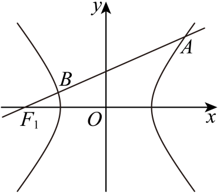

## 讲解

### 判据与流程

给焦点与方向求弦长，或给中点求弦线与长度。横焦轴标准式x²/a²−y²/b²=1，a,b>0；纵焦轴交换坐标。

1. 先核两不同实交点。代线后消元式A≠0、Δ>0才有可用的两根韦达关系；一交点或切点不能给真正弦长。竖直线单独解y，不能当有限斜率。
2. 非竖直线y=kx+m给AB²=(1+k²)[(x₁+x₂)²−4x₁x₂]，因为Δy=kΔx。代根和、积后开非负根；也可√(1+k²)√Δ/|A|，分母必须绝对值。
3. 中点M=(u,v)时两端曲线式先作差，得到uΔx/a²−vΔy/b²=0。先核分量是否可除，才转斜率；中点在坐标轴或中心时分别处理，不能把未知Δx默认非零。
4. 求出的候选线联立原曲线，证两个端点确不同，核坐标和为2M；若题限同支，再核端点符号。点差只给必要方向，真实弦还须存在。
5. 若给“焦点弦”而非“通径”，不能直接用2b²/a；通径还要求垂直实轴。最后同时回核方向、过点、中点和长度。

## 例题

### 原例：HSMA-B3-C3-D1d13a9e27467-P0125–P0138

**原题、原答案、原思路与原详解**（原次序保留，仅作等价符号规范）：

【例3】（24-25高二上·全国·课后作业）过双曲线${x}^{2}-\frac{{y}^{2}}{3}=1$的左焦点F1，作倾斜角为$\frac{\pi }{6}$的直线与双曲线交于A，B两点，则$\left| AB\right|$＝（　　）

A．2  B．3  C．4  D．5

【答案】B

【解题思路】先表达出直线AB的方程，根据题意，再将直线与双曲线联立方程组，结合韦达定理即可求解.

【解答过程】依题意，得双曲线的左焦点F1的坐标为$\left( -2,0\right)$，直线AB的方程为$y=\frac{\sqrt{3}}{3}\left( x+2\right)$.

由$\left\{ \begin{aligned}y=\frac{\sqrt{3}}{3}\left( x+2\right)\\{x}^{2}-\frac{{y}^{2}}{3}=1\end{aligned}\right.$得$8{x}^{2}-4x-13=0$ . 

设$A\left( {x}_{1},{y}_{1}\right),B\left( {x}_{2},{y}_{2}\right)$  ，

则${x}_{1}+{x}_{2}=\frac{1}{2}$，${x}_{1}{x}_{2}=-\frac{13}{8}$，所以

$\left| AB\right|=\sqrt{1+{k}^{2}}\cdot \left| {x}_{1}-{x}_{2}\right|$

$=\sqrt{{\left[ 1+\left( \frac{\sqrt{3}}{3}\right)\right]}^{2}\left[ {\left( {x}_{1}+{x}_{2}\right)}^{2}-4{x}_{1}{x}_{2}\right]}$

$=\sqrt{\left( 1+\frac{1}{3}\right)\times [{\left( \frac{1}{2}\right)}^{2}-4\times \left( -\frac{13}{8}\right)]}$

＝3. 

故选：B.

**补讲与核验**

曲线a=1、b²=3，所以c=2，左焦点F₁=(−2,0)。倾斜角π/6给斜率k=tan(π/6)=√3/3，过F₁的线为y=k(x+2)。代曲线并乘9，得到9x²−(x+2)²=9，展开为8x²−4x−13=0。

二次项8非零，Δ=16+416=432>0，确两个不同交点；根和1/2、积−13/8，说明分居两支。根差平方=(1/2)²−4(−13/8)=27/4；AB²=(1+k²)×27/4=(4/3)×27/4=9，长度3，B正确。

原P0134中间行把因子写成[1+(√3/3)]²，这是原OMML的括号/平方位置错误；应为1+(√3/3)²=4/3。原行保留，下一行实际用了正确因子，故最终原答案3仍正确。不能因原中间行错而机械照算，也不能静默改原文。

### 原例：HSMA-B3-C3-D1d13a9e27467-P0187–P0197

**原题、原答案、原思路与原详解**（原次序保留，仅作等价符号规范）：

【例4】（24-25高二上·四川成都·期末）设$A,B$为双曲线${x}^{2}-\frac{{y}^{2}}{2}=1$上的两点，线段$AB$的中点为$M(2,2)$，则$\left| AB\right|=$（    ）

A．$\sqrt{5}$  B．$2\sqrt{5}$  C．$\sqrt{10}$  D．$2\sqrt{10}$

【答案】B

【解题思路】设点$A({x}_{1},{y}_{1}),B({x}_{2},{y}_{2})$，利用中点弦问题求出直线$AB$斜率，并求出该直线方程，再与双曲线方程联立求出弦长.

【解答过程】设双曲线${x}^{2}-\frac{{y}^{2}}{2}=1$上的点$A({x}_{1},{y}_{1}),B({x}_{2},{y}_{2})$，线段$AB$的中点为$M(2,2)$，则${x}_{1}\ne {x}_{2}$，

则$\left\{ \begin{aligned}{x}_{1}^{2}-\frac{{y}_{1}^{2}}{2}=1\\{x}_{2}^{2}-\frac{{y}_{2}^{2}}{2}=1\end{aligned}\right.$，且$\left\{ \begin{aligned}{x}_{1}+{x}_{2}=4\\{y}_{1}+{y}_{2}=4\end{aligned}\right.$，

两式相减，得$({x}_{1}+{x}_{2})({x}_{1}-{x}_{2})-\frac{1}{2}({y}_{1}+{y}_{2})({y}_{1}-{y}_{2})=0$，即${y}_{1}-{y}_{2}=2({x}_{1}-{x}_{2})$，

则直线$AB$斜率$k=\frac{{y}_{1}-{y}_{2}}{{x}_{1}-{x}_{2}}=2$，直线$AB$的方程为：$y=2x-2$，

由$\left\{ \begin{aligned}y=2x-2\\{x}^{2}-\frac{{y}^{2}}{2}=1\end{aligned}\right.$，消去$y$，得${x}^{2}-4x+3=0$，解得${x}_{1}=1,{x}_{2}=3$，

$|AB|=\sqrt{1+{k}^{2}}|{x}_{1}-{x}_{2}|=2\sqrt{5}$.

故选：B.

**补讲与核验**

中点M=(2,2)给x₁+x₂=4、y₁+y₂=4。两端曲线式作差得(x₁+x₂)(x₁−x₂)−(1/2)(y₁+y₂)(y₁−y₂)=0，代和式得到4Δx−2Δy=0，即Δy=2Δx。

先不能直接除Δx。若Δx=0，则Δy也0，A=B，与两不同端点矛盾，所以Δx≠0，斜率才合法为2。过M得到y−2=2(x−2)，即y=2x−2。代曲线：x²−(2x−2)²/2=1，展开移项为x²−4x+3=0，根1、3，对应A=(1,0)、B=(3,4)。两点确不同且都在右支，中点(2,2)正确，AB²=2²+4²=20，所以AB=2√5，B正确。必要候选最后真能截得弦，不能省这次存在检验。

## 易错

- (1+k²)写成(1+k)²：前者来自两坐标差平方和，不能先加再平方。
- 求候选中点线就结束：还可能无实端点或只有一个点。
- 给焦点即套通径：必须另有垂直实轴方向。

## 资料疑点与勘误

原P0134的[1+(√3/3)]²已核document.xml的OMML：外层sSup确套整个方括号，是原件写错，非提取遗漏；正确因子为1+(√3/3)²。原答案3可由紧随的正确下一行核实。

## 来源

原件：专题3.6 直线与双曲线的位置关系（举一反三讲义）数学人教A版选择性必修第一册（解析版）.docx。

知识与题型口径：HSMA-B3-C3-D1d13a9e27467-P0114–P0123；完整原例见各例段落号。

原件：专题3.6 直线与双曲线的位置关系（举一反三讲义）数学人教A版选择性必修第一册（解析版）.docx。

知识与题型口径：HSMA-B3-C3-D1d13a9e27467-P0124–P0240；完整原例见各例段落号。
