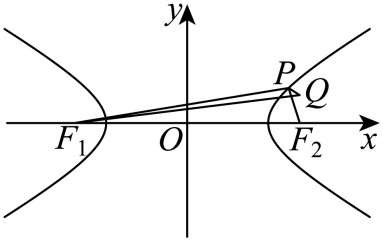

## 讲解

### 判据与流程

点在指定双曲线支上，目标含到焦点及固定点的距离和、差或绝对差。

1. 先认原曲线与实际支，开根式x=√(...)只保x≥0对应的支。焦轴、a,c及哪个焦点远/近要列清。
2. 用定义把一段焦距换成另一段加/减2a。例如右支PF₁=PF₂+2a；该±2a由原支决定，不能随便选有利符号。
3. 距离和用PA+PB≥AB，等号是P在线段AB上；绝对距离差用|PA−PB|≤AB，等号位于相应外侧射线。目标若是带符号差，先处理外层绝对值与符号，再谈最大最小。
4. 把等号所在的线段或射线与指定曲线支联立。证明存在且符合范围，才把界称最值；若只有延长线交点，等号无效。可用线段参数0≤t≤1或代入曲线的连续符号变化核实位置。
5. 若等号不达，继续在合法范围比较或说明只有可趋近的界；双曲线无界时尤其要核是否根本无最大/最小。最终回原距离式确认值非负且单位正确。

## 例题

### 原例：HSMA-B3-C3-D066064c91145-P0314–P0323

**原题、原答案、原思路与原详解**（原次序保留，仅作等价符号规范）：

【例7】（24-25高二上·河南南阳·期中）已知$P$为曲线$C:x=\sqrt{1+\frac{{y}^{2}}{2}}$上任意一点，$A(-\sqrt{3},0)$，$B(0,\sqrt{22})$，则$\left| PA\right|+\left| PB\right|$的最小值为（    ）

A．$2+\sqrt{15}$  B．$5$

C．$4\sqrt{3}$  D．$7$

【答案】D

【解题思路】运用双曲线定义转化，再结合三点位置关系分析即可.

【解答过程】由$x=\sqrt{1+\frac{{y}^{2}}{2}}$，得${x}^{2}-\frac{{y}^{2}}{2}=1(x\ge 1)$，所以$C$为双曲线${x}^{2}-\frac{{y}^{2}}{2}=1$的右支，

$A(-\sqrt{3},0)$为该双曲线的左焦点．设右焦点为${A}^{\prime}$，则$\left| PA\right|-\left| P{A}^{\prime}\right|=2a=2$，

所以$\left| PA\right|=\left| P{A}^{\prime}\right|+2$．所以$\left| PA\right|+\left| PB\right|=\left| P{A}^{\prime}\right|+\left| PB\right|+2\ge \left| B{A}^{\prime}\right|+2=5+2=7$，

当且仅当点$P$在线段${A}^{\prime}B$上时，等号成立，所以$\left| PA\right|+\left| PB\right|$的最小值为$7$．

故选：D.

**补讲与核验**

原曲线x=√(1+y²/2)指定右支x≥1；平方后标准式x²−y²/2=1不能删去这个限制。左焦点A=(−√3,0)，右焦点A′=(√3,0)，差PA−PA′=2。故PA+PB=PA′+PB+2≥A′B+2，A′B²=3+22=25，下界7。

等号须P在线段A′B上，而且在右支。沿该线段，从A′处曲线式x²−y²/2−1为3−1=2>0，到B=(0,√22)处为−11−1=−12<0；连续代入值从正到负，途中有零点，且该点x>0，因此正是右支点。于是下界确能达到，D正确。其余选项均不是实际最短值。这里检的是线段与指定支的真实交点，不能只写三点共线。

### 原例：HSMA-B3-C3-D066064c91145-P0356–P0369

**原题、原答案、原思路与原详解**（原次序保留，仅作等价符号规范）：

【例8】（24-25高二上·江西·阶段练习）已知双曲线$C$:$\frac{{x}^{2}}{3}-{y}^{2}=1$的右焦点为${F}_{2}$，点P在C的右支上，且$Q\left( 2,\frac{1}{2}\right)$，则$\left| PQ\right|+\left| P{F}_{2}\right|$的最小值为（    ）

A．$4-2\sqrt{3}$  B．$\sqrt{17}-2\sqrt{3}$

C．$\sqrt{15}-2\sqrt{3}$  D．$\frac{\sqrt{65}}{2}-2\sqrt{3}$

【答案】D

【解题思路】利用双曲线的定义将$\left| PQ\right|+\left| P{F}_{2}\right|$的最小值转化为$\left| PQ\right|+\left| P{F}_{1}\right|$的最小值即可.

【解答过程】

由题知，${a}^{2}=3$，${b}^{2}=1$，所以${c}^{2}=4$，

设双曲线$C$的左焦点为${F}_{1}$，则${F}_{1}\left( -2,0\right)$，${F}_{2}\left( 2,0\right)$，因为点P在C的右支上，

由双曲线的定义知$\left| P{F}_{1}\right|-\left| P{F}_{2}\right|=2a=2\sqrt{3}$，

所以$\left| PQ\right|+\left| P{F}_{2}\right|=\left| PQ\right|+\left| P{F}_{1}\right|-2\sqrt{3}\ge \left| Q{F}_{1}\right|-2\sqrt{3}=\sqrt{{\left( 2+2\right)}^{2}+{\left( \frac{1}{2}\right)}^{2}}-2\sqrt{3}=\frac{\sqrt{65}}{2}-2\sqrt{3}$,

当${F}_{1},P,Q$三点共线时取等号，

所以$\left| PQ\right|+\left| P{F}_{2}\right|$的最小值为$\frac{\sqrt{65}}{2}-2\sqrt{3}$.

故选：D.

**补讲与核验**

标准式读a=√3、c=2、左焦点F₁=(−2,0)、右焦点F₂=(2,0)。P在右支，PF₁−PF₂=2√3，所以PQ+PF₂=PQ+PF₁−2√3≥QF₁−2√3=√65/2−2√3，D为候选。

仍须证P在线段F₁Q内且在右支。令F₁+ t(Q−F₁)=(−2+4t,t/2)，0≤t≤1。到x=0的t=1/2，曲线式x²/3−y²−1<0；Q对应t=1时该式4/3−1/4−1=1/12>0。因此在t∈(1/2,1)有实际零点，x>0、曲线迫使x≥√3，是右支点，且在线段内。三角等号成立，所以候选实际达到。原解“共线”补足了线段位置与支存在，未加新题目条件。

## 易错

- 距离差转换不看支：常数±2a会错号。
- 只说共线即得最值：三角等号还需线段或外侧位置。
- “连线必交曲线”凭示意图：用联立及参数范围给真实证据。

## 来源

原件：专题3.4 双曲线及其标准方程（举一反三讲义）数学人教A版选择性必修第一册（解析版）.docx。

知识与题型口径：HSMA-B3-C3-D066064c91145-P0313–P0416；完整原例见各例段落号。
