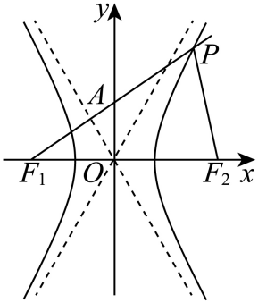

## 讲解

### 判据与流程

题同时出现两个焦点与曲线点、两焦半径夹角、垂直、等腰或三角面积。

1. 核三点不共线；顶点使焦点三角形退化，面积0而不能套内角推导。读a²,b²,c²及焦距2c，别漏2。
2. 将两未知焦半径整体记r₁,r₂。支已明就有向差±2a，未明可用(r₁−r₂)²=4a²；于是r₁²+r₂²=4a²+2r₁r₂，减少两个独立未知量。
3. 对焦距边用余弦定理4c²=r₁²+r₂²−2r₁r₂cosθ；代上式先求乘积，再用S=(1/2)r₁r₂sinθ。若给面积、直角可反求a²与b²。
4. 坐标已知时可用焦距作底、到焦轴距离作高：x轴型S=c|y|，y轴型S=c|x|。绝对值保障面积非负。
5. 解出的角、距离或参数回核正长度、三角不等式、给定支/象限与a,b>0；等腰必须逐种相等边讨论，不能令两焦半径相等而忽略它们差2a>0。

## 例题

### 原例：HSMA-B3-C3-D066064c91145-P0272–P0284

**原题、原答案、原思路与原详解**（原次序保留，仅作等价符号规范）：

【变式6-1】（24-25高二上·吉林·期末）已知${F}_{1}$，${F}_{2}$分别是双曲线C：$\frac{{x}^{2}}{4}-\frac{{y}^{2}}{3}=1$的左、右两个焦点，点P在双曲线C上，且满足$\angle {F}_{1}P{F}_{2}={60}^{\circ}$，则$\triangle {F}_{1}P{F}_{2}$的面积是（    ） 

A．1  B．$\sqrt{3}$  C．3  D．$3\sqrt{3}$

【答案】D

【解题思路】由双曲线的性质，结合双曲线的定义、余弦定理及三角形的面积公式求解．

【解答过程】已知${F}_{1}$，${F}_{2}$分别是双曲线C：$\frac{{x}^{2}}{4}-\frac{{y}^{2}}{3}=1$的左、右两个焦点，点P在双曲线C上，

则$||P{F}_{1}|-|P{F}_{2}||=2a=4$，$|{F}_{1}{F}_{2}|=2c=2\sqrt{7}$，

又$\angle {F}_{1}P{F}_{2}={60}^{\circ}$，

则$|{F}_{1}{F}_{2}{|}^{2}=|P{F}_{1}{|}^{2}+|P{F}_{2}{|}^{2}-2|P{F}_{1}||P{F}_{2}|\cos \angle {F}_{1}P{F}_{2}$，

即$28={4}^{2}+|P{F}_{1}||P{F}_{2}|$，

即$|P{F}_{1}||P{F}_{2}|=12$，

即$\triangle {F}_{1}P{F}_{2}$的面积是$\frac{1}{2}\times 12\times \frac{\sqrt{3}}{2}=3\sqrt{3}.$

故选：D$.$

**补讲与核验**

正项在x²，a²=4、b²=3、c²=7。令两焦半径为r₁、r₂，定义给(r₁−r₂)²=16，因此r₁²+r₂²=16+2r₁r₂。余弦定理从焦距边2c出发：28=r₁²+r₂²−2r₁r₂ cos60°=16+2r₁r₂−r₁r₂，所以r₁r₂=12。

三角形两边夹角面积公式给S=(1/2)×12×sin60°=3√3，D正确。A/B/C都不是两条焦半径乘积与夹角共同给出的面积。不能把焦距2c直接当作夹角两邻边之一，或把差的平方16误当两焦半径平方和。

### 原例：HSMA-B3-C3-D066064c91145-P0129–P0139

**原题、原答案、原思路与原详解**（原次序保留，仅作等价符号规范）：

【变式3-1】（24-25高二上·新疆克孜勒苏·期末）已知双曲线的中心在原点，两个焦点${F}_{1},{F}_{2}$分别为$\left( -\sqrt{5},0\right)$和$\left( \sqrt{5},0\right)$，点$P$在双曲线上，且$P{F}_{1}\perp P{F}_{2}$，$\triangle P{F}_{1}{F}_{2}$的面积为1，则双曲线的方程为（    ）

A．$\frac{{x}^{2}}{2}-\frac{{y}^{2}}{3}=1$  B．$\frac{{x}^{2}}{3}-\frac{{y}^{2}}{2}=1$

C．${x}^{2}-\frac{{y}^{2}}{4}=1$  D．$\frac{{x}^{2}}{4}-{y}^{2}=1$

【答案】D

【解题思路】根据双曲线的定义确定$a,b$的值，可得双曲线的标准方程.

【解答过程】不妨设点$P$在第一象限.

设$\left| P{F}_{1}\right|={t}_{1}$，$\left| P{F}_{2}\right|={t}_{2}$，

根据题意：$\left\{ \begin{aligned}{t}_{1}^{2}+{t}_{2}^{2}=20\\\frac{1}{2}{t}_{1}{t}_{2}=1\end{aligned}\right.$，

所以${\left( {t}_{1}-{t}_{2}\right)}^{2}={t}_{1}^{2}-2{t}_{1}{t}_{2}+{t}_{2}^{2}=16$，即${\left( 2a\right)}^{2}=16$，所以${a}^{2}=4$，${b}^{2}={c}^{2}-{a}^{2}=5-4=1$，

所以双曲线的方程为：$\frac{{x}^{2}}{4}-{y}^{2}=1$.

故选：D.

**补讲与核验**

焦点给c=√5，焦距边2c=2√5。令两焦半径t₁,t₂；垂直说明夹角90°，勾股给t₁²+t₂²=(2c)²=20，面积1给(1/2)t₁t₂=1，即乘积2。定义给(2a)²=(t₁−t₂)²=20−2×2=16，因此a²=4。

c²=a²+b²给b²=5−4=1>0，焦轴x轴，标准式x²/4−y²=1，D正确。对称性允许把P取到第一象限，但没有将a、b互换；其余选项a²不是由三角条件得出的4。

## 易错

- 把距离差平方当平方和：少了2r₁r₂。
- 焦距2c误作c：会同时算错角与面积。
- 等腰只选一个相等边情形：两焦半径不相等，还可能其中之一等于焦距。

## 来源

原件：专题3.4 双曲线及其标准方程（举一反三讲义）数学人教A版选择性必修第一册（解析版）.docx。

知识与题型口径：HSMA-B3-C3-D066064c91145-P0250–P0312；完整原例见各例段落号。
