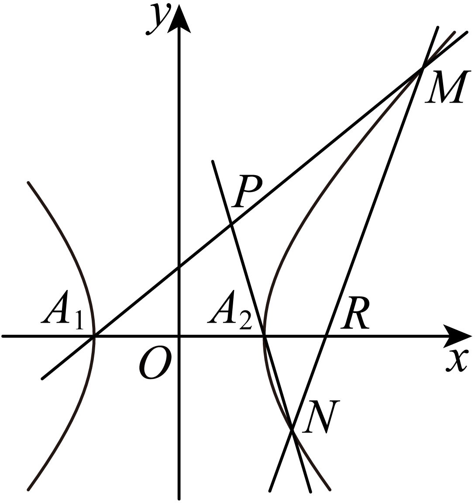

## 讲解

### 判据与流程

题说动线恒过定点、动点在定直线或某比值为常数，要求证明对全部原题合法变化都成立。

1. 列全部合法参数，保真实曲线、两不同交点、指定支、连线有效与分母非零。先选能覆盖合法竖直/水平情况的设法；未覆盖的合法方向留待单独核。
2. 联立原曲线写根和根积，把动对象的系数/坐标/比值表示成参数函数。中间每次除法先说明对象非零，不可为方便自行删合法0值。
3. 定点证明候选坐标代入所有合法直线式恒为0；定直线证明动点坐标满足固定有效线式；定值证明表达式与全部参数无关。特例仅可用来发现候选，正式结论依赖一般证明。
4. 用曲线关系转换根平方、顶点连线比或向量，逐行交代替换来源。若某参数使当前表达式0/0，回未除法式/几何核结论，而非默认原题无效。
5. 最后处理合法特殊方向或零参数，并确认连线或交点存在。不能只证“如果交点存在则在定线上”而漏给题所需的实际存在性。

## 例题

### 原例：HSMA-B3-C3-D1d13a9e27467-P0420–P0438

**原题、原答案、原思路与原详解**（原次序保留，仅作等价符号规范）：

【例7】（24-25高三上·江苏·阶段练习）已知点$(\sqrt{6},1)$在离心率为$\frac{2\sqrt{3}}{3}$的双曲线$C:\frac{{x}^{2}}{{a}^{2}}-\frac{{y}^{2}}{{b}^{2}}=1(a,b>0)$上．

(1)求$C$的方程；

(2)过点$P(1,0)$的直线与$C$相交于$B,D$两点，$B$关于$x$轴的对称点为$A$，求证：直线$AD$过$x$轴上的定点，并求出该定点坐标．

【答案】(1)$\frac{{x}^{2}}{3}-{y}^{2}=1$；

(2)证明见解析，定点坐标为$(3,0)$.

【解题思路】（1）根据给定条件，利用离心率及双曲线所过点求出$a,b$即可.

（2）设出直线$BD$的方程，与双曲线方程联立，结合韦达定理，求出直线$AD$与$x$轴交点横坐标即可推理得证.

【解答过程】（1）由双曲线$C:\frac{{x}^{2}}{{a}^{2}}-\frac{{y}^{2}}{{b}^{2}}=1$的离心率为$\frac{2\sqrt{3}}{3}$，得$\frac{{a}^{2}+{b}^{2}}{{a}^{2}}=\frac{4}{3}$，解得${a}^{2}=3{b}^{2}$，

又点$(\sqrt{6},1)$在双曲线$C:\frac{{x}^{2}}{{a}^{2}}-\frac{{y}^{2}}{{b}^{2}}=1$上，则$\frac{6}{{a}^{2}}-\frac{1}{{b}^{2}}=1$，解得${a}^{2}=3,{b}^{2}=1$，

所以$C$的方程为$\frac{{x}^{2}}{3}-{y}^{2}=1$.

（2）显然直线$BD$的斜率存在，设其方程为$y=k(x-1)$，$B({x}_{1},{y}_{1}),D({x}_{2},{y}_{2})$，则$A({x}_{1},-{y}_{1})$，

由$\left\{ \begin{aligned}y=k(x-1)\\{x}^{2}-3{y}^{2}=3\end{aligned}\right.$消去$y$并整理得$(3{k}^{2}-1){x}^{2}-6{k}^{2}x+3({k}^{2}+1)=0$，

$\left\{ \begin{aligned}3{k}^{2}-1\ne 0\\\Delta =36{k}^{4}-12(3{k}^{2}-1)({k}^{2}+1)>0\end{aligned}\right.$，解得${k}^{2}<\frac{1}{2}$且${k}^{2}\ne \frac{1}{3}$，$\left\{ \begin{aligned}{x}_{1}+{x}_{2}=\frac{6{k}^{2}}{3{k}^{2}-1}\\{x}_{1}{x}_{2}=\frac{3({k}^{2}+1)}{3{k}^{2}-1}\end{aligned}\right.$，

当直线$BD$与$x$轴不重合时，${y}_{1}+{y}_{2}\ne 0$，直线$AD$：$y-{y}_{2}=\frac{{y}_{2}+{y}_{1}}{{x}_{2}-{x}_{1}}(x-{x}_{2})$，

令$y=0$，得$x={x}_{2}-\frac{{y}_{2}({x}_{2}-{x}_{1})}{{y}_{2}+{y}_{1}}=\frac{{x}_{1}{y}_{2}+{x}_{2}{y}_{1}}{{y}_{1}+{y}_{2}}=\frac{{x}_{1}\cdot k({x}_{2}-1)+{x}_{2}\cdot k({x}_{1}-1)}{k({x}_{1}-1)+k({x}_{2}-1)}$

$=\frac{2{x}_{1}{x}_{2}-({x}_{1}+{x}_{2})}{{x}_{1}+{x}_{2}-2}=\frac{2\cdot \frac{3({k}^{2}+1)}{3{k}^{2}-1}-\frac{6{k}^{2}}{3{k}^{2}-1}}{\frac{6{k}^{2}}{3{k}^{2}-1}-2}=3$，此时直线$AD$过定点$T(3,0)$，

当直线$BD$与$x$轴重合时，直线$AD$为$x$轴，也过点$T(3,0)$，

所以直线$AD$过$x$轴上的定点，该定点坐标为$(3,0)$.

**补讲与核验**

第一问e²=4/3给a²+b²=(4/3)a²，所以a²=3b²；将题给点(√6,1)代标准式得6/a²−1/b²=1，代a²=3b²后2/b²−1/b²=1，得到b²=1、a²=3，是真双曲线。

第二问竖直线x=1代曲线无实点，所以所有合法BD斜率确存在。设y=k(x−1)，消元二次式系数为A=3k²−1、B=−6k²、C=3(k²+1)，Δ=12−24k²。两不同交点的合法范围是k²<1/2且k²≠1/3，k=0也在内。记S=x₁+x₂=6k²/(3k²−1)、T=x₁x₂=3(k²+1)/(3k²−1)，A点是B=(x₁,y₁)反射所得(x₁,−y₁)。

k≠0时，y₁+y₂=k(S−2)=2k/(3k²−1)≠0，AD与x轴交点可写横坐标(2T−S)/(S−2)。分别代韦达：2T−S=6/(3k²−1)，S−2=2/(3k²−1)，比值恒3，与合法k无关。x₁≠x₂来自两不同根，所以连线AD有效。

k=0不能约去k，应回几何：BD是x轴，两端不同，B的轴反射仍是自身，AD也为x轴，仍经过(3,0)。因此不是用几条特例猜定点，而是覆盖全部合法非零k与零k，证明统一经过T=(3,0)。

### 原例：HSMA-B3-C3-D1d13a9e27467-P0509–P0531

**原题、原答案、原思路与原详解**（原次序保留，仅作等价符号规范）：

【例8】（24-25高二上·黑龙江哈尔滨·阶段练习）已知双曲线$C$的中心为坐标原点，左、右顶点分别为${A}_{1}\left( -4,0\right)$，${A}_{2}\left( 4,0\right)$，虚轴长为6．

  

(1)求双曲线$C$的方程；

(2)过点$R\left( 6,0\right)$的直线$l$与$C$的右支交于$M$，$N$两点，若直线${A}_{1}M$与${A}_{2}N$交于点$P$．证明：点$P$在定直线上；

【答案】(1)$\frac{{x}^{2}}{16}-\frac{{y}^{2}}{9}=1$

(2)证明见解析

【解题思路】（1）由$a,b$直接求出双曲线方程即可；

（2）设直线$MN$方程和设$M\left( {x}_{1},{y}_{1}\right),N\left( {x}_{2},{y}_{2}\right)$，直曲联立表示出韦达定理，利用点$M$在双曲线上代入化简表示出直线${A}_{1}M,{A}_{2}N$方程，联立两方程化简即可；

【解答过程】（1）设双曲线的标准方程为$\frac{{x}^{2}}{{a}^{2}}-\frac{{y}^{2}}{{b}^{2}}=1\left( a>0,b>0\right)$，

依题意有$a=4,2b=6,\therefore b=3$，

所以双曲线方程为$\frac{{x}^{2}}{16}-\frac{{y}^{2}}{9}=1$.

（2）

  

(i)证明:设直线$MN$方程为:$x=my+6$，设$M\left( {x}_{1},{y}_{1}\right),N\left( {x}_{2},{y}_{2}\right)$，

联立方程$\left\{ \begin{aligned}x=my+6\\\frac{{x}^{2}}{16}-\frac{{y}^{2}}{9}=1\end{aligned}\right.$，消去$x$得:$\left( 9{m}^{2}-16\right){y}^{2}+108my+180=0$，

$\Delta ={108}^{2}{m}^{2}-720\left( 9{m}^{2}-16\right)>0$，

$\because m\ne \pm \frac{4}{3},\therefore {y}_{1}+{y}_{2}=\frac{-108m}{9{m}^{2}-16},{y}_{1}{y}_{2}=\frac{180}{9{m}^{2}-16}$，

$\because M\left( {x}_{1},{y}_{1}\right)$是双曲线$C$上的点，

$\therefore \frac{{x}_{1}^{2}}{16}-\frac{{y}_{1}^{2}}{9}=1,\therefore \frac{{x}_{1}^{2}-16}{16}=\frac{{y}_{1}^{2}}{9},\therefore \frac{\left( {x}_{1}+4\right)\left( {x}_{1}-4\right)}{{y}_{1}^{2}}=\frac{16}{9},\therefore \frac{{x}_{1}+4}{{y}_{1}}=\frac{16{y}_{1}}{9\left( {x}_{1}-4\right)}$，

直线${A}_{1}M:y=\frac{{y}_{1}}{{x}_{1}+4}\left( x+4\right)$，同理直线${A}_{2}N:y=\frac{{y}_{2}}{{x}_{2}-4}\left( x-4\right)$，

联立方程得$\frac{{y}_{1}}{{x}_{1}+4}\left( x+4\right)=\frac{{y}_{2}}{{x}_{2}-4}\left( x-4\right),\therefore \frac{x+4}{x-4}=\frac{{y}_{2}\left( {x}_{1}+4\right)}{{y}_{1}\left( {x}_{2}-4\right)}=\frac{{x}_{1}+4}{{y}_{1}}\cdot \frac{{y}_{2}}{{x}_{2}-4}$

$=\frac{16{y}_{1}}{9\left( {x}_{1}-4\right)}\cdot \frac{{y}_{2}}{\left( {x}_{2}-4\right)}=\frac{16{y}_{1}}{9\left( m{y}_{1}+2\right)}\cdot \frac{{y}_{2}}{\left( m{y}_{2}+2\right)}=\frac{16{y}_{1}{y}_{2}}{9{m}^{2}{y}_{1}{y}_{2}+18m\left( {y}_{1}+{y}_{2}\right)+36}=-5$，

解得$x=\frac{8}{3}$，故点$P$在定直线$x=\frac{8}{3}$上.

**补讲与核验**

第一问2a=8、2b=6，得a=4、b=3，标准式x²/16−y²/9=1。第二问MN过R=(6,0)且在右支截两点，水平线y=0只给一个右顶点，不能符合；因此可以设x=my+6，包含合法的竖直线m=0。

代入并同乘144，得(9m²−16)y²+108my+180=0。要同右支两点，合法范围|m|<4/3：此时二次项非零、Δ=5184m²+11520>0，y积180/(9m²−16)<0；两端x和为192/(16−9m²)>0、x积为(144m²+576)/(16−9m²)>0，所以两端都在右支。|m|>4/3则x积负、异支，不符；等号退成一次，也不符。

y₁,y₂非零，故两个x都大于4，原式中y₁、x₁−4、x₂−4均可除。设S=y₁+y₂=−108m/(9m²−16)，T=y₁y₂=180/(9m²−16)。曲线给(x₁+4)/y₁=16y₁/[9(x₁−4)]，于是两连线斜率比k₂/k₁=16T/[9m²T+18mS+36]。分子2880/(9m²−16)，分母−576/(9m²−16)，比恒−5，且都非零。

因此两连线斜率不同，确有唯一有限交点P。其方程联立给(x+4)/(x−4)=−5；P不可能x=4，否则第二线y=0而第一线y=8k₁≠0，故可除。得到6x=16，即x=8/3。全部合法m含0均已证明，所以P落在定直线x=8/3，而非由几张图猜得。

## 易错

- k=0直接剔除：原动线可能仍合法且经过定点。
- 交点坐标公式分母0便当不存在：须核两线是否真平行、重合或仅设法特殊。
- 只检几个m值：有限特例不证明恒定。

## 来源

原件：专题3.6 直线与双曲线的位置关系（举一反三讲义）数学人教A版选择性必修第一册（解析版）.docx。

知识与题型口径：HSMA-B3-C3-D1d13a9e27467-P0398–P0599；完整原例见各例段落号。
