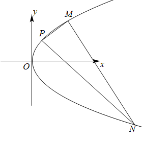

## 讲解

### 判据与流程

看到“恒过”“证明为定值”“动交点在定直线上”，应把命题理解为全部满足原条件的构型；特例、图形、数值试算只能帮助猜测。

1. 设一个覆盖运动的参数：右开口曲线点可用(t²/(2p),t)，非水平两点弦用x=my+b；选择参数时解释为何轴线/顶点是否由原条件排除，别任意省略特殊方向。
2. 把条件化成端点参数和、积或根和、积。斜率相反先列斜率存在与非零条件，乘分母前确认它们非零。约去端点差前确认点不同，坐标和若为0须保留竖直分支。
3. 定值：目标量写出完整式，逐步替换约束使参数消失；定点：线方程整理为y=k(x+a)+b，固定点(−a,b)对所有合法k代入恒成立，另查参数表示遗漏方向。不能以“用几个特例所得相同”替代恒等证明。
4. 定直线：先求动交点坐标与参数关系，再消参得到固定直线。若仅证明“在这条线上”，必要性足够；若求“完整轨迹”，还要说明该线每个候选点有合法原构型、哪些点需删除。

## 易错

相反斜率中的两个另点都要不同于固定点，不能只排一侧切线参数。约分后结论看似恒定，不代表原式在分母零的点也有意义。

知识与分类依据：`HSMA-B3-C3-D66bc76a70856-P0478-P0499`（《专题3.8 直线与抛物线的位置关系（举一反三讲义）数学人教A版选择性必修第一册（解析版）.docx》）。原资料口径、补条件与勘误分别说明。

## 例题

### 原例：两侧另点条件一起保留再证斜率定值

来源：`HSMA-B3-C3-D66bc76a70856-P0500-P0517`；原件《专题3.8 直线与抛物线的位置关系（举一反三讲义）数学人教A版选择性必修第一册（解析版）.docx》。题号、学年及地区按讲义原标注，未另作来源核验。

以下完整保留原题、原答案与原详解（仅统一等价公式排版及配图路径）：

【例8】（24-25高二上·河南·阶段练习）已知点$P\left( 1,2\right)$是抛物线$C$：${y}^{2}=2px\left( p>0\right)$上的一点，点$M$，$N$是$C$上异于点$P$的不同的两点．

(1)求$C$的标准方程；

(2)若直线$PM$，$PN$的斜率互为相反数，求证：直线$MN$的斜率为定值，并求出此定值．

【答案】(1)${y}^{2}=4x$

(2)证明见解析，定值为$-1$

【解题思路】（1）点$P\left( 1,2\right)$代入抛物线方程求出$p$即可；

（2）设出直线$PM$，$PN$的方程，与抛物线方程联立，求出${y}_{M}$，${y}_{N}$，结合抛物线方程，利用斜率公式求出直线$MN$的斜率即可．

【解答过程】（1）因为点$P\left( 1,2\right)$是抛物线$C$：${y}^{2}=2px\left( p>0\right)$上的一点，

所以${2}^{2}=2p\times 1$，解得$p=2$，

所以$C$的标准方程为${y}^{2}=4x$；

（2）显然直线$PM$、$PN$的斜率存在且$k\ne 0$，

设直线$PM$的方程为$y-2=k\left( x-1\right)$，则直线$PN$的方程为$y-2=-k\left( x-1\right)$，

由$\left\{ \begin{aligned}{y}^{2}=4x\\y-2=k\left( x-1\right)\end{aligned}\right.$，得$k{y}^{2}-4y+8-4k=0$，$\Delta =16{\left( k-1\right)}^{2}>0,\therefore k\ne 1$，

所以${y}_{M}{y}_{P}=\frac{8-4k}{k}$，解得${y}_{M}=\frac{4-2k}{k}$，

同理可得${y}_{N}=-\frac{4+2k}{k}$，

所以${k}_{MN}=\frac{{y}_{M}-{y}_{N}}{{x}_{M}-{x}_{N}}=\frac{{y}_{M}-{y}_{N}}{\frac{{y}_{M}^{2}}{4}-\frac{{y}_{N}^{2}}{4}}=\frac{4}{{y}_{M}+{y}_{N}}=\frac{4}{\frac{4-2k}{k}+\left( -\frac{4+2k}{k}\right)}=-1$，

即直线$MN$的斜率为定值，该定值为$-1$．

#### 补充讲解

P=(1,2)代入先得p=2。设PM斜率k，则PN斜率−k；k≠0，因为水平线y=2与曲线只有P一个点。PM不能是P处切线（斜率1），所以k≠1；PN也不能相切，所以−k≠1、k≠−1。这补足原解只显列k≠1的另一侧条件。采用纵坐标参数可直接说明除法依据：任意另点T=(t²/4,t)，t≠2；若PT斜率存在，还须t≠−2。斜率=(t−2)/[(t²−4)/4]=4/(t+2)。由互为相反数且非零，4/(y_M+2)+4/(y_N+2)=0；乘非零分母得y_M+y_N=−4。M≠N保证y_M−y_N≠0，而横坐标差=(y_M−y_N)(y_M+y_N)/4=−(y_M−y_N)≠0，故MN斜率确实存在且为4/(−4)=−1。证明对全部合法k成立，不能由图上的几条线猜定值。

### 原例：切线交点消参并给完整直线覆盖

来源：`HSMA-B3-C3-D66bc76a70856-P0575-P0600`；原件《专题3.8 直线与抛物线的位置关系（举一反三讲义）数学人教A版选择性必修第一册（解析版）.docx》。题号、学年及地区按讲义原标注，未另作来源核验。

以下完整保留原题、原答案与原详解（仅统一等价公式排版及配图路径）：

【例9】（24-25高二上·山东济南·阶段练习）已知抛物线$C$：${y}^{2}=4x$.

(1)过抛物线的焦点，且斜率为$\sqrt{3}$的直线${l}_{1}$交抛物线$C$于$A$，$B$两点，求$\left| AB\right|$；

(2)直线${l}_{2}$过点$P\left( 2,0\right)$且与抛物线交于$M$，$N$两点，过$M$，$N$分别作抛物线的切线，这两条切线交于点$Q$.证明：点$Q$在定直线上.

【答案】(1)$\left| AB\right|=\frac{16}{3}$

(2)证明见解析

【解题思路】（1）由已知直线${l}_{1}$：$y=\sqrt{3}\left( x-1\right)$，联立抛物线方程，结合韦达定理、焦点弦公式即可得解.

（2）设$M\left( {x}_{3},{y}_{3}\right)$，$N\left( {x}_{4},{y}_{4}\right)$，首先将过点$M,N$的两条切线方程求出来（分别用它们的坐标表示），然后联立两条切线方程可得$Q$的横坐标表达式为${x}_{Q}=\frac{{y}_{3}{y}_{4}}{4}$，由$M,N,P$三点共线可得${x}_{Q}=\frac{{y}_{3}{y}_{4}}{4}$为定值，由此即可得证.

【解答过程】（1）

设$A\left( {x}_{1},{y}_{1}\right)$，$B\left( {x}_{2},{y}_{2}\right)$，由题意可得抛物线焦点$F\left( 1,0\right)$，准线$x=-1$，直线${l}_{1}$：$y=\sqrt{3}\left( x-1\right)$，

联立$\left\{ \begin{aligned}y=\sqrt{3}\left( x-1\right)\\{y}^{2}=4x\end{aligned}\right.$，得$3{x}^{2}-10x+3=0$，所以${x}_{1}+{x}_{2}=\frac{10}{3}$，

所以$\left| AB\right|={x}_{1}+{x}_{2}+2=\frac{10}{3}+2=\frac{16}{3}$.

（2）

设$M\left( {x}_{3},{y}_{3}\right)$，$N\left( {x}_{4},{y}_{4}\right)$，

由题意，过点$M$且与抛物线相切的直线斜率存在且不为0，不妨设为$k$，

则过点$M$且与抛物线相切的直线方程为$y-{y}_{3}=k\left( x-{x}_{3}\right)$，①

联立$\left\{ \begin{aligned}y-{y}_{3}=k\left( x-{x}_{3}\right)\\{y}^{2}=4x\end{aligned}\right.$，得$k{y}^{2}-4y+4{y}_{3}-4k{x}_{3}=0$，

所以$\Delta =16-16k\left( {y}_{3}-k{x}_{3}\right)=0$，代入${y}_{3}^{2}=4{x}_{3}$，得$\frac{{k}^{2}{y}_{3}^{2}}{4}-k{y}_{3}+1={\left( \frac{k{y}_{3}}{2}-1\right)}^{2}=0$，

解得$k=\frac{2}{{y}_{3}}$，带入①式即得${y}_{3}y=2x+2{x}_{3}$，

即过点$M$且与抛物线相切的直线方程为${y}_{3}y=2x+2{x}_{3}$，

同理可得过点$N$且与抛物线相切的直线方程为${y}_{4}y=2x+2{x}_{4}$，

联立$\left\{ \begin{aligned}{y}_{3}y=2x+2{x}_{3}\\{y}_{4}y=2x+2{x}_{4}\end{aligned}\right.$，可得${x}_{Q}=\frac{{y}_{4}{x}_{3}-{y}_{3}{x}_{4}}{{y}_{3}-{y}_{4}}=\frac{\frac{{y}_{3}{y}_{4}}{4}\left( {y}_{3}-{y}_{4}\right)}{{y}_{3}-{y}_{4}}=\frac{{y}_{3}{y}_{4}}{4}$，

由题意，直线$MN$斜率可能不存在但是一定不为0，设直线$MN$方程为$x=my+2$，

联立$\left\{ \begin{aligned}x=my+2\\{y}^{2}=4x\end{aligned}\right.$，得${y}^{2}-4my-8=0$，所以${y}_{3}{y}_{4}=-8$，即得${x}_{Q}=-2$，

所以点$Q$在定直线$x=-2$上.

#### 补充讲解

(1)焦点弦用p=2、横坐标和10/3，所以长16/3；根积1、两横坐标1/3与3对应纵坐标−2√3/3、2√3，异号保证F在线段内。(2)所有合法两点弦过P=(2,0)，可写x=my+2；轴线y=0只有一个交点，已由两点条件排除。联立给y²−4my−8=0，Δ=16m²+32>0，根积−8使两个端点y都非零，因而原解在本题设下使用有斜率的切线不漏顶点分支。

两切线yᵢy=2x+yᵢ²/2相减，因y₃≠y₄可除其差，得y_Q=(y₃+y₄)/2；再代一条切线，x_Q=y₃y₄/4=−2。因此Q始终在x=−2，与参数m无关。还可得y_Q=2m，任意m∈R均有真实两端点，故其轨迹确是整条x=−2；若题目只问“在定直线上”，必要性证明已经够用，声称完整轨迹时才需此反向覆盖。
