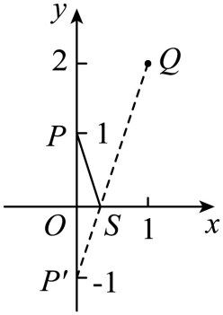

## 错法

看到“折线最短”就反射一个端点，算出两点距离便当答案；不看两端点同侧异侧，不核展开线与指定轴的交点，或只说三点共线而不看折点是否处在两点之间。等式中的下界正确，也未必有原题允许的折点来达到它。

## 正解

先判侧：同侧将一端点反射，使展开后两端异侧，取它们连线与轴的交点；异侧原线段AB已穿过约束直线，直接连接即可。侧向为零时单列端点在轴的情况。

使用三角不等式，A′P+PB≥A′B的等号要求P在线段A′B内，“在同一直线上”只是部分条件。可以写P=A′+t(B−A′)，计算交点参数并检查0≤t≤1；再把P核回原允许集合。若原题允许的是射线/线段，还要相应的坐标或方向限制，延长线上的点不能代替真实折点。

下界不能达到时不要称它为最小值。对闭线段范围，需在可取范围重新比较；无约束最优点在线段外时，较近端点最优，理由见关联知识的加权三角不等式推导。若端点不允许，可能只存在可趋近的下界。

本条所选原题没有对实数x再限区间；实际交点x=1/3也在展开线段内，因此反射下界确达到。不需要为制造“删点”而在原题无依据地增加限制。真正的核验是证明已有原条件均满足。

## 例题

### 原例：HSMA-B3-C2-Ddb68d9cdcfb4-P0351–P0364

**原题、原答案、原思路与原详解**（原次序保留，仅作等价符号规范）：

【变式7-1】（24-25高二上·河北石家庄·期中）唐代诗人李颀的诗《古从军行》开头两句说：“白日登山望烽火，黄昏饮马傍交河，“诗中隐含着一个有趣的数学问题——“将军饮马”问题，即将军在观望火之后从山脚下某处出发，先到河边饮马后再回到军营，怎样走才能使总路最短？试求$\sqrt{{x}^{2}+1}+\sqrt{{x}^{2}-2x+5}$最小（    ）

A．$\sqrt{5}$  B．$\sqrt{10}$  C．$1+\sqrt{5}$  D．$2+\sqrt{2}$

【答案】B

【解题思路】将已知变形设出$P\left( 0,1\right)$，$Q\left( 1,2\right)$，则$\sqrt{{x}^{2}+1}+\sqrt{{x}^{2}-2x+5}$为点$S\left( x,0\right)$分别到点$P\left( 0,1\right)$，$Q\left( 1,2\right)$的距离之和，则$\left| PS\right|+\left| QS\right|\ge \left| {P}^{\prime}Q\right|$，即可根据两点间距离计算得出答案.

【解答过程】$\sqrt{{x}^{2}+1}+\sqrt{{x}^{2}-2x+5}$，

$=\sqrt{{\left( x-0\right)}^{2}+{\left( 0-1\right)}^{2}}+\sqrt{{\left( x-1\right)}^{2}+{\left( 0-2\right)}^{2}}$，

设$P\left( 0,1\right)$，$Q\left( 1,2\right)$，$S\left( x,0\right)$，

则$\sqrt{{x}^{2}+1}+\sqrt{{x}^{2}-2x+5}$为点$S\left( x,0\right)$分别到点$P\left( 0,1\right)$，$Q\left( 1,2\right)$的距离之和，

点$P$关于$x$轴的对称点的坐标为${P}^{\prime}\left( 0,-1\right)$，

连接${P}^{\prime}Q$，

则$\left| PS\right|+\left| QS\right|\ge \left| {P}^{\prime}Q\right|=\sqrt{{\left( 1-0\right)}^{2}+{\left[ 2-\left( -1\right)\right]}^{2}}=\sqrt{10}$，

当且仅当${P}^{\prime}$，$S$，$Q$三点共线时取等号，

故选：B.

**补讲与核验**

第一根号是S(x,0)到P(0,1)的距离，第二根号先配成(x−1)²+4，是到Q(1,2)的距离；两点同在x轴上方，所以反射P为P′=(0,−1)。总路程等于SP′+SQ≥P′Q=√(1²+3²)=√10。

等号须S在线段P′Q上。写S=P′+t(Q−P′)=(t,−1+3t)，y=0给t=1/3，在[0,1]内，因此S=(1/3,0)可取。原题x无额外区间限制，故最小值实际达到√10，B正确。A、C、D均不等于这个可达最短值。若额外限定x范围，就先核1/3是否允许，不可直接照抄此答案。

## 来源

原件：专题2.5 点、线间的对称关系（举一反三讲义）数学人教A版2019选择性必修第一册（解析版）.docx。

知识与题型口径：HSMA-B3-C2-Ddb68d9cdcfb4-P0339–P0404；完整原例见各例段落号。
