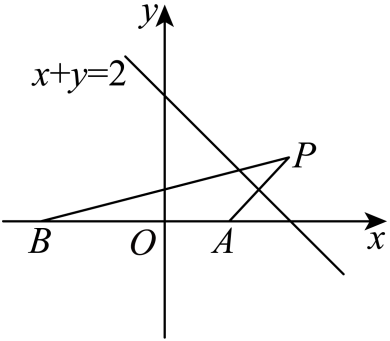

## 讲解

### 是什么

固定两端点A、B，折点P可在指定直线l上移动，求AP+PB最小。对称反射把某段距离换成相等的一段，再用三角不等式把折线压成直线；但是同侧、异侧及折点的允许范围决定哪一种展开能达到下界。

### 怎么来的

若A、B在l的同一开半平面，将A反射成A′。P在l上，PA=PA′，故AP+PB=A′P+PB≥A′B。三角不等式等号要求P在线段A′B上。A′与B在l异侧，线段与l相交，故在允许P取整条l时等号可以达到，交点就是最佳折点。

若A、B位于l异侧，线段AB本身已与l相交，直接用AP+PB≥AB，并在P为线段AB与l的交点时达到，不必先反射。若有端点在轴上，也按线段AB是否有允许的交点判断；两端点都在轴上，P在两端点之间的允许部分都可达到AB，并未必唯一。

同侧判别可把l写成Ax+By+C=0，计算两点的代入值。两值乘积>0为同侧，<0为异侧，=0说明至少一端点在l上，要单独核等号。

反射还解释光线方向：入射速度向量分成沿镜面和垂直镜面的分量；反射保持切向分量，翻转法向分量。由此入射与出射分别同法线成等角。反射入射来源点得到的像点与反射支撑直线共线，但通常在出射射线的反向延长线上；支撑直线还不包含完整传播信息。

### 什么时候能用

若折点限于线段、射线或轴的一部分，先计算直线展开的交点，再核它是否落在允许范围内。交点不允许时，下界不能达到；不能把全直线的最短值照搬。开放端点可能只有下确界而没有最小值，须结合实际范围。

闭线段约束的端点处理（这是拓展，考试可用）：记位置P的路程和为F(P)。若无约束最佳点P₀在线段外，取靠近P₀的端点E和线段内任意点Q，则E在P₀Q之间，可写E=(1−t)P₀+tQ，0<t≤1。两段距离分别用加权三角不等式，相加得F(E)≤(1−t)F(P₀)+tF(Q)。因为P₀是全直线最佳点，F(P₀)≤F(E)，代入前式得到F(E)≤(1−t)F(E)+tF(Q)，减去(1−t)F(E)并除以t>0，得F(E)≤F(Q)。所以较近的可取端点确为闭线段最小处；若该端点不允许，则不能宣布最小值已取得。

多次反射须按行进顺序展开，并核每次交点位于指定镜面及真实传播方向。只得到直线方程，不等于已经证明某个反射路径可实现。

## 易错

- 同侧异侧都反射后写一样的最短式：先判侧，异侧直接连AB可达到更直接的下界。
- “共线”就说等号：还须P处于展开后两端点之间。
- 方程求出的点不在允许河岸段：它只能给无约束候选，不能宣布最短已经达到。

## 例题

### 原例：HSMA-B3-C2-Ddb68d9cdcfb4-P0340–P0350

**原题、原答案、原思路与原详解**（原次序保留，仅作等价符号规范）：

【例7】（24-25高二上·福建福州·期中）唐代诗人李颀的诗《古从军行》开头两句说：“白日登山望烽火，黄昏饮马傍交河”，诗中隐含着一个有趣的数学问题——“将军饮马”问题，即将军在观望烽火之后从山脚下某处出发，先到河边饮马后再回到军营，怎样走才能使总路程最短？在平面直角坐标系中，设军营所在的位置为$B(-2,0)$，若将军从山脚下的点$A(1,0)$处出发，河岸线所在直线的方程为$x+y=2$，则“将军饮马”的最短总路程为（   ）

A．$\sqrt{29}$  B．$5$  C．$\sqrt{17}$  D．$\sqrt{15}$

【答案】C

【解题思路】作点$A(1,0)$关于直线$x+y=2$的对称点为$P\left( x,y\right)$，则最短路程为$BP$.根据点关于

直线的对称问题，列方程组，可求得$P\left( 2,1\right)$，再应用两点间的距离公式求$\left| BP\right|$即可.

【解答过程】如图，作点$A(1,0)$关于直线$x+y=2$的对称点为$P\left( x,y\right)$，

  

则$\left\{ \begin{aligned}\frac{1+x}{2}+\frac{y}{2}=2\\\frac{y-0}{x-1}\cdot \left( -1\right)=-1\end{aligned}\right.$，解得$\left\{ \begin{aligned}x=2\\y=1\end{aligned}\right.$，

所以$P\left( 2,1\right)$.

则“将军饮马”的最短总路程为$\left| BP\right|=\sqrt{{\left( 2+2\right)}^{2}+{\left( 1-0\right)}^{2}}=\sqrt{17}$.

故选：C.

**补讲与核验**

河岸用f(x,y)=x+y−2表示，f(A)=−1、f(B)=−4，两端点在同侧，故将A反射为A′=(2,1)。任意河岸点Q都满足QA=QA′，于是AQ+QB=A′Q+QB≥A′B=√((2+2)²+1²)=√17。

等号不是仅靠三点共线，而要求Q在线段BA′上。令Q=B+t(A′−B)=(−2+4t,t)，代入河岸x+y=2，得−2+5t=2，t=4/5∈[0,1]，Q=(6/5,4/5)确在允许的整条河岸上，所以这个下界能达到，C正确。其余三个数与实际达到的√17不同。

### 原例：HSMA-B3-C2-Ddb68d9cdcfb4-P0268–P0276

**原题、原答案、原思路与原详解**（原次序保留，仅作等价符号规范）：

【例6】（24-25高二上·河北唐山·期中）一条光线从点$P\left( 0,1\right)$射出，与$x$轴相交于点$Q\left( 2,0\right)$，经x轴反射，则反射光线所在直线的方程为（   ）

A．$x-2y-1=0$  B．$x-2y+1=0$

C．$x-2y-2=0$  D．$x+2y-2=0$

【答案】C

【解题思路】根据对称点${P}^{\prime}\left( 0,-1\right)$在反射光线上，即可根据两点求解斜率，即可得直线方程.

【解答过程】点$P\left( 0,1\right)$关于$x$轴的对称点为${P}^{\prime}\left( 0,-1\right)$，

故${P}^{\prime}\left( 0,-1\right)$，$Q\left( 2,0\right)$在反射光线所在的直线上，故$k=\frac{0+1}{2}=\frac{1}{2}$，

直线方程为$y=\frac{1}{2}x-1$，即$x-2y-2=0$，

故选：C.

**补讲与核验**

入射从P=(0,1)到Q=(2,0)，传播方向向量为Q−P=(2,−1)。经x轴反射后，切向x分量保留，法向y分量变号，出射方向为(2,1)。所以出射射线为(x,y)=(2,0)+t(2,1)，t≥0，支撑直线满足x−2y−2=0，C正确。D是入射支撑直线，未把法向分量反向；A、B均不过Q。

P′=(0,−1)与Q同在出射的支撑直线上，但P′对应t=−1，位于传播方向的反向延长线上，并不在真实出射射线内。原解“P′在反射光线上”的字面表述不准确；用于确定支撑直线的计算正确，射线方向由从Q出发且y≥0保留。

## 资料疑点与勘误

Ddb68d9cdcfb4-P0272将像点P′称“在反射光线上”。实际P′在反射支撑直线的反向延长线上，射线需从Q沿(2,1)出发，t≥0。P0274已写“所在的直线上”，计算支撑直线正确。

## 来源

原件：专题2.5 点、线间的对称关系（举一反三讲义）数学人教A版2019选择性必修第一册（解析版）.docx。

知识与题型口径：HSMA-B3-C2-Ddb68d9cdcfb4-P0267–P0338；完整原例见各例段落号。

原件：专题2.5 点、线间的对称关系（举一反三讲义）数学人教A版2019选择性必修第一册（解析版）.docx。

知识与题型口径：HSMA-B3-C2-Ddb68d9cdcfb4-P0339–P0404；完整原例见各例段落号。
