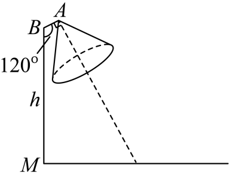
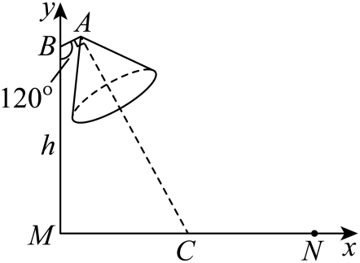

## 讲解

### 判据

实际数量的线性关系需要题设或模型依据；两次观测本身不能证明所有情形永远线性。几何应用先选原点和两条互相垂直的正向轴，把长度、角度、平行垂直变成坐标条件。直线斜率与原轴单位有关：长度随时间的斜率带cm/min，图中缩放或换单位后数值也会变。

### 流程

1. 确定变量、单位及允许范围；几何图中选方便的原点、轴向，逐点写坐标并说明来源。
2. 数量模型由两已知数据点求斜率及截距；几何模型由角、长度和方向求点坐标与直线。
3. 把所求条件翻译为方程：燃尽是长度0，路面中线是宽度中点，互垂用合法垂直判据。
4. 解后回到实际对象：长度/高度非负、时间起点与终点、线段或射线朝向、单位和取整精度都要核。模型结论只在题设适用范围内使用。

## 例题

### 原例（HSMA-B3-C2-D43dd22fd502a-P0285—P0292）

**原题与原解析（保留）**

【例7】（24-25高二上·四川眉山·阶段练习）有一根蜡烛点燃6min后，蜡烛长为17.4cm；点燃21min后，蜡烛长为8.4cm.已知蜡烛长度$l$(cm)与燃烧时间t(min)可以用直线方程表示，则这根蜡烛从点燃到燃尽共耗时（    ）

A．25min  B．35min  C．40min  D．45min

【答案】B

【解题思路】根据已知条件可知直线方程的斜率$k$及所过的点，进而得到直线方程，再求蜡烛从点燃到燃尽所耗时间即可.

【解答过程】由题意知：蜡烛长度$l$(cm)与燃烧时间t(min)可以用直线方程，过$(6,17.4),(21,8.4)$两点，故其斜率$k=\frac{8.4-17.4}{21-6}=-\frac{3}{5}$，

∴直线方程为$l-8.4=-\frac{3}{5}(t-21)$，

∴当蜡烛燃尽时，有$t-21=14$，即$t=35$，

故选：B.

### 补讲

把横轴取燃烧时间t（min），纵轴取剩余长度l（cm）；两个测量点是(6,17.4)、(21,8.4)，不是把单位或坐标次序对调。纵差−9cm、横差15min，斜率−0.6cm/min，表示每分钟减少0.6cm。

点斜式展开得l−8.4=−0.6t+12.6，所以l=21−0.6t；t=0时模型给初长21cm。燃尽应置l=0，得0.6t=21，t=35min，选B。原解从21min再燃14min得到35min，与此相同。物理上t从点燃到燃尽只取[0,35]；t>35所给负长度不属于真实蜡烛。匀速燃烧的线性关系是题设模型，不能从两个观测点独自推出任何蜡烛都严格匀速。

### 原例（HSMA-B3-C2-D43dd22fd502a-P0300—P0312）

**原题与原解析（保留）**

【变式7-2】（2025高二·全国·专题练习）如图，在路边安装路灯，路宽14m，在路边的点$M$处立有一根高为$ℎ$灯柱$MB$，灯杆$AB$长1m，且与灯柱$MB$成$120^{\circ}$．路灯采用锥形灯罩（灯罩顶点在点$A$处），灯罩轴线与灯杆垂直．当灯柱高$ℎ$约多少时，灯罩轴线正好与道路路面的中线相交？（精确到0.01m，其中$\sqrt{3}\approx 1.732$）

【答案】10.12m

【解题思路】建立如图所示坐标系，利用垂直关系得到斜率关系从而得到直线方程，再代入点$C\left( 7,0\right)$即可求出；

【解答过程】如图，记路面宽$\left| MN\right|=14m$，以灯柱底端$M$为原点，$MN$，$MB$分别为$x$，$y$轴建立平面直角坐标系，

则点$B$的坐标为$\left( 0,ℎ\right)$，$MN$的中点$C$的坐标为$\left( 7,0\right)$．

因为$\angle MBA=120^{\circ}$，所以直线$BA$的倾斜角为$30^{\circ}$，

由$\left| BA\right|=1m$，得点$A$的坐标为$\left( 1\times cos30^{\circ},ℎ+1\times sin30^{\circ}\right)$，即$A\left( \frac{\sqrt{3}}{2},ℎ+\frac{1}{2}\right)$．

又因为$CA\perp BA$，所以${k}_{CA}=-\frac{1}{{k}_{BA}}=-\frac{1}{tan30^{\circ}}=-\sqrt{3}$，

所以直线$AC$的方程为$y-\left( ℎ+\frac{1}{2}\right)=-\sqrt{3}\left( x-\frac{\sqrt{3}}{2}\right)$．

又直线$AC$过点$C\left( 7,0\right)$，所以$-\left( ℎ+\frac{1}{2}\right)=-\sqrt{3}\left( 7-\frac{\sqrt{3}}{2}\right)$，解得$ℎ=7\sqrt{3}-2\approx 10.12\left( m\right)$．

故灯柱高$ℎ$约为10.12m．

### 补讲

选M为原点，横轴沿路面MN正向、纵轴沿灯柱向上；路宽14m使中点C=(7,0)，柱顶B=(0,h)。图示灯杆从B朝右上，向下的BM与BA夹120°；若BA与正x轴夹φ，则90°+φ=120°，所以φ=30°。

BA长1m，横增量cos30°=√3/2、纵增量sin30°=1/2，故A=(√3/2,h+1/2)。BA斜率tan30°=1/√3，非水平且存在；垂直灯罩轴线AC的斜率为−√3。代A得y−(h+1/2)=−√3(x−√3/2)。

代C=(7,0)，得到−h−1/2=−7√3+3/2，两侧加h、再加7√3及减3/2，即h=7√3−2。用题给√3≈1.732，h≈12.124−2=10.124，精确到0.01m为10.12m。h>0且7>√3/2，C位于从A向右下的轴线射线上，符合实际灯罩方向；不能仅有整条直线相交便忽略光轴的朝向。

## 易错

过两个数据点的数学直线会延伸到模型范围外；负蜡烛长度无物理意义。光轴是有朝向的射线，不能只证明无限延伸直线通过目标。

## 来源

原件：专题2.3 直线的方程（二）（举一反三讲义）数学人教A版2019选择性必修第一册（解析版）.docx；来源 ID：D43dd22fd502a。

知识与分类定位：HSMA-B3-C2-D43dd22fd502a-P0281—P0284。

选用原例：HSMA-B3-C2-D43dd22fd502a-P0285—P0292, HSMA-B3-C2-D43dd22fd502a-P0300—P0312。
