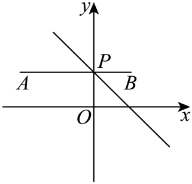

## 讲解

### 判据

折点在直线上、目标是两段距离之和，或两根号可认作到固定点的距离。用反射前先把每个根号写成完整的两点距离平方，确定端点和折点所在的轴或线。

### 流程

1. 明确A、B以及折点P的允许集合，用直线代入值判同侧/异侧。有一端在轴上则单独检查。若是根号式，先配平方辨明固定点，避免把常数4误读为纵坐标4。
2. 同侧反射一个端点A到A′，以PA=PA′换一段，得到A′P+PB≥A′B。异侧则直接AP+PB≥AB，因为线段AB已穿过该直线。
3. 等号不仅要求共线，还须P在展开后两个端点之间。求展开直线与约束直线交点，或用线段参数0≤t≤1核P位置。
4. 再核交点落在原允许轴、线段或射线上。全直线允许时通常可达；有限区间不含该交点时，只有下界不能宣布最小，要在允许范围重新比较。闭线段可比较相应端点；开放端点需区分最小值与仅能趋近的下界。
5. 把最优点代回原约束和距离式，给可达的最短长度及题目所求坐标。若求反射光线，还要从反射点按正确方向给射线，不能把支撑线反向延长部分当传播路径。

## 易错

- 未配方就从根号猜两个点：纵坐标应是常数平方根的正确值。
- 把共线替代线段内：三角不等式等号要求折点在两端点之间。
- 原集合只允许一段河岸而候选在延长线上：该候选无效，原题最短必须另求。

## 例题

### 原例：HSMA-B3-C2-Ddb68d9cdcfb4-P0351–P0364

**原题、原答案、原思路与原详解**（原次序保留，仅作等价符号规范）：

【变式7-1】（24-25高二上·河北石家庄·期中）唐代诗人李颀的诗《古从军行》开头两句说：“白日登山望烽火，黄昏饮马傍交河，“诗中隐含着一个有趣的数学问题——“将军饮马”问题，即将军在观望火之后从山脚下某处出发，先到河边饮马后再回到军营，怎样走才能使总路最短？试求$\sqrt{{x}^{2}+1}+\sqrt{{x}^{2}-2x+5}$最小（    ）

A．$\sqrt{5}$  B．$\sqrt{10}$  C．$1+\sqrt{5}$  D．$2+\sqrt{2}$

【答案】B

【解题思路】将已知变形设出$P\left( 0,1\right)$，$Q\left( 1,2\right)$，则$\sqrt{{x}^{2}+1}+\sqrt{{x}^{2}-2x+5}$为点$S\left( x,0\right)$分别到点$P\left( 0,1\right)$，$Q\left( 1,2\right)$的距离之和，则$\left| PS\right|+\left| QS\right|\ge \left| {P}^{\prime}Q\right|$，即可根据两点间距离计算得出答案.

【解答过程】$\sqrt{{x}^{2}+1}+\sqrt{{x}^{2}-2x+5}$，

$=\sqrt{{\left( x-0\right)}^{2}+{\left( 0-1\right)}^{2}}+\sqrt{{\left( x-1\right)}^{2}+{\left( 0-2\right)}^{2}}$，

设$P\left( 0,1\right)$，$Q\left( 1,2\right)$，$S\left( x,0\right)$，

则$\sqrt{{x}^{2}+1}+\sqrt{{x}^{2}-2x+5}$为点$S\left( x,0\right)$分别到点$P\left( 0,1\right)$，$Q\left( 1,2\right)$的距离之和，

点$P$关于$x$轴的对称点的坐标为${P}^{\prime}\left( 0,-1\right)$，

连接${P}^{\prime}Q$，

则$\left| PS\right|+\left| QS\right|\ge \left| {P}^{\prime}Q\right|=\sqrt{{\left( 1-0\right)}^{2}+{\left[ 2-\left( -1\right)\right]}^{2}}=\sqrt{10}$，

当且仅当${P}^{\prime}$，$S$，$Q$三点共线时取等号，

故选：B.

**补讲与核验**

第一根号是S(x,0)到P(0,1)的距离，第二根号先配成(x−1)²+4，是到Q(1,2)的距离；两点同在x轴上方，所以反射P为P′=(0,−1)。总路程等于SP′+SQ≥P′Q=√(1²+3²)=√10。

等号须S在线段P′Q上。写S=P′+t(Q−P′)=(t,−1+3t)，y=0给t=1/3，在[0,1]内，因此S=(1/3,0)可取。原题x无额外区间限制，故最小值实际达到√10，B正确。A、C、D均不等于这个可达最短值。若额外限定x范围，就先核1/3是否允许，不可直接照抄此答案。

### 原例：HSMA-B3-C2-Ddb68d9cdcfb4-P0393–P0404

**原题、原答案、原思路与原详解**（原次序保留，仅作等价符号规范）：

【例8】（24-25高二上·吉林长春·期中）已知$\left( m,n\right)$为直线$x+y-1=0$上的一点，则$\sqrt{{m}^{2}+{n}^{2}}+\sqrt{{\left( m+2\right)}^{2}+{\left( n-1\right)}^{2}}$的最小值为（    ）

A．$2\sqrt{3}$  B．$\sqrt{10}$  C．4  D．3

【答案】D

【解题思路】利用两点的距离公式结合“将军饮马”模型计算最值即可.

【解答过程】如图，$\sqrt{{m}^{2}+{n}^{2}}+\sqrt{{\left( m+2\right)}^{2}+{\left( n-1\right)}^{2}}$为点$P\left( m,n\right)$到原点$O$和到点$A\left( -2,1\right)$的距离之和，

即$\left| PO\right|+\left| PA\right|$．

设$O\left( 0,0\right)$关于直线$x+y-1=0$对称的点为$B\left( a,b\right)$，

则$\left\{ \begin{aligned}\frac{a}{2}+\frac{b}{2}-1=0\\\frac{b}{a}=1\end{aligned}\right.$，解得$\left\{ \begin{aligned}a=1\\b=1\end{aligned}\right.$，即$B\left( 1,1\right)$，

则$\left| PO\right|=\left| PB\right|$，当$A,P,B$三点共线时，$\left| PO\right|+\left| PA\right|$取到最小值，

且最小值为$\left| PO\right|+\left| PA\right|=\left| AB\right|=1-\left( -2\right)=3$．

故选：D.

**补讲与核验**

将原式认作P=(m,n)到O=(0,0)及A=(−2,1)的距离和，约束为m+n=1。O、A代入轴x+y−1左侧为−1、−2，故同侧。O的反射点B=(1,1)，PB=PO，折线和≥AB=3。

展开线段AB在y=1上，从x=−2到x=1；与轴x+y=1交于P=(0,1)，位于这条线段内，也满足允许的整条直线约束。于是等号达到，D正确。原解只写三点共线，补上“P在AB线段内”才是三角不等式等号完整条件；本题的实际交点确满足。其余选项都不等于实际达到的3。

## 来源

原件：专题2.5 点、线间的对称关系（举一反三讲义）数学人教A版2019选择性必修第一册（解析版）.docx。

知识与题型口径：HSMA-B3-C2-Ddb68d9cdcfb4-P0267–P0404；完整原例见各例段落号。
