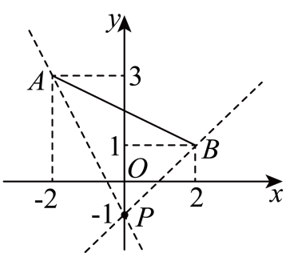
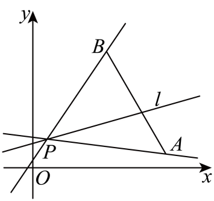

## 讲解

### 判据

过固定P且与闭线段AB相交的有限斜率，是各Q∈AB、Q≠P且Q横坐标≠P横坐标时PQ的方向；若P∈AB，任何有限斜率都已在P处相交，直接得全体实数。P在承载线AB上但在段外时，只有该承载线相交，有限斜率至多一个。

P不在承载线时，令Q=A+t(B−A)、0≤t≤1，k(t)为纵差除横差。横差为0的t把斜率范围分开，不能把两个端点斜率自动连成有界区间。

### 流程

1. 查A≠B及P是否共线、是否在线段内。先处理这些会使一般分式失效的情形。
2. 参数化Q，解横差=0，确定有无竖直分界，以及分界在端点还是内部。
3. 每一非竖直子区间用端点值和趋向分界的正/负无穷求范围。可用分式差判单调；原分子分母皆是t的一次式，这一步不用导数。
4. 端点交点允许则包含其有限斜率；竖直只记录为无有限k，不把∞写成区间内实数。合并全部支，再核代表方向能否确实相交。

## 例题

### 原例（HSMA-B3-C2-D560423420f6d-P0184—P0192）

**原题与原解析（保留）**

【例5】（24-25高二上·内蒙古呼和浩特·期中）已知$A\left( -2,3\right)$、$B\left( 2,1\right)$，若斜率存在的直线l经过点$P\left( 0,-1\right)$，且与线段AB有交点，则l的斜率的取值范围为（    ）

A．$\left[ -2,1\right]$  B．$\left[ -1,2\right]$  C．$\left( -\infty ,-2\right]\cup \left[ 1,+\infty \right)$  D．$\left( -\infty ,-1\right]\cup \left[ 2,+\infty \right)$

【答案】C

【解题思路】先利用直线的斜率公式计算${k}_{PA}$，${k}_{PB}$；再结合图形，利用直线与线段有交点的条件建立不等式，即可得出结果.

【解答过程】由直线的斜率公式可得：

${k}_{PA}=\frac{3-\left( -1\right)}{-2-0}=-2$；${k}_{PB}=\frac{1-\left( -1\right)}{2-0}=1$.

结合图形，要使直线l经过点$P\left( 0,-1\right)$，且与线段AB有交点，l的斜率需满足$k\le -2$或$k\ge 1$.

故选：C.

### 补讲

令线段上的点Q=(−2+4t,3−2t)，0≤t≤1。相对P，横差4t−2、纵差4−2t；t=1/2时Q=(0,2)，PQ竖直，原题要求斜率存在，应排除这一点对应的方向。

当t≠1/2，k=(4−2t)/(4t−2)。解k(4t−2)=4−2t，得到t=(k+2)/(2k+1)，但k=−1/2时原等式成为1=4，无交点。对左半段0≤t<1/2，可写k=−1/2+3/(4t−2)，分母从−2增至0但未到0，故k从−2减至负无穷，范围(−∞,−2]。右半段1/2<t≤1，分母从0增至2，故k从正无穷减至1，范围[1,+∞)。端点A、B允许相交，所以−2、1均取到，合并得到C。

线段处在P上方并跨过过P的竖直线，不代表斜率在−2与1之间。竖直方向把斜率图分成两支，这是本题得到两翼范围的关键。

### 原例（HSMA-B3-C2-D560423420f6d-P0193—P0203）

**原题与原解析（保留）**

【变式5-1】（24-25高二上·黑龙江哈尔滨·期末）已知点$P(1,2)$，经过点P作直线l，若直线l与连接$A(9,1)$，$B(5,8)$两点的线段（含端点）总有公共点，则直线l的斜率k的取值范围为（   ）

A．$\left[ \frac{1}{8},\frac{3}{2}\right]$  B．$\left[ -\frac{1}{8},\frac{3}{2}\right]$  C．$\left( -\infty ,-\frac{1}{8}\right)$  D．$\left( -\infty ,-\frac{1}{8}\right]\cup \left[ \frac{3}{2},+\infty \right)$

【答案】B

【解题思路】由题意作图，利用斜率的计算公式，可得答案.

【解答过程】由题意作图如下：

设直线$AP$的斜率为${k}_{AP}$，直线$BP$的斜率为${k}_{BP}$，直线$l$的斜率为${k}_{l}$，

由图可知${k}_{AP}\le {k}_{l}\le {k}_{BP}$，

由$A\left( 9,1\right)$，$B\left( 5,8\right)$，$P\left( 1,2\right)$，则${k}_{AP}=\frac{1-2}{9-1}=-\frac{1}{8}$，${k}_{BP}=\frac{8-2}{5-1}=\frac{6}{4}=\frac{3}{2}$，

所以$-\frac{1}{8}\le {k}_{l}\le \frac{3}{2}$.

故选：B.

### 补讲

令Q=(9−4t,1+7t)，0≤t≤1，则相对P的横差8−4t≥4，一直为正，没有竖直分界。k=(−1+7t)/(8−4t)。

对0≤t₁<t₂≤1，直接通分相减得k(t₂)−k(t₁)=52(t₂−t₁)/[(8−4t₂)(8−4t₁)]>0，所以斜率连续递增，最小在A为−1/8，最大在B为3/2。闭线段含端点，范围[−1/8,3/2]，选B。这一步说明端点包住全部中间方向的依据，不只凭图形猜测。

## 易错

“两端斜率−2、1”本身不足以断言范围[−2,1]；需要P与整段的横向位置和竖直分界信息。图形可提示，参数分式给出完整判据。

## 来源

原件：专题2.1 直线的倾斜角与斜率（举一反三讲义）数学人教A版2019选择性必修第一册（解析版）.docx；来源 ID：D560423420f6d。

知识与分类定位：HSMA-B3-C2-D560423420f6d-P0043—P0046, HSMA-B3-C2-D560423420f6d-P0183—P0183。

选用原例：HSMA-B3-C2-D560423420f6d-P0184—P0192, HSMA-B3-C2-D560423420f6d-P0193—P0203。
