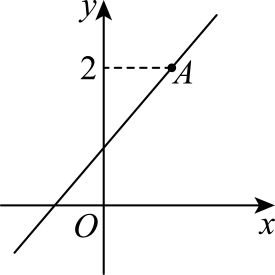
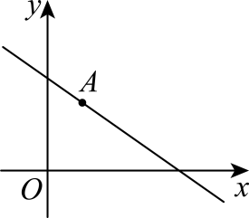

## 讲解

### 判据

直线与两轴各有唯一有限非零截距a、b时，和坐标轴围成的非退化三角形面积S=|ab|/2；要求两正半轴时还须a>0、b>0。零截距不围成非退化三角形，轴平行直线也没有该三角形。

### 流程

1. 从原条件求直线，或在合法非零截距支设x/a+y/b=1。
2. 分别令y=0、x=0求截距，核分母、符号和是否唯一。
3. 由坐标轴互相垂直，取直角边长|a|、|b|，面积用乘积一半；两正轴题才可直接去绝对值。
4. 参数最值先求合法区间，再在该区间比较面积。正分母倒数最小时分母最大；用配方或基本不等式说明等号条件，并回代看能否取到。

同一道综合原题的定点、象限条件、面积条件要各自核原约束，不能将前一小问的参数限制带入另一小问。

## 例题

### 原例（HSMA-B3-C2-D6518689e422c-P0305—P0312）

**原题与原解析（保留）**

【例7】（24-25高二上·甘肃白银·期末）过点$\left( -1,3\right)$且斜率为2的直线$l$与坐标轴围成的三角形的面积为（    ）

A．$\frac{25}{2}$  B．$\frac{25}{4}$  C．$\frac{5}{2}$  D．$\frac{5}{4}$

【答案】B

【解题思路】利用点斜式求得直线$l$的方程，求得直线$l$与坐标轴的交点坐标，从而求得三角形的面积.

【解答过程】依题意得直线$l$的方程为$y-3=2\left( x+1\right)$，即$y=2x+5$，

则直线$l$与坐标轴的交点分别为$A\left( -\frac{5}{2},0\right),B\left( 0,5\right)$，

所以${S}_{\triangle OAB}=\frac{1}{2}\left| OA\right|\left| OB\right|=\frac{1}{2}\times \frac{5}{2}\times 5=\frac{25}{4}$．

故选：B.

### 补讲

点斜式y−3=2(x+1)，先展开右侧2x+2，再加3得y=2x+5。令y=0得到x=−5/2，所以x截距是负数−5/2；令x=0得到纵截距5。

原点到两交点的距离是5/2、5，这两边沿坐标轴且互相垂直，面积=它们乘积的一半=25/4，选B。面积不能直接用带符号截距积的一半，须取绝对值；两交点不能重合于O，否则不是非退化三角形。

### 原例（HSMA-B3-C2-D43dd22fd502a-P0327—P0349）

**原题与原解析（保留）**

【例8】（24-25高二上·宁夏吴忠·期中）已知直线$l:\left( a-1\right)y=\left( 2a-3\right)x+1$．

(1)求直线$l$所过定点；

(2)若直线$l$不经过第四象限，求实数$a$的取值范围；

(3)若直线$l$与两坐标轴的正半轴围成的三角形面积最小，求$l$的方程．

【答案】(1)$\left( 1,2\right)$

(2)$\left[ \frac{3}{2},+\infty \right)$

(3)$2x+y-4=0$

【解题思路】（1）由方程变形可得$a\left( 2x-y\right)-3x+y+1=0$，列方程组，解方程即可；

（2）数形结合，结合直线图象可得出关于实数$a$的不等式，解之即可；

（3）求得直线与坐标轴的交点，可得面积，进而利用二次函数的性质可得最值.

【解答过程】（1）由$l:\left( a-1\right)y=\left( 2a-3\right)x+1$，即$a\left( 2x-y\right)-3x+y+1=0$，

则$\left\{ \begin{aligned}2x-y=0\\-3x+y+1=0\end{aligned}\right.$，解得$\left\{ \begin{aligned}x=1\\y=2\end{aligned}\right.$，所以直线过定点$\left( 1,2\right)$.

（2）因为直线$l$不过第四象限，结合图形可知，直线$l$的斜率存在，所以$a\ne 1$，

此时，直线$l$的方程可化为$y=\frac{2a-3}{a-1}x+\frac{1}{a-1}$，记点$A\left( 1,2\right)$，则${k}_{OA}=2$，

由图可得$0\le \frac{2a-3}{a-1}\le 2$，解得$a\ge \frac{3}{2}$，因此，实数$a$的取值范围是$\left[ \frac{3}{2},+\infty \right)$.

（3）已知直线$l:\left( a-1\right)y=\left( 2a-3\right)x+1$，且由题意知$a\ne 1$，

令$x=0$，得$y=\frac{1}{a-1}>0$，得$a>1$，

令$y=0$，得$x=\frac{1}{3-2a}>0$，得$a<\frac{3}{2}$，

则$S=\frac{1}{2}\times \frac{1}{a-1}\times \frac{1}{3-2a}=\frac{1}{-4{a}^{2}+10a-6}=\frac{1}{-4{\left( a-\frac{5}{4}\right)}^{2}+\frac{1}{4}}$，

所以当$a=\frac{5}{4}$时，$S$取最小值，

此时直线$l$的方程为$\left( \frac{5}{4}-1\right)y=\left( 2\times \frac{5}{4}-3\right)x+1$，即$2x+y-4=0$.

### 补讲

（1）把原式移到一侧，按a的次数分组得a(2x−y)+(−3x+y+1)=0。定点要对所有实数a成立：分别取a=0、a=1可推出常数项0和a系数0。由y=2x代入−3x+y+1=0得−x+1=0，因此(1,2)。回代原式左右均2a−2。两个法向系数2a−3、1−a不可能同时0，整个直线族都有效。

（2）a=1时原式成为0=−x+1，即x=1，确有第四象限点，排除后才可除a−1。其余情况y=kx+b；第四象限条件x>0、y<0。若k<0，充分大的正x会令y<0；若b<0，充分小的正x会令y<0。故不经过第四象限等价于k≥0且b≥0（b=0、k≥0也合法）。本题b=1/(a−1)绝不会0，所以要求a>1；此时k=(2a−3)/(a−1)≥0等价于a≥3/2。答案[3/2,+∞)成立。

（3）与两正半轴围非退化三角形，两个截距必须严格正且有限。纵截距1/(a−1)>0给a>1；横截距1/(3−2a)>0给a<3/2，所以1<a<3/2。面积S=1/[2(a−1)(3−2a)]。分母展开为−4a²+10a−6，再配平方成−4(a−5/4)²+1/4。在合法区间内分母正；为使其倒数最小，应使分母最大。平方项≥0，最大1/4于a=5/4取得，这个a确在区间内，最小面积4。代回原式两边乘4得y=−2x+4，即2x+y−4=0。原第三问仅要求直线，但最小面积4也验证了计算与正截距条件。

### 资料说明（与原解分开）

原P0342用过(1,2)的图得到0≤k≤2；在原直线族的这一合法分支中，k=2−1/(a−1)实际不到2，故上界2并不会新增参数解。这里说明端点未取到的原因，保留原解及正确参数结果。

## 易错

截距有符号，面积无负数；正半轴限定须严格正。极值的等号点若不在参数区间，不能声称取得最小值。

## 来源

原件：专题2.2 直线的方程（一）：直线方程的几种形式（举一反三讲义）数学人教A版2019选择性必修第一册（解析版）.docx；来源 ID：D6518689e422c。

原件：专题2.3 直线的方程（二）（举一反三讲义）数学人教A版2019选择性必修第一册（解析版）.docx；来源 ID：D43dd22fd502a。

知识与分类定位：HSMA-B3-C2-D6518689e422c-P0096—P0102, HSMA-B3-C2-D6518689e422c-P0304—P0304, HSMA-B3-C2-D43dd22fd502a-P0326—P0326。

选用原例：HSMA-B3-C2-D6518689e422c-P0305—P0312, HSMA-B3-C2-D43dd22fd502a-P0327—P0349。
