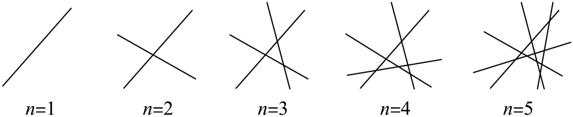

## 讲解

### 判据与流程

整除命题和几何计数都可通过“旧部分+新增量”归纳，但新增量的理由不同：整除需说明新增量是固定整数的倍数，几何需按条件证明恰增加哪些结果。

对 $d\mid F(n)$，d为非零整数，先验证起点。任意k假设 $F(k)=dz$、z为整数；推导 $F(k+1)=F(k)+dG(k)$ 或 $cF(k)+dG(k)$，c、G(k)均为整数。于是新式也是d倍整数。若下标只取偶数，应按该类合法步长递推，不能写k+1到非法下标。

几何计数先固定对象条件，令r(n)为数量；增加第k+1个对象，说明每种新增结果被计一次且没有遗漏，再得 $r(k+1)=r(k)+g(k)$。直线例需要不同直线、两两有唯一交点、无三线共点；这给新直线上的k个不同交点和k+1段，每段增加一个不同区域。

最后将归纳假设代入上述关系，计算到目标通式。看图猜出前几个数量只是猜想阶段，不能替代一般k的新增理由。

## 易错

“某式可被d整除”需式内为整数；几何“最多”与“恰好”需条件区分。如果允许平行、共点或重合，原增量就会改变。

知识与分类依据：`HSMA-B4-C4-D2d0d99511540-P0175-P0194`（《专题4.7 数学归纳法【七大题型】（举一反三）（人教A版2019选择性必修第二册）（解析版）.docx》）；`HSMA-B4-C4-D2d0d99511540-P0261-P0270`（《专题4.7 数学归纳法【七大题型】（举一反三）（人教A版2019选择性必修第二册）（解析版）.docx》）。原资料口径、补条件与勘误分别说明。

## 例题

### 原例：三个连续立方和的整除

来源：`HSMA-B4-C4-D2d0d99511540-P0262-P0270`；原件《专题4.7 数学归纳法【七大题型】（举一反三）（人教A版2019选择性必修第二册）（解析版）.docx》。题号、学年及地区按讲义原标注，未另作来源核验。

以下完整保留原题、原答案与原详解（仅统一等价公式排版及配图路径）：

【变式5-2】（23-24高二上·全国·课后作业）用数学归纳法证明：${n}^{3}+{\left( n+1\right)}^{3}+{\left( n+2\right)}^{3}$能被$9$整除$\left( n\in {N}^{\ast }\right)$.

【解题思路】先验证$n=1$时，${n}^{3}+{\left( n+1\right)}^{3}+{\left( n+2\right)}^{3}$能被$9$整除；假设当$n=k$时，${k}^{3}+{\left( k+1\right)}^{3}+{\left( k+2\right)}^{3}$能被$9$整除，再证明${\left( k+1\right)}^{3}+{\left( k+2\right)}^{3}+{\left( k+3\right)}^{3}$能被$9$整除，结合归纳原理可得出结论成立.

【解答过程】证明：（1）当$n=1$时，${1}^{3}+{2}^{3}+{3}^{3}=36$能被$9$整除，所以结论成立；

（2）假设当$n=k\left( k\in {N}^{\ast }\right)$时结论成立，即${k}^{3}+{\left( k+1\right)}^{3}+{\left( k+2\right)}^{3}$能被$9$整除．

则当$n=k+1$时，${\left( k+1\right)}^{3}+{\left( k+2\right)}^{3}+{\left( k+3\right)}^{3}={\left( k+1\right)}^{3}+{\left( k+2\right)}^{3}+{k}^{3}+9{k}^{2}+27k+27k$

$={k}^{3}+{\left( k+1\right)}^{3}+{\left( k+2\right)}^{3}+9\left( {k}^{2}+3k+3\right)$，

因为${k}^{3}+{\left( k+1\right)}^{3}+{\left( k+2\right)}^{3}$能被$9$整除，$9\left( {k}^{2}+3{k}^{2}+3\right)$能被$9$整除，

所以，${\left( k+1\right)}^{3}+{\left( k+2\right)}^{3}+{\left( k+3\right)}^{3}$能被$9$整除，即即$n=k+1$时结论也成立．

由（1）（2）知命题对一切$n\in {N}^{\ast }$都成立．

#### 补充讲解

设 $F(k)=k^3+(k+1)^3+(k+2)^3$。从k到k+1，先删去 $k^3$、再新增 $(k+3)^3$，所以

$$F(k+1)-F(k)=(k+3)^3-k^3=9k^2+27k+27=9(k^2+3k+3).$$

因为k是整数，括号内也是整数；假设 $F(k)=9z$、$z\in\mathbb Z$，则 $F(k+1)=9[z+k^2+3k+3]$，给出整除的实际理由。

**原资料勘误：**P0266末常数27误写成27k；P0268括号内 $3k$ 误写成 $3k^2$。原文保留，规范递推应以上述差式为准；原最终整除结论正确。

### 原例：新增直线的交点与区域增量

来源：`HSMA-B4-C4-D2d0d99511540-P0176-P0194`；原件《专题4.7 数学归纳法【七大题型】（举一反三）（人教A版2019选择性必修第二册）（解析版）.docx》。题号、学年及地区按讲义原标注，未另作来源核验。

以下完整保留原题、原答案与原详解（仅统一等价公式排版及配图路径）：

【例4】（23-24高二·全国·课堂例题）在平面上画n条直线，且任何2条直线都相交，其中任何3条直线不共点.问：这n条直线将平面分成多少个部分？

【解题思路】先通过$n=1$，2，3，4，5的结果归纳出${r}_{n}=1+1+2+3+4+\cdots +n$，再用数学归纳法证明即可.

【解答过程】记n条直线把平面分成${r}_{n}$个部分，我们通过$n=1$，2，3，4，5，画出图形观察${r}_{n}$的情况（如图）

从图中可以看出，

${r}_{1}=2=1+1$，

${r}_{2}=4={r}_{1}+2=1+1+2$，

${r}_{3}=7={r}_{2}+3=1+1+2+3$，

${r}_{4}=11={r}_{3}+4=1+1+2+3+4$，

${r}_{5}=16={r}_{4}+5=1+1+2+3+4+5$.

由此猜想${r}_{n}=1+1+2+3+4+\cdots +n$.

接下来用数学归纳法证明这个猜想.

（1）当$n=1$，2时，结论均成立.

（2）假设当$n=k$时结论成立，即${r}_{k}=1+1+2+3+4+\cdots +k$.

那么，当$n=k+1$时，第k+1条直线与前面的k条直线都相交，有k个交点，

这k个交点将这条直线分成k+1段，且每一段将原有的平面部分分成两个部分，

所以${r}_{k+1}={r}_{k}+(k+1)=1+1+2+3+4+\cdots +k+(k+1)$，结论也成立.

根据（1）和（2）可知，对$n\in {N}^{\ast }$，都有${r}_{n}=1+1+2+3+4+\cdots +n$，

即${r}_{n}=1+\frac{n(n+1)}{2}$.

#### 补充讲解

这里的直线应为互不重合的不同直线；“任何两条相交”按通常课堂口径为有唯一交点，即排除平行和重合。“无三线共点”使新增直线与原k条线的k个交点两两不同。

沿新直线走，每经过一个交点才进入下一区域，k个点把它分成k+1段（两端为射线）。每个旧区域是一些半平面的交，故为凸区域；同一直线不能离开后又进入同一个区域，因此这些段分别切开k+1个不同旧区域，每段仅增加1个区域。于是新增量k+1有理由，而不是由几幅图推广。原图用于观察前几种情况，证明由相交和不共点条件提供。
