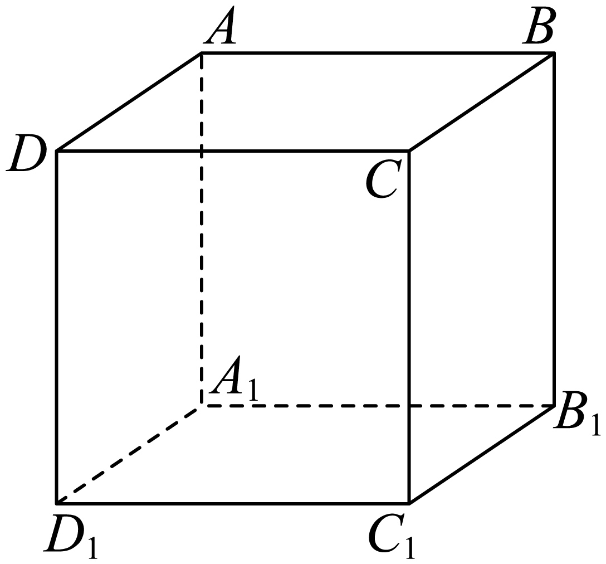

## 错法

看到两条空间直线不相交，就直接写平行。平面几何默认“已在同一平面”的二选一被搬到空间，漏掉异面第三种。另一种错法是有限线段没有交点就断言所在直线不交，忽略延长线。

## 正解

两条不同直线若不相交，接着查能否共面：共面才平行，不能共面则异面。常用异面判据是 a⊂α、b∩α={P}、P∉a；如果两线共面，其共同面与 α 的交线会是 a，又迫使 P∈a，产生矛盾。

两条不在同一平面图框中的线也可能共面；两条在纸面上画成交叉的线也可能异面。空间位置需用归属、公共点和定理证明，不能按透视图线条走向判定。

## 例题

### 原例（HSMA-B2-C8-D916045a86699-P0493–P0500）

> 原件：专题8.4 空间点、直线、平面之间的位置关系（举一反三讲义）高一数学人教A版必修第二册（解析版）.docx。题源标注沿用原资料。完整原题、原答案、原解题思路与详解保留，Unicode空格等价转写。

【变式7-1】（2025高二上·云南·学业考试）如图，在正方体$ABCD-{A}_{1}{B}_{1}{C}_{1}{D}_{1}$中，直线$BC$与直线$D{D}_{1}$（   ）

A．异面  B．平行  C．相交且垂直  D．相交但不垂直

【答案】A

【解题思路】由图正方体结构特点及异面直线的定义可得答案.

【解答过程】由图知$D{D}_{1}\cap $平面$ABCD=D$，$BC\subset $平面$ABCD$，$D\notin BC$， 

根据异面直线的定义，直线$BC$与直线$D{D}_{1}$异面.

故选：A.

**补讲：每一步的依据**

假设 BC 与 DD₁ 有交点 X，则 X 同属底面与 DD₁，只能是 D；但 D 不在 BC，故两线不相交。这仍没推出平行。进一步假设两线共面于 β，则 β 包含 BC 且包含 D，底面也含它们；B、C、D 不共线，两个面必须重合。于是 DD₁ 应在底面内，与它只有 D 一个底面交点矛盾，所以两线不共面，A 正确。B 漏共面，C、D 漏公共点判断。

## 易错

- 不能只凭“不相交”去套平行的传递性，需先证每项确为平行。
- 证明共面可以取三不共线点定面，再查两线是否都整条落在面内。

## 来源

- HSMA-B2-C8-D916045a86699-P0389–P0393；原件《专题8.4 空间点、直线、平面之间的位置关系（举一反三讲义）高一数学人教A版必修第二册（解析版）.docx》；知识与分类口径。
- HSMA-B2-C8-D916045a86699-P0486–P0500；原件《专题8.4 空间点、直线、平面之间的位置关系（举一反三讲义）高一数学人教A版必修第二册（解析版）.docx》；知识与分类口径。
